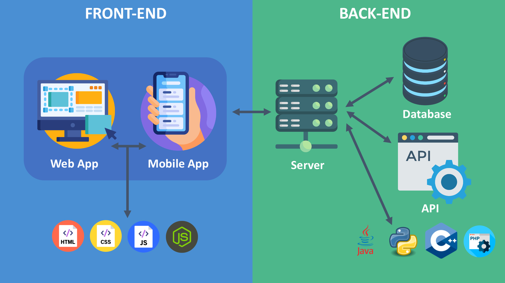
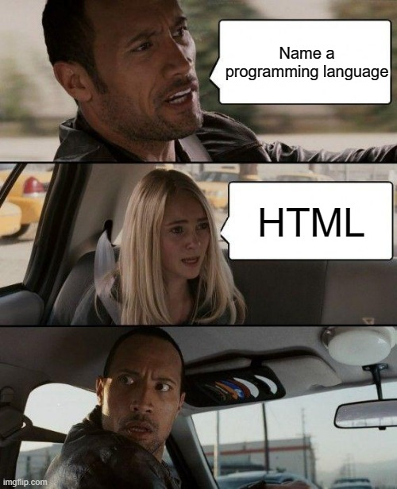
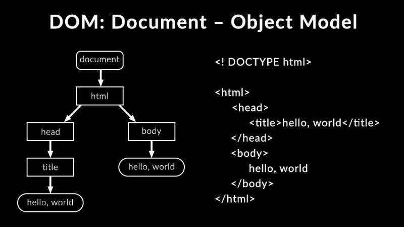

# Лекция 1. Введение в HTML и CSS


Перед тем как приступить к изучению `HTML` и `CSS`, важно понять, что это за технологии и какую роль они играют в веб-разработке. Поэтому для начала стоит разобраться с основными понятиями.

## Что такое программирование?

**Программирование** — это процесс создания инструкций для компьютера с целью выполнения определённых задач. Эти инструкции пишутся на специальных языках программирования, которые понятны как людям, так и машинам. Программирование позволяет создавать приложения, веб-сайты, игры и многое другое.

Языки программирования созданы для того, чтобы разработчики могли общаться с компьютерами и создавать программное обеспечение. Существует множество языков программирования, каждый из которых имеет свои особенности и предназначен для различных целей.

- `Python` — анализ данных, искусственный интеллект, бэкенд;
- `JavaScript` — работа в браузере, фронтенд, веб-приложения;
- `SQL` — базы данных
- `C++` — игры и системы;
- `Java` — корпоративные приложения, мобильные приложения на Android;
- и многие другие.

> Не волнуйтесь, если вы не знакомы с этими языками. В этом курсе мы сосредоточимся на `HTML` и `CSS`, которые являются основными технологиями для создания веб-страниц. После чего перейдём к изучению `JavaScript`, чтобы добавить интерактивность на наши страницы.

Выше прозвучало два новых термина: **Frontend(фронтенд)** и **Backend(бэкенд)**. На самом деле, это два разных направления в веб-разработке, с которыми мы с вами познакомимся на протяжении курса.

## Фронтенд и бэкенд

Почти каждый день мы пользуемся сайтами: открываем новости, покупаем товары, слушаем музыку.
Но как они устроены внутри?



- **Frontend(Фронтенд)** — это та часть веб-разработки, которая отвечает за внешний вид и взаимодействие с пользователем. Фронтенд-разработчики создают то, что вы видите в браузере: кнопки, формы, текст, изображения и анимации. Основные технологии фронтенда включают `HTML`, `CSS` и `JavaScript`.

> На самом деле это только верхушка айсберга. В современном фронтенде используются различные фреймворки и библиотеки, такие как `React`, `Vue` и `Angular`, которые помогают создавать сложные и динамичные веб-приложения. Но мы начнём с основ, чтобы вы могли понять, как всё работает изнутри.

- **Backend(Бэкенд)** — это та часть веб-разработки, которая отвечает за работу сервера, базы данных и бизнес-логику приложения. Бэкенд-разработчики создают серверные приложения, которые обрабатывают запросы от пользователей, взаимодействуют с базами данных и обеспечивают безопасность данных. Основные языки бэкенда включают `Python`, `Java`, `Ruby`, `PHP` и `Node.js`.
- **(DataBase)База данных** — это организованное хранилище информации, которое позволяет эффективно сохранять, искать и управлять данными. Веб-приложения часто используют базы данных для хранения информации о пользователях, продуктах, заказах и других данных.

Важно понимать, что фронтенд и бэкенд тесно связаны между собой. Фронтенд отправляет запросы на бэкенд, который обрабатывает эти запросы и возвращает данные обратно на фронтенд для отображения пользователю. Вместе они создают полноценные веб-приложения, которые мы используем каждый день.

Так же вы часто можете услышать термин **Fullstack(фулстек)**. Это разработчик, который умеет работать и с фронтендом, и с бэкендом. Такие специалисты востребованы на рынке труда, так как они могут создавать полноценные веб-приложения от начала до конца.

Но эти понятия могут существовать по отдельности. Например, фронтенд-разработчик может сосредоточиться только на создании пользовательского интерфейса, в то время как бэкенд-разработчик может работать исключительно с серверной логикой и базами данных. И далеко не все сайты имеют сложный бэкенд — некоторые из них могут быть статическими и не требовать серверной логики.

## Установка и настройка Visual Studio Code

Теперь, когда мы разобрались, что такое фронтенд и бэкенд, давайте перейдём от теории к практике.
Чтобы писать код, нам понадобится удобная рабочая среда — редактор кода, в котором мы будем создавать файлы, видеть подсветку синтаксиса и сразу проверять результат в браузере.

Существует множество редакторов: `Sublime Text`, `Atom`, `WebStorm`, `Brackets` и другие.
Но один из самых популярных и удобных на сегодняшний день — `Visual Studio Code`, или просто `VS Code`.Теперь разобравшись с основными понятиями, давайте перейдём к установке необходимых инструментов для начала работы с `HTML` и `CSS`.

### Шаг 1: Скачивание Visual Studio Code

- 1.Перейдите на официальный сайт [Visual Studio Code](https://code.visualstudio.com/).
- 2.Нажмите на кнопку _"Download"_ (Скачать) и выберите версию для вашей операционной системы (Windows, macOS или Linux).
- 3.Скачайте установочный файл.

После установки откройте VS Code — вы увидите чистый интерфейс с боковой панелью слева и большой областью для кода в центре.

### Шаг 2: Настройка Visual Studio Code

Перед началом работы давайте немного настроим VS Code под себя.
Это важно — комфортная среда повышает продуктивность и помогает сосредоточиться на коде.

Откройте Command Palette с помощью сочетания `Ctrl + Shift + P` и введите `Color Theme`, чтобы выбрать тему оформления (светлую или тёмную).
Многие разработчики предпочитают тёмную тему — она меньше утомляет глаза при долгой работе.

Перейдите в `Settings (File → Preferences → Settings или Ctrl + ,)`.
В поиске можно задать параметры:

- `auto save` → включите автоматическое сохранение (afterDelay);
- `font size `→ увеличьте шрифт до комфортного размера (например, 16);
- `word wrap` → включите перенос длинных строк (on).

Полезные сочетания клавиш:

- `Ctrl + B` — показать/скрыть боковую панель;
- `Ctrl + ~` — открыть встроенный терминал.
- `Ctrl + Z` — отменить действие;
- `Ctrl + Y` — повторить действие;
- `Ctrl + F` — найти в файле;
- `Ctrl + S` — сохранить файл.
- `Ctrl + Shift + P` — открыть командную палитру.

### Шаг 3: Установка расширений

Основной функционал VS Code можно расширить с помощью плагинов.
Для этого перейдите в боковую панель слева и нажмите на иконку Extensions (Расширения) или используйте сочетание `Ctrl + Shift + X`. После этого введите в поиске названия нужных расширений и установите их.

Рекомендуемые расширения для веб-разработки:

- **Live Server** — позволяет запускать локальный сервер и автоматически обновлять страницу в браузере при сохранении изменений в коде.
- **Prettier - Code formatter** — автоматическое форматирование кода для улучшения читаемости.
- **Russian Language Pack for Visual Studio Code** — добавляет поддержку русского языка в интерфейс редактора(Хорошее расширения для тех, кто только знакомится с редактором).
- **HTML CSS Support** — улучшает поддержку `HTML` и `CSS`, добавляя автодополнение и подсказки.
- **IntelliSense for CSS class names in HTML** — автодополнение классов `CSS` в `HTML` файлах.
- **Material Icon Theme** — добавляет красивые иконки для файлов и папок в боковой панели.

После установки расширений перезапустите `VS Code`, чтобы изменения вступили в силу.

> Расширения можно устанавливать и позже, по мере необходимости. Главное — начать с базовых инструментов, которые помогут вам в изучении `HTML` и `CSS`. Важно настроить комфортную среду для работы, чтобы процесс обучения был максимально приятным и продуктивным.

## Первая HTML-страница и структура документа

Теперь, когда рабочая среда готова, можно перейти к самому интересному — написать свой первый `HTML-документ`. `HTML` — это основа любого сайта. Без него страница просто не существует.

### Что такое HTML?

`HTML` (HyperText Markup Language) — это язык разметки, который используется для создания структуры веб-страниц. Он позволяет определять различные элементы на странице, такие как заголовки, параграфы, изображения, ссылки и многое другое. `HTML` состоит из тегов, которые указывают браузеру, как отображать содержимое страницы.



> Главное понимать, что `HTML` не является языком программирования в традиционном смысле, так как он не содержит логики или алгоритмов. Вместо этого он описывает структуру и содержание веб-страницы.

### Как браузер понимает HTML?

Браузеры, такие как `Google Chrome`, `Mozilla Firefox`, `Safari` и другие, предназначены для интерпретации `HTML` кода и отображения его в виде веб-страниц. Когда вы открываете `HTML` файл в браузере, он читает код, анализирует теги и строит визуальное представление страницы на основе этой информации.

Когда вы открываете сайт, браузер получает `HTML-файл` от сервера и строит из него дерево элементов — так называемую `DOM-модель (Document Object Model)`.
Затем применяются стили `(CSS)`, и страница превращается в то, что вы видите на экране.

**Document Object Model (DOM)** — это программный интерфейс для веб-документов. Он представляет структуру документа в виде дерева объектов, где каждый узел соответствует части документа, такой как элемент, атрибут или текст. `DOM` позволяет скриптам и программам динамически изменять содержимое, структуру и стили веб-страницы.



На схеме видно, что браузер создаёт иерархическое дерево:

- На вершине находится объект `document` — весь документ целиком.
- Внутри него — элемент `<html>`, который делится на две части: `<head>` и `<body>`.
- В `<head>` хранится служебная информация, например `<title>`.
- В `<body>` — содержимое, которое видит пользователь.

Такое дерево помогает браузеру понять, в каком порядке и как отображать элементы на странице.

На данном этапе важно лишь осознать, что браузер не просто читает текст HTML, а создаёт структуру из взаимосвязанных элементов.
Позже, когда мы будем изучать `JavaScript`, мы научимся _“добираться”_ до этих элементов и изменять их прямо из кода.

### Структура HTML-документа

Когда вы создаёте новый файл `index.html`, он начинается с базового шаблона. В `Visual Studio Code` это можно сделать очень быстро: введите в пустом файле восклицательный знак `!` и нажмите `Enter`. После этого редактор автоматически сгенерирует базовую структуру `HTML` документа:

```html
<!DOCTYPE html>
<html lang="ru">
  <head>
    <meta charset="UTF-8" />
    <meta name="viewport" content="width=device-width, initial-scale=1.0" />
    <title>Document</title>
  </head>
  <body></body>
</html>
```

Здесь:

- `<!DOCTYPE html>` — объявление типа документа, которое сообщает браузеру, что это `HTML5` документ.
- `<html lang="ru">` — корневой элемент документа, указывающий, что язык страницы — русский.
- `<head>` — секция для метаданных, таких как кодировка, заголовок страницы и ссылки на стили.
- `<meta charset="UTF-8">` — определяет кодировку символов, чтобы браузер правильно отображал текст.
- `<meta name="viewport" content="width=device-width, initial-scale=1.0">` — обеспечивает адаптивность страницы на разных устройствах.
- `<title>Document/title>` — заголовок страницы, который отображается на вкладке браузера.
- `<body>` — основное содержимое страницы, которое видит пользователь. Здесь будут размещаться все видимые элементы, такие как текст, изображения и ссылки.

### Основные теги HTML

После того как вы создали базовую структуру документа, можно приступать к добавлению содержимого внутри тега `<body>`. Рассмотрим несколько основных тегов `HTML`, которые помогут вам начать создавать веб-страницы:

#### Теги для работы с текстом

- `<h1>` до `<h6>` — заголовки разного уровня важности. `<h1>` — самый важный, а `<h6>` — наименее важный.

```html
<h1>Это заголовок первого уровня</h1>
<h2>Это заголовок второго уровня</h2>
<h3>Это заголовок третьего уровня</h3>
<h4>Это заголовок четвертого уровня</h4>
<h5>Это заголовок пятого уровня</h5>
<h6>Это заголовок шестого уровня</h6>
```

С помощью заголовков вы можете структурировать контент на странице, делая его более читаемым и понятным.

- `<p>` — параграф текста.

```html
<p>
  Это пример параграфа текста. Параграфы используются для разделения текста на
  логические блоки.
</p>
```

Внутри параграфов можно использовать другие теги для форматирования текста, такие как `<strong>`, `<em>`, '`<b>`' , `<i>` и другие:

- `<strong>` — выделение текста жирным шрифтом, указывающее на важность.

```html
<p>Это <strong>важный</strong> текст.</p>
```

- `<em>` — выделение текста курсивом, указывающее на акцент.

```html
<p>Это <em>акцентированный</em> текст.</p>
```

- '`<b>`' — выделение текста жирным шрифтом без указания на важность.

```html
<p>Это <b>жирный</b> текст.</p>
```

- `<i>` — выделение текста курсивом без указания на акцент.

```html
<p>Это <i>курсивный</i> текст.</p>
```

- `<br>` — перенос строки.

```html
<p>Это первая строка.<br />Это вторая строка.</p>
```

- `<hr>` — горизонтальная линия для разделения контента.

```html
<p>Первый абзац текста.</p>
<hr />
<p>Второй абзац текста.</p>
```

- `span` — строчный элемент для выделения части текста без создания нового блока. Он часто используется для применения отдельных стилей через `CSS`, например, чтобы изменить цвет или размер шрифта внутри предложения.

```html
<p>Это пример <span>выделенного</span> текста.</p>
```

#### Теги для создания ссылок и изображений

Часто на веб-страницах используются ссылки и изображения. Вот основные теги для их создания:

- `<a>` — тег для создания гиперссылок.

```html
<a href="https://www.example.com">Перейти на Example.com</a>
```

Тут атрибут `href` указывает адрес ссылки. А текст между открывающим и закрывающим тегами `<a>` отображается как кликабельная ссылка.

- `` — тег для вставки изображений.

```html

```

Атрибут `src` указывает путь к файлу изображения, а `alt` — альтернативный текст, который отображается, если изображение не может быть загружено.

> **Обратите внимание, что этот тег не имеет закрывающего тега.**

Вот так выглядит простая `HTML` страница с использованием рассмотренных тегов:

```html
<!DOCTYPE html>
<html lang="ru">
  <head>
    <meta charset="UTF-8" />
    <meta name="viewport" content="width=device-width, initial-scale=1.0" />
    <title>Моя первая страница</title>
  </head>
  <body>
    <h1>Добро пожаловать на мою первую страницу!</h1>
    <p>
      Это мой первый параграф текста. Я учусь создавать веб-страницы с помощью
      HTML.
    </p>
    <p>
      Вот ссылка на гугл:
        <a href="https://www.google.com">Перейти на Google</a>
    </p>
    <p>А вот пример изображения:</p>
    
    </body>
</html>
```

Теперь для того чтобы увидеть результат нужно сохранить файл и открыть его в браузере. Вы можете сделать это двумя способами:

- 1. Найдите файл `index.html` в проводнике вашей операционной системы и дважды щёлкните по нему. Браузер откроет файл и отобразит вашу страницу.
- 2. Если у вас установлено расширение `Live Server` в `VS Code`, вы можете щёлкнуть правой кнопкой мыши по файлу в редакторе и выбрать _"Open with Live Server"_. Это запустит локальный сервер и откроет страницу в браузере. Этим способом мы будем пользоваться чаще, так как он позволяет автоматически обновлять страницу при сохранении изменений в коде.

## Что такое CSS и как он работает вместе с HTML


Мы уже познакомились с `HTML` и научились создавать простые веб-страницы. Однако, чтобы сделать их красивыми и привлекательными, нам понадобится ещё одна важная технология — `CSS`.

**СSS (Cascading Style Sheets)** — это язык стилей, который используется для описания внешнего вида и форматирования веб-страниц, созданных с помощью `HTML`. С помощью `CSS` можно изменять цвета, шрифты, отступы, размеры элементов и многое другое.

Если HTML можно сравнить с скелетом страницы, то CSS — это её одежда и стиль.

### Как CSS работает вместе с HTML?

Добавим немного стилей к нашей первой странице, чтобы она выглядела более привлекательно. Существует несколько способов подключения `CSS` к `HTML` документу:

#### Встроенные стили (inline styles)

В этом методе стили добавляются непосредственно к отдельным элементам с помощью атрибута `style`.

```html
<h1 style="color: blue; text-align: center;">
  Добро пожаловать на мою первую страницу!
</h1>

<p style="font-size: 18px; color: #808080;">
  Это мой первый параграф текста. Я учусь создавать веб-страницы с помощью HTML.
</p>

<p style="color: darkgreen;">
  Вот ссылка на гугл:
  <a href="https://www.google.com" style="color: blue;">Перейти на Google</a>
</p>

<p style="font-style: italic;">А вот пример изображения:</p>

```

В этом примере мы добавили стили прямо в теги с помощью атрибута `style`. Вот что делают некоторые из этих стилей:

- `color: blue`; — устанавливает синий цвет текста для заголовка `<h1>`.
- `text-align: center;` — выравнивает заголовок по центру.
- `font-size: 18px;` — устанавливает размер шрифта для параграфа.
- `color: #808080;` — задаёт серый цвет текста для параграфа. Обратите внимание, что цвет можно задавать как именами (`blue`, `darkgreen`), так и в шестнадцатеричном формате (`#808080`).
- `font-style: italic;` — делает текст курсивным.
- `width: 200px;` — устанавливает ширину изображения.
- `border: 2px solid black;` — добавляет чёрную рамку вокруг изображения.

Такой способ прост и нагляден, но использовать его рекомендуется только для демонстрации или тестов, так как при большом количестве кода встроенные стили быстро усложняют поддержку страницы.

#### Внутренние стили (internal styles)

В этом методе стили добавляются внутри тега `<style>` в секции `<head>` вашего `HTML` документа.

```html
<!DOCTYPE html>
<html lang="ru">
  <head>
    <meta charset="UTF-8" />
    <meta name="viewport" content="width=device-width, initial-scale=1.0" />
    <title>Моя первая страница</title>
    <style>
      h1 {
        color: blue;
        text-align: center;
      }
      p {
        font-size: 18px;
        color: #808080;
      }
      a {
        color: blue;
      }
      img {
        width: 200px;
        border: 2px solid black;
      }
    </style>
  </head>
  <body>
    <h1>Добро пожаловать на мою первую страницу!</h1>
    <p>Это мой первый параграф текста. Я учусь создавать веб-страницы с помощью HTML.</p>
    <p>
      Вот ссылка на гугл:
      <a href="https://www.google.com">Перейти на Google</a>
    </p>
    <p>А вот пример изображения:</p>
    
  </body>
</html>
```

В этом примере мы создали блок стилей внутри тега `<style>`, где определили стили для различных элементов страницы. Такой подход позволяет централизованно управлять стилями, что упрощает их изменение и поддержку.

> Однако если страница становится больше, и стилей становится десятки или сотни, их удобнее хранить в отдельном файле.
> Именно так работает внешняя таблица стилей, о которой поговорим дальше.

#### Внешние стили (external styles)

Когда страница становится больше и стилей становится много, добавлять их прямо в HTML неудобно. В этом случае лучше создать отдельный `CSS`-файл, который будет хранить все правила оформления. Такой подход используется во всех реальных проектах и помогает держать код чистым и понятным.

Создайте рядом с вашим файлом `index.html` новый файл под названием `style.css`.
Структура проекта теперь выглядит так:

```pgsql
lesson1
 ┣ index.html
 ┗ style.css
```

в файлу `index.html` добавьте ссылку на внешний файл стилей внутри тега `<head>`:

```html
<link rel="stylesheet" href="style.css" />
```

теперь ваш файл `index.html` должен выглядеть так:

```html
<!DOCTYPE html>
<html lang="ru">
    <head>
        <meta charset="UTF-8" />
        <meta name="viewport" content="width=device-width, initial-scale=1.0" />
        <title>Моя первая страница</title>
        <link rel="stylesheet" href="style.css" />
    </head>
    <body>
        <h1>Добро пожаловать на мою первую страницу!</h1>
        <p>Это мой первый параграф текста. Я учусь создавать веб-страницы с помощью HTML.</p>
        <p>
            Вот ссылка на гугл:
            <a href="https://www.google.com">Перейти на Google</a>
        </p>
        <p>А вот пример изображения:</p>
        
    </body>
</html>
```

А в файле `style.css` добавьте следующие стили:

```css
h1 {
    color: blue;
    text-align: center;
}
p {
    font-size: 18px;
    color: #808080;
}
a {
    color: blue;
}
img {
    width: 200px;
    border: 2px solid black;
}
```

Теперь при открытии `index.html` в браузере стили из файла `style.css` будут применены к вашей странице. Такой подход — вынесение стилей в отдельный файл — используется во всех современных проектах.
Он позволяет:

- быстро менять дизайн, не трогая `HTML`,
- подключать один и тот же файл стилей к разным страницам,
- легко расширять проект, добавляя новые элементы.

## Заключение

Сегодня мы сделали важный первый шаг в веб-разработке. Познакомились с основами `HTML` — узнали, как строится структура страницы, какие бывают теги и как браузер превращает код в готовую веб-страницу. А затем добавили `CSS`, чтобы придать странице стиль и увидеть, как структура и оформление работают вместе.

Теперь вы понимаете, что:

- `HTML` создаёт каркас страницы — её структуру;
- `CSS` делает этот каркас красивым и удобным для пользователя.

На следующем занятии мы продолжим работать с CSS и научимся форматировать текст:
задавать шрифты, цвета, размеры, отступы и выравнивание, чтобы страница выглядела аккуратно и профессионально.
