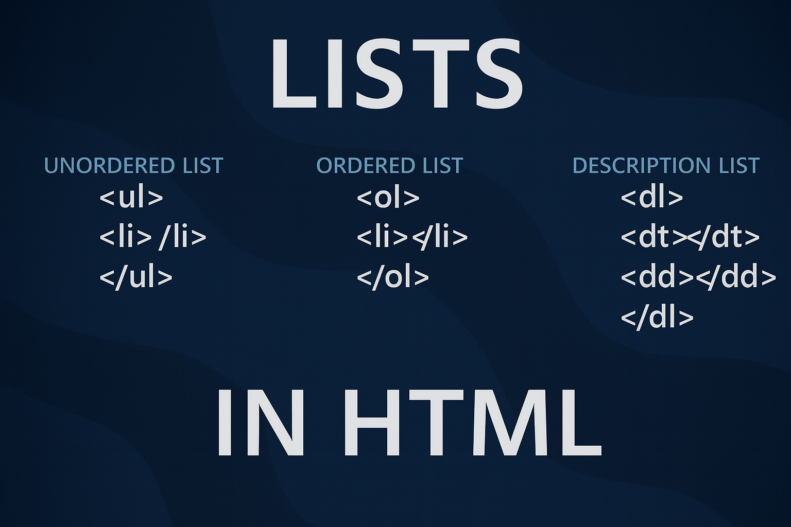

# Списки и их оформление



На предыдущих занятиях мы научились форматировать текст с помощью `HTML` и `CSS`, подбирать шрифты и делать страницы более читаемыми. Теперь настало время разобраться, как структурировать контент, чтобы информация выглядела логично и аккуратно.

Веб-страницы часто содержат наборы однотипных данных — списки покупок, шаги инструкции, пункты меню, контакты, услуги, задачи и т.д. Для таких случаев в `HTML` существуют списки (lists).

Списки помогают:

- Организовать информацию
- Сделать контент более читабельным
- Улучшить восприятие структуры страницы
- Облегчить навигацию по сайту

Примеры использования списков:

- Меню сайта
- Шаги инструкции
- Списки товаров
- Контакты
- Задачи и цели
- Пункты договоров и соглашений
- Списки литературы и источников

**Списки** — это один из самых часто используемых элементов `HTML`, и они применяются не только для текста, но и при создании навигации, меню, карточек, галерей и даже форм. Именно поэтому важно не просто знать теги списков, но и уметь их оформлять с помощью `CSS`.

## Виды списков в HTML

В `HTML` существуют три основных вида списков:

1. **Маркированные списки** (unordered lists) — используются для перечисления элементов без определенного порядка. Каждый элемент списка обозначается маркером (обычно точкой или кружком).
2. **Нумерованные списки** (ordered lists) — используются для перечисления элементов в определенном порядке. Каждый элемент списка нумеруется.
3. **Описание списков** (description lists) — используются для определения терминов и их описаний. Каждый термин сопровождается его определением.

Каждый из них используется в зависимости от контекста и цели представления информации.Рассмотрим каждый вид подробнее.

### Маркированные списки

Маркированные списки создаются с помощью тега `<ul>` (unordered list). Каждый элемент списка обозначается тегом `<li>` (list item). Используются для перечисления элементов без определенного порядка.

Пример маркированного списка:

```html
<h2>Плюсы быть программистом:</h2>
<ul>
  <li>Высокий доход</li>
  <li>Возможность работать удаленно</li>
  <li>Постоянное развитие и обучение</li>
  <li>Креативная работа</li>
  <li>Появляется любовь к кофе и котам :)</li>
</ul>
```

Браузер автоматически добавляет маркеры перед каждым элементом списка. По умолчанию это черные точки, но с помощью `CSS` можно изменить стиль маркеров.

Примеры стилей маркеров:

```css
ul {
  list-style-type: disc; /* Черные точки (по умолчанию) */
  list-style-type: circle; /* Пустые кружки */
  list-style-type: square; /* Черные квадраты */
  list-style-type: none; /* Без маркеров */
}
```

Также если нам не нужны маркеры можно просто применить свойство `list-style: none;`

```css
ul {
  list-style: none; /* Без маркеров */
}
```

Или если мы хотим использовать свои изображения в качестве маркеров:

```css
ul {
  list-style-image: url("path/to/image.png"); /* Пользовательское изображение */
}
```

Более современный способ стилизации маркеров — использование псевдоэлемента `::marker`:

```css
li::marker {
  color: blue; /* Цвет маркеров */
  font-size: 1.2em; /* Размер маркеров */
}
```

Так мы можем менять цвет, размер и другие свойства маркеров.

Расположение маркеров можно настроить с помощью свойства `list-style-position`:

```css
ul {
  list-style-position: inside; /* Маркеры внутри элемента списка */
  list-style-position: outside; /* Маркеры снаружи элемента списка (по умолчанию) */
}
```

Существуют и другие свойства для настройки списков, такие как `list-style`, которое объединяет несколько свойств в одно:

```css
ul {
  list-style: square inside url("path/to/image.png"); /* Комбинированное свойство */
}
```

Где:

- `square` — тип маркера
- `inside` — позиция маркера
- `url('path/to/image.png')` — пользовательское изображение

> Чаще всего мы будем использовать именно это свойство.

#### Вложенные списки:

```html
<ul>
  <li>
    <p>Фрукты</p>
    <ul>
      <li>Яблоки</li>
      <li>Бананы</li>
      <li>Вишня</li>
    </ul>
  </li>
  <li>
    <p>Овощи</p>
    <ul>
      <li>Морковь</li>
      <li>Картофель</li>
      <li>Свекла</li>
    </ul>
  </li>
</ul>
```

Можно комбинировать разные стили маркеров для разных уровней вложенности:

```css
ul {
  list-style-type: disc; /* Первый уровень - черные точки */
}
ul ul {
  list-style-type: circle; /* Второй уровень - пустые кружки */
}
ul ul ul {
  list-style-type: square; /* Третий уровень - черные квадраты */
}
```

#### Почему списки смещены вправо

Вы могли заметить, что списки по умолчанию имеют небольшой отступ от левого края. Это не ошибка — так браузеры делают текст списка более удобным для чтения.

Позже, когда мы будем изучать блочную модель и свойства отступов (`margin` и `padding`), вы узнаете, как управлять этим смещением и точно настраивать расположение элементов на странице.

> Пока достаточно знать, что каждый браузер применяет свои *“встроенные” *стили — они называются `user-agent styles`. Из-за этого списки, заголовки и параграфы могут иметь разные отступы в разных браузерах.

#### Пример навигационного меню с использованием маркированного списка

Очень часто списки используются для создания навигационных меню на сайтах. Вот пример простого навигационного меню, оформленного с помощью маркированного списка и `CSS`:

```html
<nav>
  <ul>
    <li><a href="#">Главная</a></li>
    <li><a href="#">О нас</a></li>
    <li><a href="#">Услуги</a></li>
    <li><a href="#">Контакты</a></li>
  </ul>
</nav>
```

Стилизация меню с помощью `CSS`:

```css
ul {
  list-style: none;
  padding: 0;
}

a {
  text-decoration: none;
  color: blue;
}
```

### Нумерованные списки

Нумерованные списки используются, когда важен порядок элементов. Например, при описании шагов, инструкций, рейтингов или последовательных действий.Создаются с помощью тега `<ol> `(ordered list), а каждый элемент списка задаётся тегом `<li>` (list item).

Пример нумерованного списка:

```html
<h2>Этапы изучения веб-разработки:</h2>
<ol>
  <li>Изучить основы HTML</li>
  <li>Освоить CSS</li>
  <li>Научиться работать с JavaScript</li>
  <li>Познакомиться с фреймворками</li>
  <li>Создать свой первый проект</li>
</ol>
```

По умолчанию браузер нумерует элементы арабскими цифрами (1, 2, 3...), но это поведение можно изменить с помощью атрибута `type`.

#### Aтрибут type для нумерованных списков

Атрибут type определяет вид нумерации списка:

| Значение | Описание                               |
| -------- | -------------------------------------- |
| `1`      | Арабские цифры (по умолчанию): 1, 2, 3 |
| `A`      | Прописные латинские буквы: A, B, C     |
| `a`      | Строчные латинские буквы: a, b, c      |
| `I`      | Прописные римские цифры: I, II, III    |
| `i`      | Строчные римские цифры: i, ii, iii     |

Пример использования атрибута type:

```html
<ol type="A">
  <li>Первый пункт</li>
  <li>Второй пункт</li>
  <li>Третий пункт</li>
</ol>
```

Это создаст нумерованный список с прописными латинскими буквами.

#### Атрибут start

Если нужно начать нумерацию не с единицы, используйте атрибут `start`:

```html
<ol start="5">
  <li>Пятый пункт</li>
  <li>Шестой пункт</li>
</ol>
```

Это создаст нумерованный список, начинающийся с цифры 5. Это удобно, если список разбит на части или продолжает предыдущий список на странице.

#### Атрибут reversed

Чтобы изменить направление нумерации, можно добавить атрибут `reversed`. В этом случае нумерация будет идти в обратном порядке:

```html
<ol reversed>
  <li>Третий шаг</li>
  <li>Второй шаг</li>
  <li>Первый шаг</li>
</ol>
```

Это создаст нумерованный список, начинающийся с наибольшего числа и уменьшающийся до 1.

#### Стилизация нумерованных списков с помощью CSS

Для изменения вида нумерации в `CSS` используется свойство `list-style-type` — так же, как и у маркированных списков.

```css
ol {
  list-style-type: decimal; /* по умолчанию */
  list-style-type: upper-roman; /* I, II, III */
  list-style-type: lower-alpha; /* a, b, c */
}
```

Вот некоторые популярные значения `list-style-type `для нумерованных списков:

| Значение               | Пример     |
| ---------------------- | ---------- |
| `decimal`              | 1, 2, 3    |
| `decimal-leading-zero` | 01, 02, 03 |
| `upper-roman`          | I, II, III |
| `lower-roman`          | i, ii, iii |
| `upper-alpha`          | A, B, C    |
| `lower-alpha`          | a, b, c    |

> В `HTML` и `CSS` нумерацию можно управлять как через атрибут `type`, так и через свойство `list-style-type`.
> Однако `CSS` даёт больше гибкости, и именно его предпочтительно использовать в современных проектах.

#### Вложенные нумерованные списки

Нумерованные списки, как и маркированные, можно вкладывать друг в друга:

```html
<ol>
  <li>
    Frontend:
    <ol>
      <li>HTML</li>
      <li>CSS</li>
      <li>JavaScript</li>
    </ol>
  </li>
  <li>
    Backend:
    <ol>
      <li>Python</li>
      <li>PHP</li>
      <li>Node.js</li>
    </ol>
  </li>
</ol>
```

Можно задавать разные типы нумерации для каждого уровня вложенности:

```css
ol {
  list-style-type: decimal;
}
ol ol {
  list-style-type: lower-alpha;
}
ol ol ol {
  list-style-type: lower-roman;
}
```

> Это помогает визуально различать уровни иерархии и делает структуру более читаемой.

#### Смешанные списки

Иногда бывает нужно объединить нумерованные и маркированные списки, например, чтобы показать последовательность действий, внутри которых есть подпункты.В таких случаях используется вложение разных типов списков.

Пример смешанного списка:

```html
<h2>Как приготовить кофе:</h2>
<ol>
  <li>
    Выберите кофе:
    <ul>
      <li>Зёрна арабики</li>
      <li>Зёрна робусты</li>
    </ul>
  </li>
  <li>
    Подготовьте оборудование:
    <ul>
      <li>Кофемолка</li>
      <li>Турка или кофеварка</li>
    </ul>
  </li>
  <li>Заварите и наслаждайтесь!</li>
</ol>
```

> Совет: Если структура списка сложная (например, с несколькими уровнями вложенности), используйте разные типы нумерации (1, 2, 3 → a, b, c) и маркеров(disc, circle) — это помогает глазам быстрее ориентироваться в информации.

### Списки описаний

Списки описаний используются для представления пар _"термин — определение"_ или вопрос — ответ, где каждому элементу соответствует пояснение.
Они создаются с помощью трёх тегов:

- `<dl>`— _description list_ — контейнер для всего списка;
- `<dt>` — _description term_— термин (название, понятие, вопрос);
- `<dd>` — _description definition_ — описание или определение термина.

Пример списка описаний:

```html
<h2>Основные языки веб-разработки</h2>
<dl>
  <dt>HTML</dt>
  <dd>Отвечает за структуру веб-страницы.</dd>

  <dt>CSS</dt>
  <dd>Определяет внешний вид элементов.</dd>

  <dt>JavaScript</dt>
  <dd>Добавляет интерактивность и динамику.</dd>
</dl>
```
Списки описаний полезны для создания словарей , FAQ(вопрос — ответ) и других структурированных данных, где важно связать термины с их определениями.

**Базовое оформление через CSS**

По умолчанию такие списки выглядят просто — но их можно оформить так, чтобы визуально выделить термины и определения:

```css
dl {
  margin: 20px 0;
}

dt {
  font-weight: bold;
  color: #0078d7;
  margin-top: 10px;
}

dd {
  margin-left: 20px;
  color: #444;
}
```

Это придаст списку более профессиональный вид и улучшит читаемость.

**Пример с немного более современным оформлением**

```css
dl {
  border-left: 3px solid #0078d7;
  padding-left: 15px;
}

dt {
  font-weight: 600;
  color: #0078d7;
  margin-top: 10px;
}

dd {
  margin: 0 0 10px 10px;
  color: #555;
}
```
> Не пугайтесь, пока что не все свойства и значения вам знакомы. Мы постепенно разберёмся с ними в следующих уроках. Главное — понять структуру списков и их назначение.

Советы:
- Каждый `<dt>` может иметь несколько `<dd>`, если нужно дать несколько определений.
- `<dd>` может содержать дополнительную разметку: ссылки, списки, изображения.
- Лучше не использовать `<dl> `для оформления обычных списков — это семантический элемент именно для пар *"термин–описание"*.

#### Пример: глоссарий на сайте

Один из самых частых примеров использования `<dl> `— это глоссарий терминов. Он помогает пользователям быстро находить определения важных слов и выражений.

```html
<h2>Глоссарий веб-разработчика</h2>
<dl>
  <dt>Frontend</dt>
  <dd>Часть веб-приложения, с которой взаимодействует пользователь напрямую (интерфейс).</dd>

  <dt>Backend</dt>
  <dd>Серверная часть приложения, которая обрабатывает данные и управляет логикой.</dd>

  <dt>API</dt>
  <dd>Интерфейс, который позволяет разным программам обмениваться данными между собой.</dd>

  <dt>Framework</dt>
  <dd>Набор инструментов и библиотек, упрощающих разработку приложений.</dd>
</dl>
```

Стилизация глоссария с помощью `CSS`:

```css
dl {
  background-color: #f9f9f9;
  border-left: 4px solid #0078d7;
  padding: 15px 20px;
  border-radius: 6px;
  max-width: 600px;
}

dt {
  font-weight: bold;
  color: #0078d7;
  margin-top: 10px;
}

dd {
  margin-left: 15px;
  color: #333;
  line-height: 1.5;
}
```


## Заключение

Мы разобрали один из самых универсальных инструментов `HTML` — списки. Теперь вы знаете, как с их помощью можно структурировать информацию, создавать навигацию, инструкции, FAQ и даже глоссарии.

Списки делают контент не просто аккуратнее, но и семантически понятнее — браузеру, поисковым системам и, самое главное, пользователю.

Научившись оформлять списки с помощью `CSS`, вы сделали ещё один шаг к созданию аккуратных и профессиональных веб-страниц.

> Помните: за простотой тегов `<ul>`, `<ol>` и `<dl>` скрывается огромный потенциал. Именно из них состоят меню, карточки товаров, галереи и даже формы — мы ещё вернёмся к этому, когда начнём разбирать блочную модель и верстку макетов.

На следующем занятии мы познакомимся с атрибутами `HTML` — узнаем, как добавлять элементам дополнительные свойства, использовать атрибуты `class` и `id`, и зачем они нужны при стилизации с помощью `CSS`.

Это откроет путь к созданию собственных стилей для отдельных элементов и к построению настоящей структуры страницы.

---
## Практика

**Задание: Сверстайте небольшую “страницу кафе”:**

1. **Создайте файл `cafe.html` и подключите к нему файл стилей `cafe.css`.**
2. **Создайте следующую структуру**:
   - Вверху — заголовок `<h1>`Меню кофейни`</h1>`
   - Под ним — маркированный список напитков (кофе, чай, сок, вода).
   - Затем — нумерованный список шагов “Как мы готовим кофе”.
   - Внизу — список описаний с терминами: “Арабика”, “Робуста” и их описаниями.

3. **Добавьте немного CSS:**
   - уберите стандартные маркеры у меню и сделайте их своими (например, квадратами);
   - нумерованный список выровняйте по центру;
   - термины в `<dl>`сделайте синими и жирными.

> Поэкспериментируйте с разными стилями списков и их оформлением. Попробуйте добавить отступы, изменить цвета и шрифты. Главное — потренироваться в создании и стилизации списков!
---