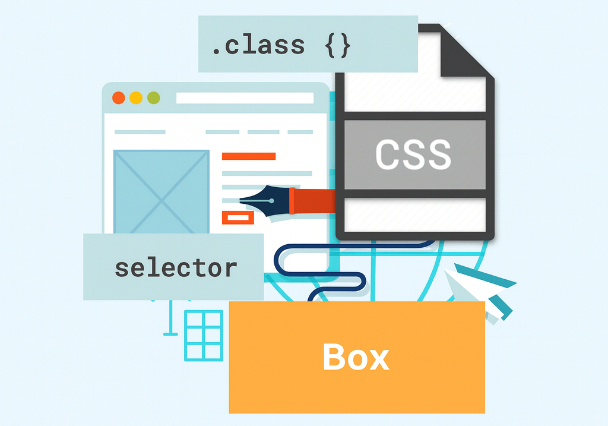
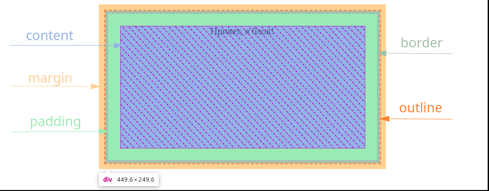
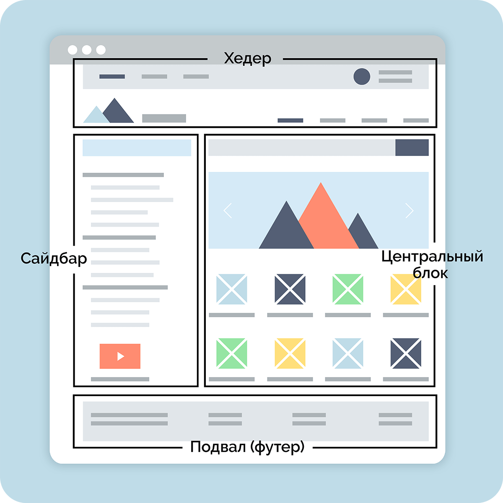
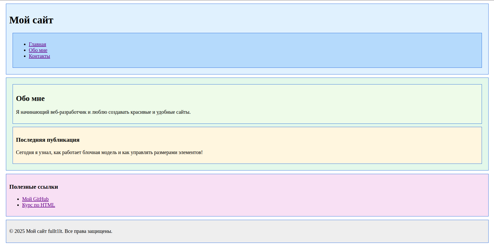

# Лекция 4. Блочная модель элементов, псевдоэлементы, псевдоклассы, селекторы



## Введение: зачем нужна блочная модель

Когда вы начинаете создавать веб-страницы, всё кажется простым: написали несколько тегов, добавили стили — и страница готова.
Но вскоре вы замечаете, что элементы начинают _«разъезжаться»_, отступы работают не так, как ожидалось, а текст выходит за границы блока.

Причина в том, что всё в HTML состоит из блоков. Каждый элемент на странице — это прямоугольник, который имеет размеры, границы и отступы. Этот прямоугольник называется box (бокс, контейнер). Совокупность всех этих свойств образует то, что в `CSS` называется блочной моделью `(Box Model)`.

Блочная модель — это фундамент `CSS`, без её понимания невозможно контролировать, как элементы располагаются на странице.

---

## Почему это важно?

Любой элемент, даже текст, — это _“коробка”_ с внутренним содержимым. Именно от понимания блочной модели зависит, как вы сможете выстраивать сетку сайта, делать адаптивную верстку, создавать карточки, кнопки, меню и макеты страниц.

Ошибки в отступах, _“разъехавшаяся”_ верстка и неровные блоки — почти всегда следствие неправильного понимания `Box Model`.

Пример: если вы хотите создать блок с текстом, вам нужно учитывать не только размер текста, но и внутренние отступы (padding), границы (border) и внешние отступы (margin). Без понимания блочной модели вы не сможете точно настроить внешний вид блока.

```html
<div>Привет, я блок!</div>
```

```css
div {
  width: 400px;
  height: 200px;
  padding: 20px;
  border: 5px solid #0078d7;
  margin: 10px;
  background-color: #f2f2f2;
  text-align: center;
  outline: 2px dashed #ff5722;
}
```

В этом примере:

- `width` и `height` - задают размеры содержимого блока.
- `padding` - добавляет внутренние отступы вокруг содержимого.
- `border` - создаёт границу вокруг блока.
- `margin` - добавляет внешние отступы между блоком и другими элементами.
- `background-color` - задаёт цвет фона блока.
- `text-align: center;` - центрирует текст внутри блока по горизонтали.
- `outline` - добавляет внешнюю линию вокруг блока, не влияя на его размер.

Результат будет выглядеть так:



Давайте разбираться как работает блочная модель и как её использовать для создания красивых и аккуратных веб-страниц!

---

## Блочная модель элементов (Box Model)


Каждый элемент на веб-странице можно представить в виде прямоугольной коробки `(box)`. Эта коробка определяет, сколько места занимает элемент, где он находится и как взаимодействует с другими элементами. Браузер вычисляет размеры каждого блока, используя четыре области:

| Область | Описание                                                                                                                     |
| -------------- | ------------------------------------------------------------------------------------------------------------------------------------ |
| `content`    | Содержимое элемента — текст, изображение или другие вложенные элементы. |
| `padding`    | Внутренний отступ между содержимым и границей (`border`).                                  |
| `border`     | Граница (рамка), которая окружает padding и контент.                                              |
| `margin`     | Внешний отступ — пространство между элементом и соседними элементами.    |
| `outline`    | Внешняя линия вокруг элемента, не влияющая на размер блока.                         |

Вернемся к нашему примеру с блоком:

```css
div {
  width: 400px;
  height: 200px;
  padding: 20px;
  border: 5px solid #0078d7;
  margin: 10px;
  background-color: #f2f2f2;
  text-align: center;
  outline: 2px dashed #ff5722;
}
```

В этом примере браузер рассчитывает общий размер блока так:

```text
Общая ширина = width + padding-left + padding-right + border-left + border-right + margin-left + margin-right
Общая высота = height + padding-top + padding-bottom + border-top + border-bottom + margin-top + margin-bottom
```

Если мы подставим наши значения:

```text
Общая ширина = 400px + 20px + 20px + 5px + 5px + 10px + 10px = 470px
Общая высота = 200px + 20px + 20px + 5px + 5px + 10px + 10px = 270px
```

Таким образом, даже если вы задали ширину и высоту блока как `400px` и `200px`, фактический размер, занимаемый блоком на странице, будет больше из-за отступов, границ и внешних отступов.

Чтобы посмотреть в браузере как работает блочная модель, можно использовать инструменты разработчика (`DevTools`). Для этого нажмите `F12` или правой кнопкой мыши выберите *"Просмотреть код"* `(Inspect)`. В панели `DevTools` выберите элемент на странице, и вы увидите визуальное представление его блочной модели, включая размеры контента, `padding`, `border` и `margin`.


Пока мы рассматриваем блочную модель, важно понимать, что разные элементы ведут себя по-разному. Некоторые из них занимают всю строку целиком и начинаются с новой — такие элементы называют блочными. Другие располагаются внутри строки, рядом с текстом — их называют строчными.

Например, `<div>` и `<p>`— блочные элементы, а `<span> `и `<a>` — строчные. Блочные элементы именно те, у которых свойства `margin`, `padding`, `width` и `height` работают *“в полный рост”*.

---

### Свойство box-sizing

По умолчанию браузеры используют модель `content-box`, в которой размеры (`width` и `height`) задаются только для области содержимого.
Если вы хотите, чтобы в размеры элемента входили и `padding`, и `border` — можно изменить поведение модели с помощью свойства `box-sizing.`

| Значение | Как работает                                                                                                                                          |
| ---------------- | ---------------------------------------------------------------------------------------------------------------------------------------------------------------- |
| `content-box`  | (по умолчанию) — размеры задаются только для контента.`Padding` и `border` добавляются сверху. |
| `border-box`   | размеры включают в себя padding и border. Общая ширина и высота не увеличиваются.                          |

> Примечания:
>
> - У строчных элементов вертикальные `margin-top/bottom` не влияют на разметку (игнорируются).
> - `padding-top/bottom` у строчных учитывается и может визуально увеличивать линию текста, но не «выталкивает» соседние блоки как у блочных элементов.

Пример использования `box-sizing`:

```html
<div class="box1">content-box</div>
<div class="box2">border-box</div>
```

```css
div {
  display: inline-block;
  background-color: #e0e0e0;
  margin: 10px;
  padding: 20px;
  border: 5px solid #0078d7;
  width: 200px;
}

.box1 { box-sizing: content-box; }
.box2 { box-sizing: border-box; }

```

> В первом блоке (`.box1`) с `content-box` общая ширина будет `250px` (200 + 20 + 20 + 5 + 5), а во втором блоке (`.box2`) с `border-box` общая ширина останется `200px`, так как padding и border уже включены в заданную ширину.

**Рекомендация**

В реальной разработке почти всегда применяют модель `border-box`,чтобы проще управлять размерами и избежать *“всплывания”* блоков.

> P.S. **“Всплывания”** - это когда блоки начинают выходить за пределы своих контейнеров из-за неправильных расчетов размеров.

Обычно это делают глобально для всех элементов:

```css
*{
  box-sizing: border-box;
}
```

Это помогает верстке быть предсказуемой и упрощает расчёт размеров.

Теперь, когда вы понимаете, из чего состоит каждый элемент и как рассчитываются его размеры, можно перейти к структуре страницы — и увидеть, как все эти блоки складываются в полноценный макет.

---

## Структура страницы и основные блочные элементы



Когда вы создаёте веб-страницу, все элементы — это блоки, но не все блоки одинаковы. Чтобы страница была понятной не только людям, но и браузерам, поисковым системам и экранным читалкам, важно использовать семантические блочные элементы — то есть такие, которые имеют смысл.

До `HTML5` почти все блоки создавали с помощью `<div>`, но теперь у нас есть специальные теги, которые помогают описать структуру страницы более логично.

### Основные семантические блочные элементы в HTML5:

| Тег        | Назначение                                                                                                          | Пример использования                        |
| ------------- | ----------------------------------------------------------------------------------------------------------------------------- | -------------------------------------------------------------- |
| `<header>`  | Верхняя часть страницы или раздела (обычно логотип, меню, заголовок). | Шапка сайта                                          |
| `<nav>`     | Блок для навигации (меню, ссылки на разделы).                                              | Главное меню сайта                             |
| `<main>`    | Основное содержимое страницы (уникальное для каждой страницы).           | Статья, каталог товаров                    |
| `<section>` | Раздел контента, объединённый общей темой.                                                | Блок “О нас”, “Отзывы”, “Контакты” |
| `<article>` | Самостоятельный материал, который можно использовать отдельно.         | Новость, пост в блоге                         |
| `<aside>`   | Боковая панель с дополнительной информацией.                                           | Реклама, ссылки, рекомендации         |
| `<footer>`  | Нижняя часть страницы (контакты, копирайт, соцсети).                                | Подвал сайта                                        |
| `<div>`     | Универсальный контейнер, не несёт смысловой нагрузки.                           | Для группировки элементов               |

> Нюанс: на странице может быть несколько `header/footer` но только **один** `<main>`, он содержит основное уникальное содержимое страницы.

Использование этих семантических элементов помогает структурировать страницу так, чтобы она была понятна и удобна для всех пользователей и устройств.
Главная разница между ними и обычным `<div>` в том, что они несут смысловую нагрузку и описывают роль содержимого внутри них.

> Совет: старайтесь использовать семантические элементы по назначению. Это улучшит SEO вашего сайта и сделает его более доступным.
> P.S. Вы можете использовать `<div>`, когда нет подходящего семантического тега, но старайтесь минимизировать его использование.

Пример базовой структуры страницы:

```html
<body>
  <nav>
    <ul>
      <li><a href="#">Главная</a></li>
      <li><a href="#">Обо мне</a></li>
      <li><a href="#">Контакты</a></li>
    </ul>
  </nav>
  <header>
    <h1>Мой сайт</h1>
  </header>

  <main>
    <section>
      <h2>Обо мне</h2>
      <p>Я начинающий веб-разработчик и люблю создавать красивые и удобные сайты.</p>
    </section>

    <article>
      <h3>Последняя публикация</h3>
      <p>Сегодня я узнал, как работает блочная модель и как управлять размерами элементов!</p>
    </article>
  </main>

  <aside>
    <h3>Полезные ссылки</h3>
    <ul>
      <li><a href="https://github.com/fullt1lt">Мой GitHub</a></li>
      <li><a href="https://github.com/fullt1lt/CoursesFrontend">Курс по HTML</a></li>
    </ul>
  </aside>

  <footer>
    <p>© 2025 Мой сайт fullt1lt. Все права защищены.</p>
  </footer>
</body>
```

И дополнительные стили для базового оформления:

```css
header, nav, main, section, article, aside, footer {
  border: 1px solid #0078d7;
  padding: 10px;
  margin: 10px;
}

header { background-color: #e3f2fd; }
nav { background-color: #bbdefb; }
main { background-color: #e8f5e9; }
section { background-color: #f1f8e9; }
article { background-color: #fff3e0; }
aside { background-color: #f3e5f5; }
footer { background-color: #eeeeee; }
```

Результат будет выглядеть примерно так:



Этот пример демонстрирует, как можно использовать семантические блочные элементы для создания структурированной и понятной страницы. Каждый блок имеет своё назначение, что облегчает навигацию и восприятие контента.

Важно блокам добавлять фон чтобы разделять контент визуально. Это делается с помощью свойства `background` в `CSS`.

| Свойство        | Назначение                                                                                            |
| ----------------------- | --------------------------------------------------------------------------------------------------------------- |
| `background-color`    | Задает цвет фона элемента.                                                                |
| `background-image`    | Устанавливает изображение в качестве фона (`url('image.jpg')`).          |
| `background-repeat`   | Определяет, повторяется ли фон (`no-repeat`, `repeat-x`, `repeat-y`).           |
| `background-position` | Указывает положение фона (например,`center`, `top right`).                    |
| `background-size`     | Управляет размером фонового изображения (`cover`, `contain`, `100%`). |
| `background`          | Сокращённая запись всех свойств в одной строке.                         |

```css
section {
  background-color: #f1f8e9; /* светло-зелёный фон */
  background-image: url('pattern.png'); /* фоновое изображение */
  background-repeat: no-repeat; /* не повторять изображение */
  background-position: center; /* центрировать изображение */
  background-size: cover; /* покрыть весь блок изображением */
}
```

Можно записать короче, используя сокращённую форму:

```css
section {
  background: #f1f8e9 url('pattern.png') no-repeat center / cover;
}
```

Если фон нужно сделать только цветом, без изображения:

```css
section {
  background-color: #f1f8e9; /* только цвет фона */
  background-image: none;    /* без фонового изображения */
}
```

> Совет: светлые нейтральные цвета фона помогают отделять блоки и повышают читаемость текста. Фоновое изображение лучше использовать умеренно, чтобы не отвлекать от контента.

### Блочные и строчные элементы: в чём разница?

Теперь, когда вы познакомились с основными блочными элементами, важно понять, что не все `HTML`-теги ведут себя одинаково. В `HTML` элементы делятся на два типа: блочные `(block)` и строчные `(inline)`.

| Характеристика                                            | Блочные элементы                                | Строчные элементы                      |
| ----------------------------------------------------------------------- | -------------------------------------------------------------- | ------------------------------------------------------ |
| Начинаются с новой строки                         | ✅ Да                                                        | ❌ Нет                                              |
| Можно задавать `width` и `height`                     | ✅ Да                                                        | ❌ Нет                                              |
| Учитывают `margin` и `padding` со всех сторон | ✅ Да                                                        | ⚠️ Только по горизонтали          |
| Занимают всю ширину родителя                   | ✅ Да                                                        | ❌ Нет                                              |
| Располагаются друг под другом                 | ✅ Да                                                        | ❌ Нет                                              |
| Примеры                                                          | `<div>`, `<p>`, `<section>`, `<article>`, `<header>` | `<span>`, `<a>`, `<strong>`, `<em>`, `` |

**Пример: разница между блочным и строчным элементом**

```html
<div>Я блочный элемент</div>
<span>А я строчный элемент</span>
<span>и я тоже</span>
```

```css
div {
  background-color: #bbdefb;
  width: 200px;
  padding: 10px;
  margin-bottom: 10px;
}

span {
  background-color: #c8e6c9;
  padding: 10px;
  margin: 10px;
}
```

**Результат:**

- `<div> `займёт всю строку и отодвинет всё, что после, вниз.
- `<span>` — расположится в одну линию с другими строчными элементами.
- Попытка задать `width` или `height` для `<span> `не сработает.


**Зачем это знать?**

Понимание разницы между блочными и строчными элементами — основа вёрстки. Позже мы узнаем, как управлять их поведением с помощью свойств `display`, `inline-block`, `flex` и `grid`.

Но пока достаточно помнить:

> Всё, что должно стоять “в столбик” — блочные элементы.
> Всё, что должно идти “в строку” — строчные элементы.

---

## Классы и атрибуты для стилизации блоков в HTML и CSS

До этого мы стилизовали элементы напрямую — через теги, например:

```css
p {
  color: blue;
}
h1 {
  text-align: center;
}
```

Но что делать, если нужно стилизовать только один конкретный элемент, а не все `<p>` или `<h1> `на странице?

Для этого в HTML существуют атрибуты `class` и `id`,которые позволяют *“называть”*элементы и обращаться к ним из `CSS`.

### Атрибут class

Атрибут `class` используется, чтобы задать элементу одно или несколько *“имен”* (классов). С его помощью можно применять стили к группе элементов с одинаковым классом.

```html
<p class="note">Это важное замечание.</p>
<p class="note">А это ещё одно важное замечание.</p>
```

```css
.note {
  color: darkblue;
  background-color: #e8f0fe;
  padding: 10px;
  border-left: 4px solid #0078d7;
}
```

Все элементы с классом `note` будут выглядеть одинаково.

### Несколько классов на одном элементе

Вы можете назначить элементу несколько классов, разделяя их пробелами:

```html
<div class="note highlighted">Это выделенный блок.</div>
```

```css
.note {
  border: 2px solid #0078d7;
  padding: 20px;
}

.highlighted {
  background-color: yellow;
}
```

В этом примере блок будет иметь стили обоих классов: рамку из класса `note` и жёлтый фон из класса `highlighted`. Так можно комбинировать стили для создания сложных эффектов.

### Атрибут id

Атрибут `id` — это уникальный идентификатор элемента. На странице не должно быть двух элементов с одинаковым `id`**(Это важно!)**.

```html
<h1 id="main-title">Добро пожаловать!</h1>
```

```css
#main-title {
  color: #0078d7;
  text-transform: uppercase;
}
```

В отличие от класса (`.`), в `CSS` перед `id` ставится решётка `#`.

#### Разница между class и id

| Характеристика                                                       | `class`                            | `id`                                                                     |
| ---------------------------------------------------------------------------------- | ------------------------------------ | -------------------------------------------------------------------------- |
| Можно использовать для нескольких элементов | ✅ Да                              | ❌ Нет                                                                  |
| Можно использовать несколько значений            | ✅ Да                              | ❌ Нет                                                                  |
| Синтаксис в CSS                                                          | `.имя`                          | `#имя`                                                                |
| Где применяется чаще                                             | Для групп элементов | Для уникальных элементов (например, #header) |

На практике почти всегда используют классы, а `id` — только для уникальных случаев (якоря, `JavaScript`, уникальные блоки).

**Пример: использование классов на практике**

```html
<h2 class="section-title">Наши услуги</h2>

<ul class="services-list">
  <li class="service-item">Разработка сайтов</li>
  <li class="service-item">Настройка SEO</li>
  <li class="service-item">Техническая поддержка</li>
</ul>
```

```css
.section-title {
  color: #0078d7;
  font-size: 24px;
  margin-bottom: 10px;
}

.services-list {
  list-style-type: none;
  padding: 0;
}

.service-item {
  color: #333;
  padding: 5px 0;
}
```

Такой подход делает код гибким: можно менять оформление отдельных групп элементов, не трогая всё остальное.

**Советы по использованию классов**

- Называйте классы осмысленно: вместо `.b1 → .main-text`, вместо `.red → .error-message.`
- Используйте английские имена (это стандарт в `HTML/CSS`).
- Не злоупотребляйте `id` — в больших проектах их почти не используют для стилей.
- Если нужно стилизовать однотипные элементы по-разному, используйте разные классы: `.btn-primary`, `.btn-secondary`, `.btn-danger` и т.д.

Пример использования классов и `id` вместе:

```html
<header id="main-header" class="header">
  <h1 class="site-title">Мой сайт</h1>
</header>
```

---

## Display: block, inline, inline-block, none

Свойство `display` определяет, как элемент отображается на странице — как самостоятельный блок, часть строки или временно скрытый объект. Давайте рассмотрим основные значения свойства `display`:

| Характеристика                                            | Блочные элементы                                | Строчные элементы                      |
| ----------------------------------------------------------------------- | -------------------------------------------------------------- | ------------------------------------------------------ |
| Начинаются с новой строки                         | ✅ Да                                                        | ❌ Нет                                              |
| Можно задавать `width` и `height`                     | ✅ Да                                                        | ❌ Нет                                              |
| Учитывают `margin` и `padding` со всех сторон | ✅ Да                                                        | ⚠️ Только**по горизонтали** |
| Занимают всю ширину родителя                   | ✅ Да                                                        | ❌ Нет                                              |
| Располагаются друг под другом                 | ✅ Да                                                        | ❌ Нет                                              |
| Примеры                                                          | `<div>`, `<p>`, `<section>`, `<article>`, `<header>` | `<span>`, `<a>`, `<strong>`, `<em>`, `` |

> Исключение: замещаемые элементы (например, ``, `<input>`, `<textarea>`) ведут себя особым образом: для них обычно работают `width/height`, а вертикальные `margin/padding` учитываются в размере области отображения.

Давайте рассмотрим примеры для каждого значения:

```html
<a class="btn">Кнопка</a>
<nav class="menu">
  <a class="menu__item">Главная</a>
  <a class="menu__item">Блог</a>
  <a class="menu__item">Контакты</a>
</nav>
```

```css
.btn {
  display: inline-block;
  padding: 8px 14px;
  background: #0078d7;
  color: #fff;
  text-decoration: none;
  border-radius: 6px;
}

.menu__item {
  display: inline-block;
  padding: 6px 10px;
}
```

В этом примере:

- Кнопка `.btn` использует `inline-block`, что позволяет ей быть в строке с другими элементами, но при этом иметь свои размеры и отступы.
- Пункты меню `.menu__item` также используют `inline-block`, чтобы располагаться в одной строке, но иметь отступы для лучшего внешнего вида.
- Если бы мы использовали `display: block` для пунктов меню, они бы располагались друг под другом, занимая всю ширину родителя.

### Подробно о значениях display

Давайте рассмотрим каждое из основных значений свойства `display` подробнее.

#### display: block

Блочный элемент всегда начинается с новой строки и занимает всю ширину родителя. Примеры блочных элементов: `<div>`, `<p>`, `<h1>`-`<h6>`, `<section>`, `<article>`.

**Пример использования:**

```html
<div class="block-example">Я блочный элемент</div>
<div class="block-example">И я тоже</div>
```

```css
.block-example {
  display: block;
  background-color: #bbdefb;
  padding: 10px;
  margin-bottom: 10px;
}
```

Результат: каждый блок занимает всю ширину и располагается друг под другом. К блочным элементам можно применять `width`, `height`, `margin` и `padding` со всех сторон.

#### display: inline

Строчный элемент располагается в одной строке с другими элементами. Примеры строчных элементов: `<span>`, `<a>`, `<strong>`, `<em>`, ``. Часто используется для стилизации части текста.

**Пример использования:**

```html
<p>Текст <span class="inline-example">строчный элемент</span> внутри строки.</p>
```

```css
.inline-example {
  display: inline;
  background-color: #c8e6c9;
  padding: 6px;
  margin: 10px;
  width: 150px;  /* не сработает */
  height: 80px;  /* не сработает */
}
```

**Результат:**
Строчный элемент остаётся в строке, и попытка задать `width` и `height` не сработает. Вертикальные отступы (`margin-top` и `margin-bottom`) не влияют на расположение.

#### display: inline-block

Элемент ведёт себя как строчный (располагается в строке), но при этом позволяет задавать размеры и отступы, как блочный элемент.

**Пример использования:**

```html
<span class="inline-block-example">Кнопка 1</span>
<span class="inline-block-example">Кнопка 2</span>
```

```css
.inline-block-example {
  display: inline-block;
  background-color: #ffe0b2;
  padding: 10px 15px;
  margin: 5px;
  border-radius: 6px;
}
```

**Результат:**
Элементы стоят рядом, но каждый имеет свои размеры. Этот тип часто используется для кнопок, меню, карточек и небольших блоков. Все свойства размеров и отступов работают корректно. Это свойство очень полезно, когда нужно создать элементы, которые должны быть в строке, но при этом иметь свои размеры и отступы.

#### display: none

Элемент полностью скрыт и не занимает место на странице. Это полезно, когда нужно временно убрать элемент из отображения. Например при создании выпадающих меню или модальных окон.

**Пример использования:**

```html
<p>Этот текст виден.</p>
<p class="hidden-text">А этот — скрыт.</p>
```

```css
.hidden-text {
  display: none;
}
```

**Результат:**
На странице будет виден только первый абзац, а второй полностью исчезнет и не займет места. Это свойство часто используется в сочетании с `JavaScript` для динамического управления видимостью элементов на странице.

**Практические советы по использованию `display`**

- Используйте `block` для элементов, которые должны занимать всю ширину и располагаться друг под другом.
- Используйте `inline` для стилизации частей текста внутри абзацев или других строчных элементов.
- Используйте `inline-block`, когда нужно, чтобы элементы располагались в строке, но при этом имели свои размеры и отступы. Между inline-block элементами может появляться небольшое пространство из-за пробелов в HTML-коде. Чтобы избежать этого, можно:
  - убрать пробелы между тегами в HTML,
  - задать родительскому элементу `font-size: 0;`, а потом восстановить размер шрифта для дочерних элементов,
  - использовать комментарии между тегами.
- Используйте `none`, чтобы временно скрыть элементы, не удаляя их из кода.
- Для выравнивания элементов по вертикали внутри строки с `inline-block` можно использовать свойство `vertical-align`. Например, `vertical-align: middle;` выровняет элемент по центру относительно соседних элементов.

---

## Отступы и размеры элементов

После того как мы разобрались, как элементы располагаются на странице с помощью `display`, пора научиться управлять расстояниями между ними и их размерами.
В этом помогают свойства `margin`, `padding`, `border`, `width` и `height`.

Отступы и размеры играют ключевую роль в создании аккуратной и удобной вёрстки. Давайте рассмотрим каждое из этих свойств подробнее.

### Внутренние и внешние отступы

Каждый элемент в HTML можно представить как прямоугольник. Чтобы правильно управлять его расположением, важно понимать разницу между внутренними и внешними отступами:

| Свойство | Что делает                                                                                                                                         | Где применяется   |
| ---------------- | ----------------------------------------------------------------------------------------------------------------------------------------------------------- | ------------------------------- |
| `padding`      | Добавляет**внутренние отступы** — пространство между контентом и границей (`border`). | Внутри элемента   |
| `margin`       | Добавляет**внешние отступы** — пространство между элементом и другими элементами. | Снаружи элемента |

#### Свойство padding

`padding` управляет расстоянием от содержимого элемента до его границ. Если задать `padding`, фон и границы растянутся, чтобы включить это пространство.

**Пример использования padding:**

```html
<div class="example-padding">Внутренние отступы (padding)</div>
```

```css
.example-padding {
  background-color: #bbdefb;
  padding: 20px; /* Отступы со всех сторон */
}
```

**Результат:**
Тут текст будет отодвинут от границ блока на 20px со всех сторон.

#### Свойство margin

`margin` управляет расстоянием между элементом и соседними элементами. Если задать `margin`, это пространство будет добавлено снаружи элемента.

**Пример использования margin:**

```html
<div class="example-margin">Внешние отступы (margin)</div>
```

```css
.example-margin {
  background-color: #c8e6c9;
  margin: 20px; /* Отступы со всех сторон */
}
```

**Результат:**
Этот блок будет отодвинут от других элементов на 20px со всех сторон.

#### Сокращённая запись для отступов

Можно задавать отступы для каждой стороны отдельно или использовать сокращённую запись:

```css
/* Одинаково для всех сторон */
margin: 20px;
padding: 10px;

/* Вертикаль | горизонталь */
margin: 10px 20px;
padding: 5px 15px;

/* top | горизонталь | bottom */
margin: 10px 15px 5px;
padding: 10px 15px 5px;

/* top | right | bottom | left */
margin: 10px 20px 30px 40px;
padding: 10px 20px 30px 40px;
```

#### Коллапс внешних отступов (margin collapse)

Особенность внешних отступов заключается в том, что если два блока идут друг за другом, то их внешние отступы могут **«сливаться»** (коллапсировать). В этом случае будет применён только больший из двух отступов. То есть если у первого блока `margin-bottom: 20px`, а у второго `margin-top: 30px`, то между ними будет всего `30px`, а не `50px`.

Пример коллапса отступов:

```html
<div class="box1">Блок 1</div>
<div class="box2">Блок 2</div>
```

```css
.box1 {
  background-color: #bbdefb;
  margin-bottom: 20px;
  padding: 10px;
}

.box2 {
  background-color: #c8e6c9;
  margin-top: 30px;
  padding: 10px;
}
```

Коллапс может происходить:

- между соседними блочными элементами;
- между родителем и его первым/последним дочерним элементом.

Как избежать коллапса:

- добавить родителю `padding-top `или `border-top`;
- использовать `overflow: hidden;` или `display: flow-root`; (создаёт новый контекст);
- применять `flex` или `grid` — у них отступы не сливаются.(об этом позже).

> Вертикальные margin не *коллапсируют* у `flex-элементов`, grid-элементов и у абсолютно позиционированных блоков.

#### Отрицательные отступы

Иногда может понадобиться **уменьшить** расстояние между элементами. Для этого можно использовать **отрицательные значения** для `margin`. Это позволит элементу «выйти» за пределы своего нормального расположения.

**Пример использования отрицательных отступов:**

```html
<div class="box-negative-margin">Блок с отрицательным отступом</div>
```

```css
.box-negative-margin {
  background-color: #ffe0b2;
  margin-top: -10px; /* Поднимает блок вверх на 10px */
  padding: 10px;
}
```

**Результат:**
Блок будет поднят вверх на 10px, уменьшая расстояние до предыдущего элемента.

### Свойства width и height

Свойства `width` и `height` позволяют задавать размеры элементов. Они работают по-разному в зависимости от типа элемента и значения свойства `box-sizing`. По факту, они определяют размеры **содержимого** элемента.

Пример использования width и height:

```html
<div class="box-size">Блок с заданными размерами</div>
```

```css
.box-size {
  background-color: #d1c4e9;
  width: 300px;  /* Ширина содержимого */
  height: 150px; /* Высота содержимого */
  padding: 20px;
  border: 5px solid #7e57c2;
}
```

Единицы измерения в CSS

| Тип единицы                 | Пример                       | Описание                                                          |
| ------------------------------------- | ---------------------------------- | ------------------------------------------------------------------------- |
| Абсолютные                  | `px`, `cm`, `mm`             | Фиксированные значения                               |
| Относительные            | `%`                              | Относительно родителя                                 |
| Относительно шрифта | `em`, `rem`                    | Относительно размера шрифта                      |
| Относительно окна     | `vw`, `vh`, `vmin`, `vmax` | Проценты от ширины/высоты окна браузера |

Тут `vw` — 1% от ширины окна, `vh` — 1% от высоты окна, а `vmin` и `vmax` — минимальное и максимальное значение между `vw` и `vh` соответственно.

Советы по использованию размеров:

- Используйте `px` для точного контроля над размерами.
- Используйте `%` для адаптивной вёрстки, чтобы элементы подстраивались под размер родителя.
- Используйте `em` и `rem` для размеров, зависимых от шрифта, чтобы обеспечить масштабируемость текста и элементов.
- Помните о влиянии `padding`, `border` и `margin` на общие размеры элемента в зависимости от значения `box-sizing`.
- старайтесь избегать фиксированных размеров там, где это возможно, чтобы обеспечить адаптивность и гибкость дизайна.
  - например , вместо `width: 400px;` можно использовать `width: 80%;`
  - вместо `height: 300px;` можно использовать `height: 50vh;` или вообще не задавать высоту, позволяя контенту определять её.

Пример использования всех свойств вместе:

```html
<div class="container">Полный пример блока</div>
```

```css
.container {
  width: 80%;
  padding: 2rem;
  margin: 5vh auto;
  border: 3px solid #0078d7;
  background-color: #f0f4ff;
  height: 200px;
}
```

### Минимальные и максимальные размеры

Иногда важно ограничить, насколько сильно элемент может растягиваться или сжиматься. Для этого используются свойства `min-width`, `max-width`, `min-height` и `max-height`.

| Свойство | Что делает                                                                                                                                                                                                      | Когда применять                                                                                                                           |
| ---------------- | ------------------------------------------------------------------------------------------------------------------------------------------------------------------------------------------------------------------------ | ------------------------------------------------------------------------------------------------------------------------------------------------------- |
| `min-width`    | Минимальная ширина элемента — меньше этого значения блок не станет.                                                                                             | Чтобы текст или изображение не «сжимались» слишком сильно при адаптивной верстке. |
| `max-width`    | Максимальная ширина элемента — шире этого значения блок не растянется.                                                                                       | Чтобы элемент не «расползался» на больших экранах.                                                           |
| `min-height`   | Минимальная высота — элемент не станет ниже заданного значения.                                                                                                    | Чтобы сохранить визуальный баланс карточек или блоков.                                                   |
| `max-height`   | Максимальная высота — при превышении контент начнет прокручиваться или выходить за границы (в зависимости от `overflow`). | Для контейнеров с ограниченным содержимым, списков, текстовых блоков.                        |

Пример использования минимальных и максимальных размеров:

```html
<div class="size-example">
  Этот блок растягивается, но не меньше 200px и не больше 600px.
</div>
```

```css
.size-example {
  width: 80%;              /* адаптивная ширина */
  min-width: 200px;        /* не меньше 200px */
  max-width: 600px;        /* не больше 600px */
  min-height: 100px;       /* минимальная высота */
  max-height: 300px;       /* максимальная высота */
  background-color: #e8f5e9;
  border: 2px solid #4caf50;
  padding: 20px;
}
```

**Результат:**

- Элемент будет занимать `80%` ширины родителя.
- Если окно станет меньше, ширина не опустится ниже `200px`.
- Если окно станет шире, блок не превысит `600px`.
- Высота блока не будет ниже `100px`, но при большом тексте может увеличиться до `300px`.
- Если контента станет слишком много — он начнёт вылезать за пределы.

#### Управление переполнением контента

Чтобы контролировать, что происходит, когда содержимого становится больше, чем выделенное пространство, используется свойство `overflow`.

| Значение | Описание                                                                                                                                  |
| ---------------- | ------------------------------------------------------------------------------------------------------------------------------------------------- |
| `visible`      | (по умолчанию) содержимое выходит за пределы элемента и отображается полностью |
| `hidden`       | лишнее содержимое обрезается и не отображается                                                           |
| `scroll`       | добавляются полосы прокрутки, чтобы можно было просмотреть всё содержимое         |
| `auto`         | полосы прокрутки появляются только при необходимости                                               |

**Пример использования overflow:**

Создадим блок с ограниченной высотой и добавим туда много текста, чтобы увидеть, как работает переполнение:

```html
<div class="overflow-example"> 
  <p>Дополнительный текст для демонстрации переполнения.</p>
  <p>Дополнительный текст для демонстрации переполнения.</p>
  <p>Дополнительный текст для демонстрации переполнения.</p>
</div>
```

```css
.overflow-example {
  width: 300px;
  height: 100px; /* Ограниченная высота */
  overflow: auto; /* Добавляет полосу прокрутки при необходимости */
  background-color: #fff3e0;
  border: 2px solid #ff9800;
  padding: 10px;
  white-space: nowrap; /* Запрещает перенос строк для демонстрации горизонтальной прокрутки */
}
```

Теперь при большом объёме текста в блоке появится прокрутка, а сам блок не будет увеличиваться бесконечно.

У свойства `overflow` есть ещё одна полезная опция — `white-space`, которая управляет переносом текста внутри элемента. Например, `white-space: nowrap;` запрещает перенос строк, что может быть полезно для создания горизонтальных списков или меню.

Так же существуют свойства `overflow-x` и `overflow-y`, которые позволяют управлять переполнением по горизонтали и вертикали отдельно.

```css
.overflow-example {
  overflow-x: auto; /* Горизонтальная прокрутка при необходимости */
  overflow-y: hidden; /* Вертикальное переполнение скрыто */
}
```

Это полезно, когда нужно контролировать поведение прокрутки в разных направлениях.

### Границы элемента: border

`border` — это рамка вокруг области содержимого и `padding`. Она состоит из трёх частей: толщина, стиль, цвет.

| Свойство/часть | Что делает                | Примечания                                                                                              |
| --------------------------- | ---------------------------------- | ----------------------------------------------------------------------------------------------------------------- |
| `border-width`            | Толщина рамки          | `thin`/`medium`/`thick` или значения: `1px`, `0.5rem`…                                      |
| `border-style`            | Как выглядит линия | `none`, `solid`, `dashed`, `dotted`, `double`, `groove`, `ridge`, `inset`, `outset`, `hidden` |
| `border-color`            | Цвет рамки                | По умолчанию —`currentColor` (цвет текста элемента)                               |

Важный нюанс `Box Model`:

- При `box-sizing: content-box` толщина рамки увеличивает общий размер элемента.
- При `box-sizing: border-box` рамка включена в заданные `width/height`.

Порядок задания границы очень важен:

```css
/* Ко всем сторонам сразу */
.box { border: 2px solid #7e57c2; }

/* Только одна сторона */
.box { border-left: 4px solid #0078d7; }

/* По сторонам отдельно */
.box {
  border-top: 1px dashed #aaa;
  border-right: 0;                   /* без рамки */
  border-bottom: 3px solid #333;
  border-left: 3px solid #333;
}
```

> Цвет можно опустить — тогда используется `currentColor`. Прозрачная рамка: `border-color: transparent;` (полезно для «выравнивания» без видимой линии).

Примеры использования border:

```сss
.border-example1 {
  border: 3px solid #4caf50; /* Толстая зелёная рамка */
}
.border-example2 {
  border: 2px dashed #ff5722; /* Пунктирная оранжевая рамка */
}
.border-example3 {
  border: 4px double #3f51b5; /* Двойная синяя рамка */
}
.border-example4 {
  border: 2px dotted #9c27b0; /* Точечная фиолетовая рамка */
}
```

### Скругление углов: border-radius

На практике часто используют скруглённые углы для создания более мягкого и современного дизайна. Для этого используется свойство `border-radius`. Оно позволяет задать радиус скругления углов рамки элемента. Что очень просто и эффективно улучшает внешний вид блоков.

**Пример использования border-radius:**

```css
.card { 
  border: 2px solid #e2e8f0;
  border-radius: 12px;  /* все углы 12px */
}

.badge {
  border-radius: 9999px;      /* «пилюля» (capsule) создает полностью округлый элемент */
}

/* или так */
.badge {
  width: 100px;
  height: 40px;
  border-radius: 20px;        /* половина высоты для «пилюли» */
}

/* Порядок: top-left, top-right, bottom-right, bottom-left */
.panel { border-radius: 8px 16px 8px 16px; }

/* Элиптическое скругление: горизонтальные / вертикальные радиусы */
.tile { border-radius: 20px 40px / 10px 20px; }

/* Круг из квадрата */
.circle { 
  width: 100px;
  height: 100px;
  border-radius: 50%;
}
```

**Пример контента с разными скруглениями:**

При больших радиусах внутренний контент может *«выпирать»* за скругление. Добавьте `overflow: hidden;`, чтобы контент обрезался по форме.

```html
<div class="card">
  <h2>Карточка с скруглёнными углами</h2>
  <p>Этот блок имеет скруглённые углы благодаря свойству border-radius.</p>
  
</div>
```

```css
.card {
  display: block;
  border: 2px solid #e2e8f0;
  border-radius: 16px; /* Скругляет углы блока */
  padding: 20px;
  max-width: 300px;
  overflow: hidden; /* Обрезает контент по форме скругления */
  box-shadow: 0 4px 18px rgba(0,0,0,.06); /* Тень для эффекта подъёма */
  text-align: center; /* Центрирует текст и изображение */
}

.avatar {
  width: 100px;
  height: 100px;
  object-fit: cover; /* Заполняет область, сохраняя пропорции */
  border-radius: 50%; /* Скругляет изображение до круга */
}
```

**Результат:**

Результат:

- У карточки — мягкие скруглённые углы и рамка.
- Изображение внутри повторяет форму блока и не выходит за границы.
- Свойство `overflow: hidden` обрезает всё, что выходит за радиус рамки, создавая аккуратный визуальный эффект.
- Тень добавляет глубину и делает дизайн более привлекательным.
- Центрирование текста и изображения улучшает композицию внутри карточки.
- Использование `object-fit: cover` гарантирует, что изображение заполнит отведённое пространство без искажений.

Свойство object-fit полезно для адаптивных изображений, особенно в аватарах и карточках товаров. Варианты использования 'object-fit':

| Значение | Описание                                                                                                                                                       |
| ---------------- | ---------------------------------------------------------------------------------------------------------------------------------------------------------------------- |
| `fill`         | Изображение растягивается, чтобы заполнить контейнер,                                                                   |
| `contain`      | Изображение масштабируется, чтобы полностью поместиться в контейнер без обрезки                  |
| `cover`        | Изображение масштабируется, чтобы заполнить контейнер, обрезая лишнее при необходимости   |
| `none`         | Изображение сохраняет свои оригинальные размеры, может выходить за пределы контейнера       |
| `scale-down`   | Изображение масштабируется вниз, если оно больше контейнера, иначе остаётся без изменений |

---

## Селекторы в CSS

Селекторы — это способ выбрать элементы на странице, к которым будут применяться стили. В CSS существует множество типов селекторов, которые позволяют точно нацеливаться на нужные элементы. Давайте рассмотрим основные из них.

### Типы селекторов:

**Простые селекторы**

```css
/* По тегу (элементу) */
p { margin-bottom: 12px; }

/* По классу */
.note { background: #e8f0fe; }

/* По id (уникален на странице) */
#main-title { text-transform: uppercase; }

/* Универсальный (любой элемент) */
* { box-sizing: border-box; }

/* Группировка селекторов */
h1, h2, h3 { color: #0d47a1; }
```

**Комбинированные селекторы (отношения в дереве):**

```css
/* Потомок: любой уровень вложенности */
header nav a { text-decoration: none; }

/* Прямой потомок: только на один уровень глубже */
ul > li { margin-bottom: 6px; }

/* Сосед справа: элемент сразу после */
h2 + p { margin-top: 4px; }

/* Все последующие соседи */
.card ~ .card { margin-top: 12px; } /* Все карточки после первой */
```

**Атрибутные селекторы**

Атрибутные селекторы позволяют применять стили к элементам в зависимости от значений их атрибутов. Например, можно выбрать все ссылки, ведущие на внешний сайт, или все изображения определённого формата.

**Cсылки на внешние сайты**

```css
/* Все ссылки, которые ведут на внешний сайт */
a[href^="https://"] {
  color: #1565c0;
  text-decoration: underline;
}
```

```html
<a href="https://github.com/fullt1lt">Мой GitHub</a>
<a href="index.html">Главная</a>
```

В этом примере стиль применится только к первой ссылке, потому что её атрибут `href` начинается с `https://.`

> `^= `— означает *“начинается с”*. Полезно для выделения внешних ссылок на другие сайты.

**Ссылки на изображения**

```css
a[href$=".jpg"] {
  color: #2e7d32;
}
```

```html
<a href="photo.jpg">Фото</a>
<a href="index.html">Главная</a>
```

Стиль применится только к первой ссылке, поскольку значение `href` заканчивается на .`jpg`.

> `$=` — означает *“заканчивается на”*. Можно использовать для выделения ссылок на файлы определённого типа — .`jpg`, `.pdf`, `.zip` и т.д.

**Изображения определённого формата**

```css
img[src$=".png"] {
  border: 2px solid #81c784;
  border-radius: 8px;
}
```

```html


```

Рамка и скругление появятся только у `.png` изображений.

> Атрибутные селекторы часто используют для иконок, логотипов или для выделения разных форматов изображений.

| Синтаксис                                                                                                   | Что делает                                            | Пример           |
| -------------------------------------------------------------------------------------------------------------------- | -------------------------------------------------------------- | ---------------------- |
| `[attr]`                                                                                                           | Элемент, у которого есть атрибут    | `[href]`             |
| `[attr^="текст"]`                                                                                             | Значение**начинается** с текста | `[href^="https://"]` |
| `[attr$="текст"]` | Значение **заканчивается** на текст | `[src$=".png"]` |                                                                |                        |
| `[attr*="текст"]`                                                                                             | Значение**содержит** текст          | `[href*="github"]`   |

---

### Приоритетность (specificity) в CSS

Когда к одному элементу применяются несколько правил `CSS`, браузер должен решить, какое из них важнее. Этот процесс называется приоритетностью (или специфичностью).

`CSS` определяет, насколько *“точно”* селектор указывает на элемент. Чем конкретнее селектор — тем выше его приоритет.

Уровни приоритетности:

| Уровень                            | Пример                      | Вес (specificity) | Комментарий                                                |
| ---------------------------------- | --------------------------- | ----------------- | --------------------------------------------------------   |
| **Inline-стили**                   | `<a style="color:red">`     | **1-0-0-0**       | Всегда приоритетнее внешних CSS                            |
| **ID**                             | `#header`                   | **0-1-0-0**       | Очень высокий приоритет                                    |
| **Классы, псевдоклассы, атрибуты** | `.menu`, `:hover`, `[href]` | **0-0-1-0**       | Средний приоритет                                          |
| **Теги и псевдоэлементы**          | `div`, `a`, `::before`      | **0-0-0-1**       | Низкий приоритет                                           |
| **Универсальный селектор**         | `*`                         | **0-0-0-0**       | Почти не имеет веса                                        |
| **!important**                     | `color: red !important;`    | —                 | Принудительно перекрывает всё, кроме `inline + !important` |

**Пример**
```html
<a id="main-link" class="link" href="#">Моя ссылка</a>
```
```css
a { color: green; }          /* 0-0-0-1 */
.link { color: blue; }       /* 0-0-1-0 */
#main-link { color: orange; }/* 0-1-0-0 */
a { color: red !important; } /* !important */
```

В этом примере цвет ссылки будет красным из-за `!important`, несмотря на то, что у неё есть более специфичные селекторы.

Пример со спором селекторов
```html
<div class="father">
  <a class="test" href="#">Ссылка</a>
</div>
```
```css
.father a {
  color: blue;
}

.father .test {
  color: red;
}

```

В этом случае цвет ссылки будет красным, так как селектор `.father .test` (0-0-2-0) имеет более высокий приоритет, чем `.father a` (0-0-1-1).

**Правило «последнее объявление побеждает»**

Если два селектора имеют одинаковый уровень приоритетности, то применяется то правило, которое объявлено позже в коде.

```css
p { color: green; } /* Первое объявление */
p { color: blue; }  /* Второе объявление */
```
В этом случае все абзацы будут синими, так как второе объявление переопределяет первое.

**Как проверить приоритетность**

1. Откройте DevTools (`F12 `→ вкладка `“Elements”`).
2. Выберите элемент и откройте вкладку `“Styles”`.
3. В ней браузер покажет перечёркнутые свойства — это те, что были переопределены селекторами с более высоким приоритетом.


**Советы**

- Не злоупотребляйте `!important` — это признак “аварийного” стиля.
- Стройте стили от общих к частным, чтобы `CSS` оставался предсказуемым.
- Для повышения приоритета — добавьте класс, а не `id`.
- Если порядок сложен — временно включите `outline` или `border`, чтобы видеть, какой стиль реально применяется.

## Псевдоклассы

**Псевдоклассы** — это специальные ключевые слова, которые добавляются к селекторам, чтобы описать состояние элемента, которого нет в `HTML`.
Например: элемент наведен курсором, был посещён, выбран, является первым в списке и т.д. Псевдоклассы начинаются с двоеточия `:` и позволяют динамически изменять внешний вид элементов при определённых условиях.

### Псевдоклассы состояния

Используются для изменения внешнего вида элементов в зависимости от действий пользователя.

| Псевдокласс | Когда срабатывает                                                            | Пример применения |
| ---------------------- | -------------------------------------------------------------------------------------------- | --------------------------------- |
| `:hover`             | При наведении курсора мыши на элемент                        | Меню, кнопки            |
| `:active`            | Когда элемент нажат                                                         | Кнопки, ссылки        |
| `:focus`             | Когда элемент в фокусе (например, при вводе текста) | Поля форм                 |
| `:visited`           | Для ссылок, которые уже посещались                              | Навигация                |

**Пример: ссылки с разными состояниями**

```html
<a href="#">Главная</a>
<a href="#">Контакты</a>
```

```css
a {
  color: #1565c0;
  text-decoration: none;

  /* При наведении */
  &:hover {
    color: #0d47a1;
    text-decoration: underline;
  }
  /* При клике */
  &:active {
    color: #ef6c00;
  }
  /* Посещённая ссылка */
  &:visited {
    color: #6a1b9a;
  }
}
```

**Результат:**

- При наведении ссылка меняет цвет и подчёркивается.
- При клике становится оранжевой.
- Если ссылка уже была посещена, она будет фиолетовой

> Порядок написания псевдоклассов важен: `:hover` должен идти после `:link` и `:visited`, чтобы стили применялись корректно.

**Пример: кнопка с эффектом наведения и нажатия**

```html
<button class="btn">Нажми меня</button>
```

```css
.btn {
  background-color: #42a5f5;
  color: white;
  border: none;
  padding: 10px 20px;
  border-radius: 6px;
  cursor: pointer;
  transition: 0.2s;
}

.btn:hover {
  background-color: #1e88e5;
}

.btn:active {
  background-color: #1565c0;
}
```

**Результат:**
При наведении цвет кнопки немного темнеет, а при нажатии — становится ещё насыщеннее. Так создаётся ощущение взаимодействия с элементом.

---

## Псевдоклассы положения

Используются для выбора элементов в зависимости от их позиции внутри родителя.

| Псевдокласс | Что выбирает                                | Пример           |
| ---------------------- | ------------------------------------------------------ | ---------------------- |
| `:first-child`       | Первый дочерний элемент           | `li:first-child`     |
| `:last-child`        | Последний дочерний элемент     | `li:last-child`      |
| `:nth-child(n)`      | Элемент по номеру или шаблону | `li:nth-child(2)`    |
| `:nth-child(odd)`    | Нечётные элементы (1, 3, 5…)          | `li:nth-child(odd)`  |
| `:nth-child(even)`   | Чётные элементы (2, 4, 6…)              | `li:nth-child(even)` |

Пример: оформление списка

```html
<ul>
  <li>Первый элемент</li>
  <li>Второй элемент</li>
  <li>Третий элемент</li>
  <li>Четвёртый элемент</li>
</ul>
```

```css
li {
  /* Первый элемент списка */
&:first-child {
  color: #1e88e5;
}
/* Последний элемент списка */
&:last-child {
  color: #ef5350;
}
/* Четный элемент списка */
&:nth-child(even) {
  background-color: #e3f2fd;
}
/* Нечётные элементы списка */
&:nth-child(odd) {
  background-color: #bbdefb;
}

}
```

> `:nth-child()` можно использовать с формулой, например `li:nth-child(3n)` — выберет каждый третий элемент.

---

## Псевдоэлементы

**Псевдоэлементы** позволяют добавлять декоративный контент до или после содержимого элемента, не меняя HTML-код.
Они начинаются с `::` и действуют как “виртуальные” дочерние элементы.

| Псевдоэлемент | Что делает                                                                           |
| -------------------------- | --------------------------------------------------------------------------------------------- |
| `::before`               | Добавляет контент**перед** содержимым элемента   |
| `::after`                | Добавляет контент**после** содержимого элемента |
| `::first-line`           | Применяет стиль к**первой строке** текста              |
| `::first-letter`         | Применяет стиль к**первой букве** текста                |

**Пример: использование `::before` и `::after`**

```html
<h2 class="title">Новости</h2>
```

```css
.title {
  &::before {
    content: '★ ';
    color: #f9a825;
  }
  &::after {
    content: ' ★';
    color: #f9a825;
  }
}
```

**Результат:**
Заголовок будет отображаться с звёздочками по бокам: `★ Новости ★`

> Псевдоэлементы не влияют на основной текст, а добавляют дополнительные визуальные элементы, например, иконки, кавычки или декоративные линии.

**Пример: декоративная линия под заголовком**

```html
<h2 class="decor-title">Контакты</h2>
```

```css
.decor-title {
  position: relative;
  display: inline-block;
  padding-bottom: 5px;
}

.decor-title::after {
  content: "";
  position: absolute;
  bottom: 0;
  left: 0;
  width: 100%;
  height: 3px;
  background-color: #42a5f5;
}
```

**Результат:**

Под заголовком появится красивая синяя линия, без использования `<hr>` или дополнительных блоков.

**Пример: стилизация первой буквы и первой строки*

```html
<p class="fancy-paragraph">
  Первый абзац с красивой первой буквой и выделенной первой строкой текста.<br>
  Здесь продолжается остальной текст абзаца, который не затрагивается стилями первой буквы и первой строки.
</p>
```

```css
.fancy-paragraph::first-letter {
  font-size: 2em;
  color: #d32f2f;
  margin-right: 8px;
}
.fancy-paragraph::first-line {
  font-weight: bold;
  color: #1976d2;
}
```

---

## Заключение

Сегодня вы узнали, что любое содержимое на веб-странице — это блок, и что именно блочная модель `(Box Model)` управляет тем, как эти блоки занимают место и взаимодействуют между собой.

Мы разобрали:

- как браузер вычисляет размеры элементов с учётом `margin`, `padding`, `border`, `width`, `height`;
- что такое блочные и строчные элементы и как свойство `display` меняет их поведение;
- как использовать семантические теги для логичной структуры страницы;
- как управлять отступами, границами и скруглениями, делая макет аккуратным;
- как с помощью селекторов точно выбирать нужные элементы;
- как псевдоклассы помогают реагировать на действия пользователя;
- и как псевдоэлементы добавляют декоративный контент без изменения `HTML`.

Эти знания — фундамент любой верстки. Дальше мы будем строить на этом, изучая продвинутые техники и современные подходы к созданию адаптивных и красивых веб-страниц.

---

## Практическое задание

Попробуйте закрепить материал на практике, создав простую страницу с несколькими блоками, отступами, рамками и декоративными элементами.

**Задача:**

Создайте страницу с навигацией, заголовком, основным контентом и футером. Стилизуйте её, применяя всё, что мы изучили в этой лекции.
- Используйте блочную модель для управления отступами и размерами.
- Добавьте рамки и скругления к блокам.
- Примените псевдоклассы для интерактивных элементов (например, кнопок или ссылок).
- Используйте псевдоэлементы для декоративных деталей (например, иконок или линий).