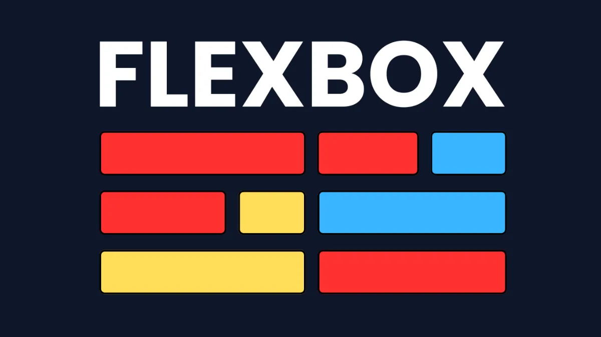
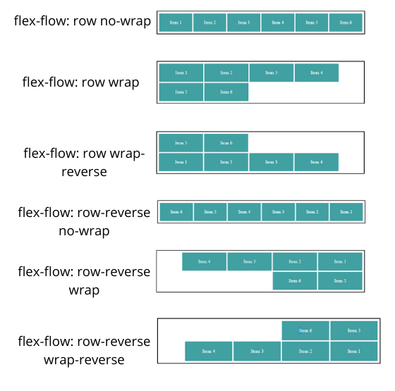
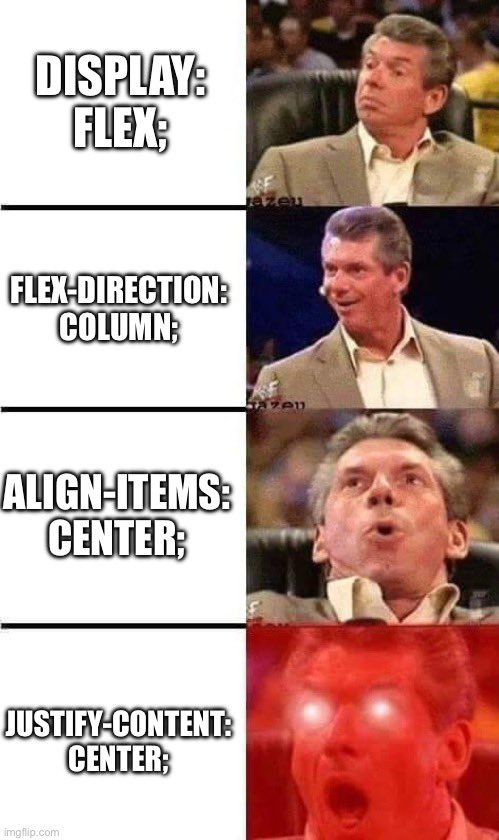
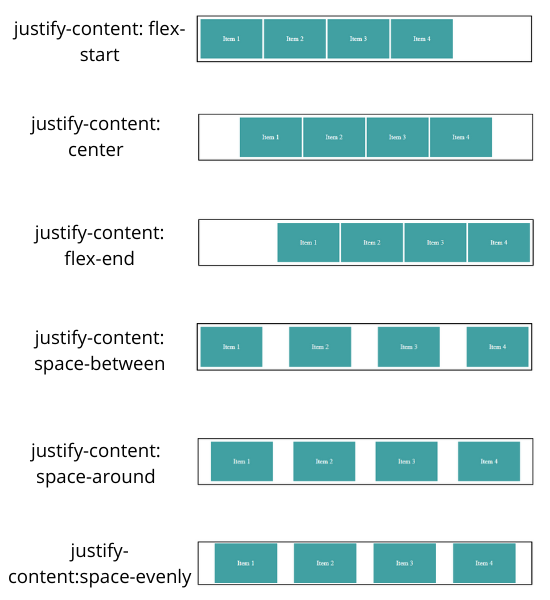
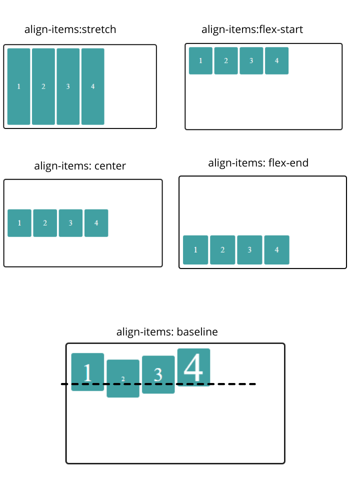
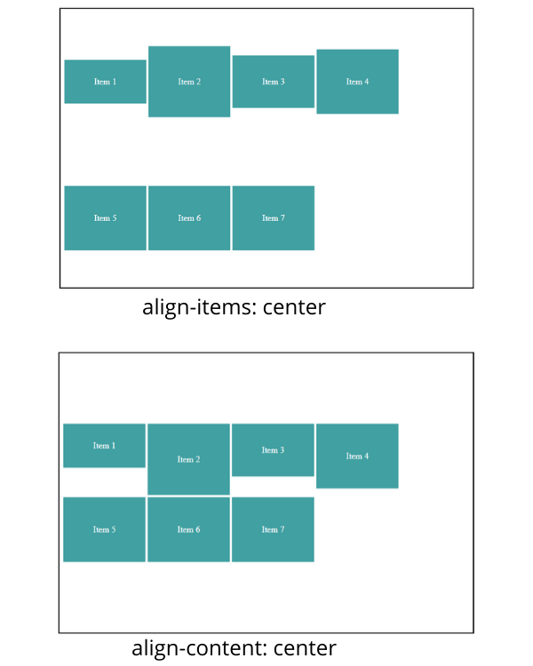
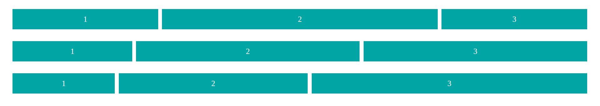

# Лекция 5. Гибкие макеты с Flexbox



## Введение: зачем нужен Flexbox

Когда веб-разработка только начинала активно развиваться, макеты сайтов создавались с помощью таблиц. Позже появились свойства `float` и `inline-block`, которые позволили выстраивать элементы в строку.

Однако такие решения имели массу ограничений: элементы часто *«ломали»* поток, было сложно выравнивать их по центру, а адаптивная вёрстка требовала множества обходных решений.

Ранее для размещения элементов в ряд использовалось свойство `float`, но оно имело ряд ограничений. `Flexbox` появился как современное решение этих проблем, обеспечивая гибкость, простоту и предсказуемость вёрстки.

## Что такое Flexbox


**Flexbox (Flexible Box Layout)** — это модель компоновки, предназначенная для гибкого расположения элементов внутри контейнера.
Она позволяет управлять выравниванием, направлением и распределением пространства между элементами даже при динамических размерах.

Главная идея `Flexbox` заключается в том, что теперь у нас есть контейнер, внутри которого элементы выстраиваются вдоль главной оси (`main axis`) и могут выравниваться вдоль поперечной оси (`cross axis`).

С помощью Flexbox можно:

- легко центрировать элементы по вертикали и горизонтали;
- автоматически подстраивать ширину и высоту блоков;
- изменять порядок элементов без изменения `HTML`-кода;
- создавать адаптивные интерфейсы для любых размеров экранов.

### Почему Flexbox стал стандартом

`Flexbox` заменил множество старых решений. Он делает вёрстку интуитивной и предсказуемой, а код — чистым и лаконичным.
Теперь разработчику не нужно прибегать к дополнительным обёрткам: всё решается простыми свойствами контейнера и его элементов.

Поддержка `Flexbox` есть во всех современных браузерах, поэтому сегодня это один из основных инструментов создания адаптивных макетов.

## Основные свойства Flexbox

Чтобы понимать, как работает `Flexbox`, важно разобраться в базовых понятиях. `Flexbox` — это не просто набор `CSS`-свойств, а целая модель распределения элементов внутри контейнера.

### Flex-контейнер и flex-элементы

Когда мы применяем свойство `display: flex` к элементу, он становится `Flex`-контейнером. Все его дочерние элементы автоматически становятся `flex`-элементами.

Контейнер управляет расположением, выравниванием и распределением пространства внутри себя. `Flex`-элементы — это содержимое, которое подчиняется правилам контейнера.

```html
<div class="container">
  <div class="item">1</div>
  <div class="item">2</div>
  <div class="item">3</div>
</div>
```

```css
.container {
  display: flex; /* создаём flex-контейнер */
  border: 2px solid #ccc;
}

.item {
  background: #90caf9;
  border: 1px solid #1565c0;
  padding: 10px;
}
```

Результат:

После применения `display: flex` элементы внутри `.container` выстроятся в ряд по горизонтали.

---

### Главная и поперечная оси


В `Flexbox` всё вращается вокруг двух осей:

- Главная ось (main axis) — определяет направление, в котором располагаются элементы. По умолчанию это горизонтальное направление: слева направо.
- Поперечная ось (cross axis) — перпендикулярна главной. По умолчанию она направлена сверху вниз.

Эти оси зависят от значения свойства `flex-direction`. Если вы меняете направление, оси тоже меняются местами.

### Основное свойство: display: flex

Чтобы превратить контейнер в `Flexbox`, нужно задать ему свойство `display: flex`.

```css
.container {
    display: flex; /* создаём flex-контейнер */
}
```

Теперь:

- элементы перестают вести себя как обычные блоки;
- контейнер управляет их направлением и выравниванием;
- к нему применяются свойства `Flexbox`, о которых мы поговорим далее.

> Важно помнить, что `display: flex` влияет только на непосредственных потомков контейнера. Вложенные элементы внутри `flex`-элементов не становятся `flex`-элементами автоматически. Если нужно, чтобы вложенные элементы тоже были `flex`-элементами, нужно отдельно задать им `display: flex`.

### Направление осей: flex-direction


Свойство `flex-direction` определяет направление главной оси и, соответственно, порядок расположения `flex`-элементов внутри контейнера.

```css
.container {
    display: flex;
    flex-direction: row; /* по умолчанию: слева направо */
}
```

Возможные значения:

- `row` — элементы идут слева направо (по умолчанию);
- `row-reverse` — справа налево;
- `column` — сверху вниз;
- `column-reverse` — снизу вверх.

Пример:

```css
.container {
    display: flex;
    flex-direction: column;
}
```

Теперь элементы будут располагаться вертикально, один под другим.

### Перенос строк: flex-wrap


По умолчанию все элементы `Flexbox` пытаются уместиться в одну строку, даже если им не хватает места. Чтобы разрешить перенос, используют свойство `flex-wrap`.

```css
.container {
  display: flex;
  flex-wrap: wrap;
}
```

Теперь если элементов слишком много, они будут переноситься на следующую строку.

Возможные значения:

- `nowrap` — все элементы в одной строке (по умолчанию);
- `wrap` — элементы переносятся на новую строку при нехватке места;
- `wrap-reverse` — перенос на новую строку, но в обратном порядке (снизу вверх).

### Сокращенное свойство: flex-flow



Чтобы не писать два свойства отдельно, можно использовать сокращённое свойство `flex-flow`, которое объединяет `flex-direction` и `flex-wrap`.

```css
.container {
  display: flex;
  flex-flow: row wrap; /* направление и перенос */
}
```

Экономит место и делает код чище.

## Основные свойства контейнера



`Flexbox` даёт разработчику полный контроль над тем, как элементы распределяются внутри контейнера. С помощью нескольких свойств можно выравнивать элементы по горизонтали, вертикали и управлять расстоянием между ними.

### Выравнивание по главной оси: justify-content



Это свойство отвечает за распределение пространства вдоль главной оси (по умолчанию — горизонтально).

```css
.container {
  display: flex;
  justify-content: center; /* выравнивание по центру */
}
```

Возможные значения:

| Значение  | Описание                                                                                                                                        |
| ----------------- | ------------------------------------------------------------------------------------------------------------------------------------------------------- |
| `flex-start`    | Элементы прижаты к началу контейнера**(по умолчанию)**                                                 |
| `flex-end`      | Элементы прижаты к концу контейнера                                                                                      |
| `center`        | Элементы выровнены по центру                                                                                                   |
| `space-between` | Первый элемент прижат к началу, последний — к концу, а между ними равные промежутки |
| `space-around`  | Элементы разделены равными отступами по бокам                                                                   |
| `space-evenly`  | Пространство равномерно распределено между всеми элементами и краями контейнера  |

Пример:

```css
.container {
  display: flex;
  justify-content: space-between; /* равномерное распределение */
}
```

Свойство `justify-content` особенно полезно для создания навигационных панелей, галерей и других элементов интерфейса, где важно равномерное распределение пространства между элементами.

### Выравнивание по поперечной оси: align-items



`align-items` управляет тем, как элементы располагаются по вертикали (если направление `flex-direction: row`).

> Если `flex-direction` установлен в `column`, то `align-items` будет влиять на горизонтальное выравнивание.

```css
.container {
  display: flex;
  align-items: center;
}
```

Возможные значения:

| Значение | Описание                                                                                             |
| ---------------- | ------------------------------------------------------------------------------------------------------------ |
| `stretch`      | Элементы растягиваются по высоте контейнера (по умолчанию) |
| `flex-start`   | Элементы прижаты к верхнему краю                                                 |
| `flex-end`     | Элементы прижаты к нижнему краю                                                   |
| `center`       | Элементы выровнены по центру                                                        |
| `baseline`     | Элементы выравниваются по базовой линии текста                      |

> Пример: с помощью `align-items: center` можно легко выровнять карточки или кнопки по вертикали без лишнего позиционирования.

### Выравнивание строк: align-content



Это свойство используется, когда элементы переносятся на несколько строк (при `flex-wrap: wrap`). Оно управляет тем, как распределяются все строки вдоль поперечной оси.

```css
.container {
  display: flex;
  flex-wrap: wrap;
  align-content: space-between;
}
```

Возможные значения:

| Значение  | Описание                                                                                                           |
| ----------------- | -------------------------------------------------------------------------------------------------------------------------- |
| `flex-start`    | Все строки прижаты к началу контейнера                                                    |
| `flex-end`      | Все строки прижаты к концу                                                                           |
| `center`        | Строки собраны в центре                                                                                |
| `space-between` | Равномерное распределение между строками                                              |
| `space-around`  | Отступы между строками и краями равномерные                                          |
| `stretch`       | Строки растягиваются, чтобы занять всё пространство (по умолчанию) |

> **Важно!!!** Свойство `align-content` влияет только тогда, когда есть несколько строк. Если все элементы помещаются в одну строку, это свойство не оказывает никакого эффекта.

### Сочетание свойств выравнивания

Часто используют комбинацию `justify-content` и `align-items`, чтобы добиться полного выравнивания по центру:

```css
.container {
  display: flex;
  justify-content: center; /* по горизонтали */
  align-items: center;     /* по вертикали */
}
```

Результат: все элементы будут идеально центрированы внутри контейнера.

### Практический пример: горизонтальное меню

```html
<nav class="menu">
  <a href="#">Главная</a>
  <a href="#">О нас</a>
  <a href="#">Услуги</a>
  <a href="#">Контакты</a>
</nav>
```

```css
.menu {
  display: flex;
  justify-content: space-between;
  align-items: center;
  background: #1565c0;
  padding: 10px 20px;
}

.menu a {
  color: white;
  text-decoration: none;
  font-weight: bold;
  &:hover {
    text-decoration: underline;
  }
}
```

Результат: горизонтальное меню с равномерным распределением пунктов и вертикальным выравниванием по центру.

## Основные свойства элементов

Если свойства контейнера управляют поведением всей группы элементов, то свойства `flex`-элементов определяют поведение каждого блока внутри контейнера. С их помощью можно задать, как элемент будет растягиваться, сжиматься, менять порядок или выравниваться независимо от остальных.

### order — изменение порядка элементов

По умолчанию элементы располагаются в том порядке, в котором они записаны в `HTML`. Однако с помощью свойства `order` можно изменить их порядок без изменения структуры разметки.

```html
<div class="container">
  <div class="item item1">1</div>
  <div class="item item2">2</div>
  <div class="item item3">3</div>
</div>
```

```css
.container {
  display: flex;
  border: 2px solid #ccc;
  padding: 10px;
}

.item {
  width: 100px;
  height: 100px;
  background: #90caf9;
  border: 1px solid #1565c0;
  margin: 5px;
  font-size: 24px;
  display: flex;
  justify-content: center;
  align-items: center;
}

/* Меняем порядок элементов */
.item1 { order: 3; }
.item2 { order: 1; }
.item3 { order: 2; }
```

Результат: визуальный порядок элементов будет `2 → 3 → 1`, несмотря на то, что в HTML они идут как `1, 2, 3`.

> Значение `order` по умолчанию — `0`. Чем меньше значение, тем раньше элемент отображается.

### flex-grow — распределение свободного пространства

Свойство `flex-grow `управляет тем, как элемент растягивается, если в контейнере есть свободное место.

```html
<div class="container">
  <div class="item item1">1</div>
  <div class="item item2">2</div>
  <div class="item item3">3</div>
</div>
```

```css
.container {
  display: flex;
  justify-content: space-between;
  align-items: center;
  padding: 10px 20px;
}

.item {
  background-color: #4CAF50;
  color: white;
  padding: 15px;
  margin: 5px;
  text-align: center;
  font-size: 20px;
}

.item1 { flex-grow: 1; }
.item2 { flex-grow: 2; }
.item3 { flex-grow: 1; }
```

- Элементы с `flex-grow: 0` (по умолчанию) не растягиваются.
- Элементы с одинаковым значением `flex-grow `делят свободное пространство поровну.
- Чем больше значение, тем большую часть свободного пространства элемент займёт.

> Пример: если задать `flex-grow: 2` для одного элемента, он займёт в два раза больше места, чем элемент с `flex-grow: 1`

Пример с разными значениями flex-grow

```html
    <div class="container">
      <div class="item item1-1">1</div>
      <div class="item item2-1">2</div>
      <div class="item item3-1">3</div>
    </div>
    <div class="container">
      <div class="item item1-2">1</div>
      <div class="item item2-2">2</div>
      <div class="item item3-2">3</div>
    </div>
    <div class="container">
      <div class="item item1-3">1</div>
      <div class="item item2-3">2</div>
      <div class="item item3-3">3</div>
    </div>
```

```css
.container {
  display: flex;
  justify-content: space-between;
  align-items: center;
  padding: 10px 20px;
}

.item {
  /* background-color: #4CAF50; */
  background-color: #41a0a2;
  color: white;
  padding: 15px;
  margin: 5px;
  text-align: center;
  font-size: 20px;
}

.item1-1 { flex-grow: 1; }
.item2-1 { flex-grow: 2; }
.item3-1 { flex-grow: 1; }

.item1-2 { flex-grow: 1; }
.item2-2 { flex-grow: 2; }
.item3-2 { flex-grow: 2; }

.item1-3 { flex-grow: 1; }
.item2-3 { flex-grow: 2; }
.item3-3 { flex-grow: 3; }
```

Результат: Все блоки в каждом контейнере будут занимать пространство пропорционально заданным значениям `flex-grow`.



### flex-basis — базовый размер элемента

Это свойство задаёт исходный размер элемента до распределения пространства. Оно может заменять `width` или `height` в зависимости от направления контейнера.

```css
.item {
  flex-basis: 200px;
}
```

- Если контейнер горизонтальный (`flex-direction: row`), `flex-basis` задаёт ширину.
- Если вертикальный (`flex-direction: column`), — высоту.
- Значение auto означает, что размер берётся из `width` или содержимого элемента.

### flex-shrink — сжатие при нехватке места

Когда контейнер становится меньше, чем суммарная ширина элементов, `Flexbox` начинает сжимать их. Свойство `flex-shrink` определяет, насколько сильно каждый элемент будет уменьшаться.

```css
.item1 { flex-shrink: 1; }
.item2 { flex-shrink: 2; }
```

- `flex-shrink: 0` — элемент не сжимается вовсе.
- Значение `1` — стандартное сжатие (по умолчанию).
- Чем больше значение, тем сильнее элемент уменьшается.

> Используется редко, но важно понимать: `flex-grow` отвечает за расширение, `flex-shrink` — за сжатие.

### flex — сокращённая запись

Чтобы не писать три свойства отдельно (`flex-grow`, `flex-shrink`, `flex-basis`), их объединяют в одно свойство `flex`.

```css
.item {
  flex: 1 1 200px;
}
```

Здесь:

- `1` — `flex-grow` (растягивание);
- `1` — `flex-shrink` (сжатие);
- `200px` — `flex-basis` (базовый размер).

Часто используют короткую запись `flex: 1`, что эквивалентно `flex: 1 1 0`.

### align-self — индивидуальное выравнивание элемента

Иногда нужно выровнять один элемент по-своему, независимо от других. Для этого используется свойство `align-self`.

```css
.item1 { align-self: flex-start; }
.item2 { align-self: center; }
.item3 { align-self: flex-end; }
```

`align-self` может принимать те же значения, что и `align-items`:

| Значение | Описание                                                                                                      |
| ---------------- | --------------------------------------------------------------------------------------------------------------------- |
| `auto`         | Наследует значение от `align-items` контейнера (по умолчанию)               |
| `flex-start`   | Элемент прижат к началу поперечной оси                                               |
| `flex-end`     | Элемент прижат к концу поперечной оси                                                 |
| `center`       | Элемент выровнен по центру                                                                     |
| `baseline`     | Элемент выравнивается по базовой линии текста                                 |
| `stretch`      | Элемент растягивается, чтобы занять всё доступное пространство |

### Итог: взаимодействие свойств

`Flexbox` позволяет точно управлять поведением каждого элемента. На практике чаще всего используются:

- `flex-grow` — чтобы элементы занимали всё доступное место;
- `flex` — как универсальная краткая запись;
- `align-self` — для выделения отдельного элемента.

## Взаимодействие свойств: flex-grow, flex-shrink, flex-basis

Эти три свойства определяют поведение `flex`-элементов при распределении пространства. Они управляют тем, как элементы растягиваются, сжимаются и какой размер берут за основу. Чтобы понять, как они работают вместе, разберём практический пример.

**Пример: сравнение `flex-grow`, `flex-shrink`, `flex-basis`**

```html
<div class="container">
  <div class="item item1">1</div>
  <div class="item item2">2</div>
  <div class="item item3">3</div>
</div>
```

```css

.container {
  display: flex;
  justify-content: flex-start;
  align-items: center;
  width: 100%;
  padding: 10px 20px;
  border: 2px solid #ccc;
}

.item {
  background-color: #009fa2;
  color: white;
  text-align: center;
  font-size: 20px;
  margin: 5px;
  padding: 15px;
  flex-basis: 100px; /* базовый размер */
}

/* Разное поведение */
.item1 { flex-grow: 0; flex-shrink: 0; }  /* фиксированный элемент */
.item2 { flex-grow: 2; flex-shrink: 1; }  /* растёт быстрее других */
.item3 { flex-grow: 1; flex-shrink: 1; }  /* растёт, но слабее */
```

**Результат:**

1. `flex-basis` — базовая ширина элемента (в данном случае `100px`).

- От этого значения `Flexbox` начинает расчёт.

2. `flex-grow`— определяет, насколько элемент увеличится, если в контейнере есть свободное место.

- У второго элемента `flex-grow: 2`, поэтому он займёт в два раза больше свободного пространства, чем третий (`flex-grow: 1`).
- Первый (`flex-grow: 0`) останется фиксированной ширины.

3. `flex-shrink` — определяет, насколько элемент уменьшится, если контейнеру не хватает места.

- У всех элементов `flex-shrink: 1`, кроме первого.
- При уменьшении ширины окна второй и третий элементы будут сжиматься, а первый — останется неизменным.

**Пример использования flex в разных элементах**

```css
.item {
  background-color: #009fa2;
  color: white;
  text-align: center;
  font-size: 20px;
  margin: 5px;
  padding: 15px;
}

.item1 { flex: 0 0 100px; }   /* фиксированный размер */
.item2 { flex: 2 1 100px; }   /* растёт активнее */
.item3 { flex: 1 1 100px; }   /* растёт слабее */
```

**Когда использовать**

| Сценарий                                            | Решение                               |
| --------------------------------------------------- | ------------------------------------- |
| Нужно, чтобы элемент оставался фиксированным        | `flex: 0 0 auto` или `flex-shrink: 0` |
| Нужно равномерное распределение элементов           | `flex: 1` для всех                    |
| Нужно, чтобы один элемент был в 2 раза шире другого | `flex: 2` и `flex: 1`                 |

## Практический пример: гибкий макет страницы с Flexbox

Создадим адаптивный макет страницы с использованием `Flexbox`, включающий шапку, боковую панель, основной контент и футер. В основном контенте разместим карточки услуг, которые будут гибко изменять размер в зависимости от ширины экрана.

```html
  <body>
    <header class="header">
      <nav class="menu">
        <a href="#">Главная</a>
        <a href="#">О нас</a>
        <a href="#">Услуги</a>
        <a href="#">Контакты</a>
      </nav>
    </header>

    <div class="layout">
      <aside class="sidebar">Боковая панель</aside>

      <main class="content">
        <h2>Наши услуги</h2>
        <ul class="cards">
          <li class="card">Карточка 1<br />Короткий текст</li>
          <li class="card">
            Карточка 2<br />Более длинное описание, которое занимает несколько
            строк
          </li>
          <li class="card">Карточка 3<br />Ещё немного текста</li>
        </ul>
      </main>
    </div>

    <footer class="footer">
      <p>© 2025 Все права защищены</p>
    </footer>
  </body>
```
```css
* { 
  list-style: none;
  margin: 0;
  padding: 0;
}

body {
  margin: 0;
  font-family: Arial, sans-serif;
  background-color: #0f172a;
  color: #ffffff;
  display: flex;
  flex-direction: column;
  min-height: 100vh;
}

.header {
  background-color: #1e293b;
  color: #ffffff;
  padding: 15px 30px;
  box-shadow: 0 2px 6px rgba(0, 0, 0, 0.4);
  border-bottom: 1px solid #334155;
}

.menu {
  display: flex;
  justify-content: space-between;
  align-items: center;
}

.menu a {
  color: #ffffff;
  text-decoration: none;
  font-weight: bold;
  transition: 0.3s;
}

.menu a:hover {
  color: #38bdf8;
}

.layout {
  display: flex;
  flex: 1;
}

.sidebar {
  background-color: #1e293b;
  color: #ffffff;
  width: 220px;
  padding: 20px;
  display: flex;
  justify-content: center;
  align-items: center;
  border-right: 1px solid #334155;
}

.content {
  background-color: #0f172a;
  flex: 1;
  padding: 20px 30px;
  display: flex;
  flex-direction: column;
}

.content h2 {
  text-align: center;
  color: #38bdf8;
  margin-bottom: 20px;
}

.cards {
  display: flex;
  justify-content: space-around;
  align-items: stretch;
  flex-wrap: wrap;
  gap: 20px;
  margin-top: 20px;
  padding-bottom: 20px;
}

.card {
  flex: 1 1 250px;
  background-color: #1e293b;
  color: #ffffff;
  padding: 25px;
  border-radius: 10px;
  box-shadow: 0 4px 10px rgba(0, 0, 0, 0.5);
  display: flex;
  justify-content: center;
  align-items: center;
  text-align: center;
  border: 1px solid #334155;
}

.card:hover {
  box-shadow: 0 6px 12px rgba(0, 0, 0, 0.6);
  background-color: #273449;
}

.footer {
  background-color: #1e293b;
  color: #94a3b8;
  text-align: center;
  padding: 15px;
  border-top: 1px solid #334155;
  font-size: 14px;
}
```

**Результат:**
- Адаптивный макет страницы с шапкой, боковой панелью, основным контентом и футером.
- Горизонтальное меню с равномерным распределением пунктов.
- Карточки услуг, которые растягиваются и сжимаются в зависимости от размера экрана.

## Заключение

**Flexbox** — это один из ключевых инструментов современной вёрстки. Он решает большинство задач, связанных с расположением элементов, выравниванием и адаптацией под разные размеры экранов. В отличие от старых методов (`float`, `inline-block`), `Flexbox` позволяет создавать гибкие макеты, которые легко масштабируются и остаются предсказуемыми при любых изменениях содержимого.

**Что важно запомнить**

1. `Flexbox` работает на уровне контейнера и его дочерних элементов.
  Достаточно задать `display: flex`, чтобы изменить логику расположения всех потомков.

2. **Главная и поперечная оси — основа всей модели.**
  От направления `flex-direction` зависит, как элементы выстраиваются и выравниваются.

3. **Выравнивание и распределение пространства**
  свойства `justify-content`, `align-items`, `align-content` позволяют гибко управлять положением элементов.

4. **Гибкое поведение элементов**
  свойства `flex-grow`, `flex-shrink`, `flex-basis` управляют тем, как элементы растягиваются, сжимаются и занимают пространство.

5. **Простота адаптации**
  с помощью `flex-wrap` можно легко создавать ряды карточек, которые автоматически переносятся при нехватке места.