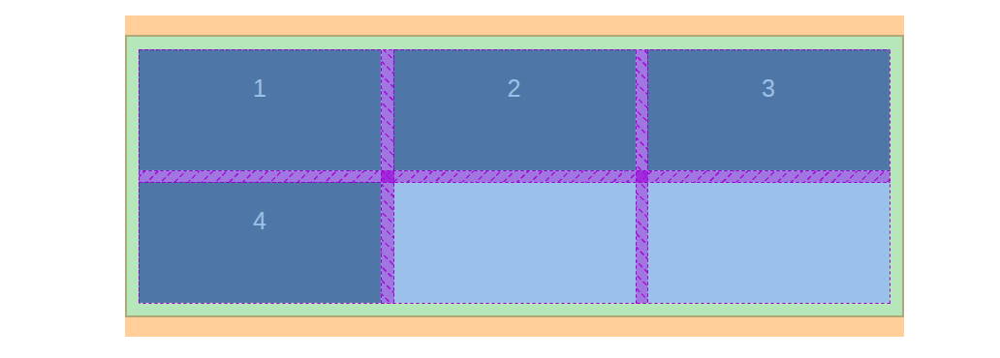
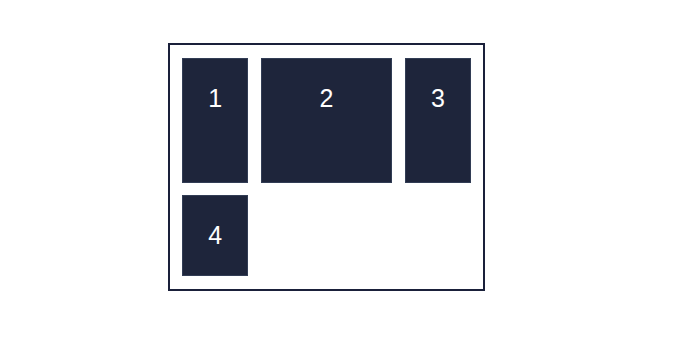
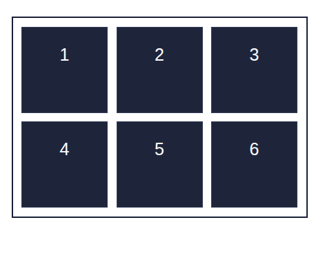
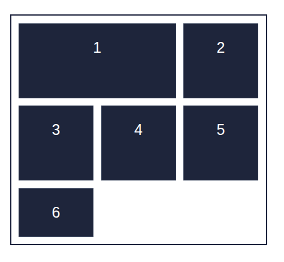
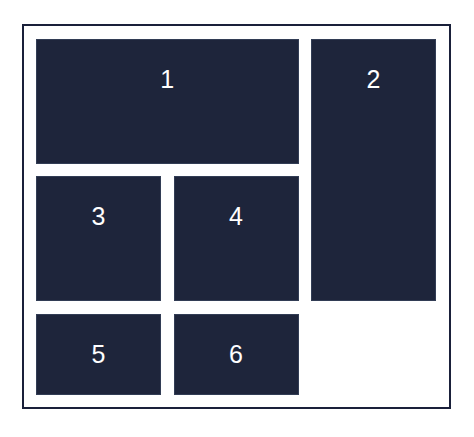
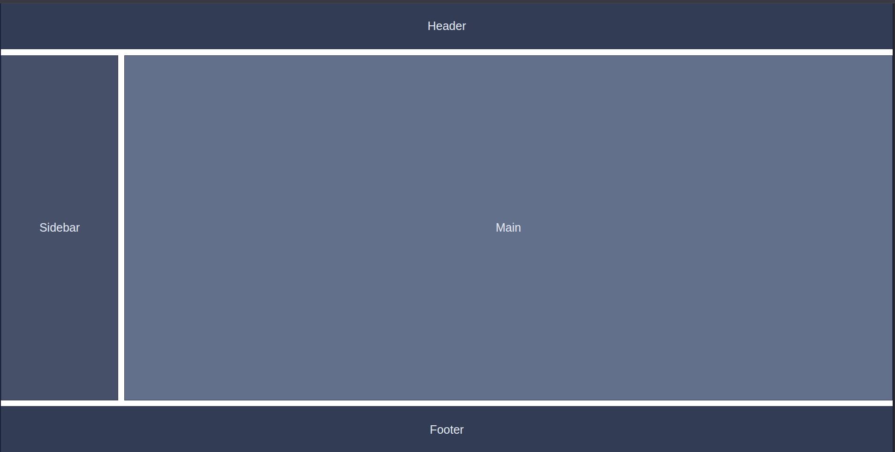
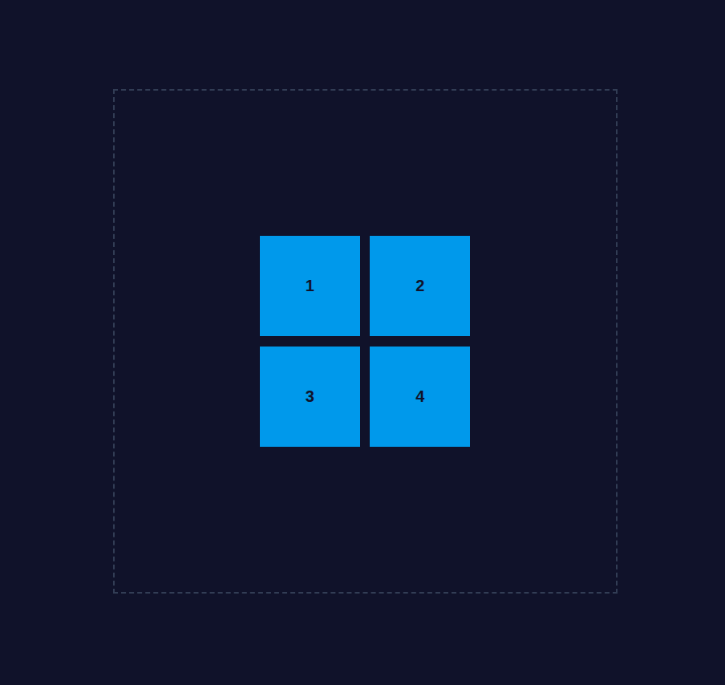
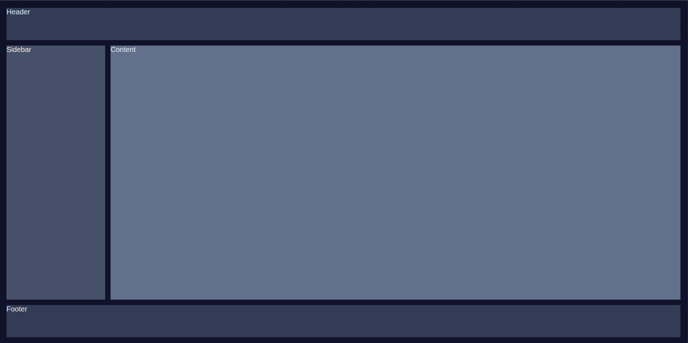

# Лекция 6. Сетки в веб-дизайне. CSS Grid


## Введение: зачем нужны сетки в веб-дизайне

Когда веб-дизайн только развивался, макеты сайтов создавались с помощью таблиц. Позже, с развитием `CSS`, появились `float`, `inline-block` и позже `Flexbox`, которые позволили располагать элементы более гибко.

Однако у всех этих инструментов есть общая проблема: они изначально не предназначались для построения двумерных сеток — макетов, где нужно управлять расположением элементов по строкам и по колонкам одновременно.

### Проблема классической вёрстки

С помощью `Flexbox` мы можем легко расположить элементы в строку или в колонку, но не управлять структурой сразу в обеих плоскостях.

Например, чтобы создать страницу с шапкой, боковой панелью, основным контентом и футером, приходится использовать вложенные контейнеры, что делает код менее наглядным:

```html
<div class="page">
  <header>Header</header>
  <div class="main">
    <aside>Sidebar</aside>
    <section>Content</section>
  </div>
  <footer>Footer</footer>
</div>
```

`Flexbox` отлично справляется с выравниванием в одном направлении, но становится сложным, когда нужно контролировать и `строки`, и `колонки` одновременно.

### Появление CSS Grid

`CSS Grid Layout` появился как решение этой проблемы. Это первый в `CSS` инструмент, созданный специально для двумерных макетов — работающих и по горизонтали, и по вертикали.

**Grid позволяет:**

- легко создавать сложные сетки без вложенных контейнеров;
- управлять размерами, отступами и выравниванием элементов сразу в двух направлениях;
- задавать шаблон сетки в виде строк и колонок
- описывать макет декларативно, в виде структуры, близкой к дизайну.

**Пример включения Grid:**

```css
.container {
  display: grid;
  grid-template-columns: 1fr 2fr;
  grid-template-rows: auto auto;
}
```

Теперь дочерние элементы автоматически распределяются в ячейки сетки.

**Разница между Flexbox и Grid**

| Свойство                   | Flexbox                                                    | Grid                                    |
| -------------------------- | ---------------------------------------------------------- | --------------------------------------- |
| Основное направление       | Одномерный (строка или колонка)                            | Двумерный (строки и колонки)            |
| Основная задача            | Выравнивание и распределение элементов в одном направлении | Построение полноценного макета страницы |
| Распределение пространства | Управление элементами внутри потока                        | Управление всей структурой страницы     |
| Пример использования       | Меню, карточки, списки                                     | Страница, сетка галереи, макет сайта    |

### Почему стоит изучать CSS Grid

- `Grid` значительно упрощает создание сложных макетов, которые раньше требовали большого количества обёрток.
- Он делает код логичным и читаемым — сетка описывается декларативно, а не через позиционирование.
- `Grid` отлично работает вместе с `Flexbox`: их можно комбинировать, используя `Grid` для общей структуры, а `Flexbox` — для мелких элементов внутри ячеек.

**CSS Grid Layout** — это фундамент для современного веб-дизайна. Он позволяет мыслить не как верстальщик, «складывающий блоки», а как дизайнер, определяющий сетку и размещающий элементы в ней точно по координатам.

**Пример вдохновляющих работ с использованием CSS Grid можно найти здесь:**

-  - Галерея **«Grid»** : коллекция сайтов с сетками.
-  - Галерея **«Made in Webflow»** : вдохновляющие проекты, созданные с использованием **CSS Grid**.
-  - Примеры и шаблоны для изучения **CSS Grid**.
-  - Лучшие сайты, использующие **CSS Grid**.

## Основные понятия и структура CSS Grid

`CSS Grid Layout `— это система двумерной компоновки, в которой элементы располагаются в строках и колонках. Чтобы эффективно использовать `Grid`, нужно понять базовые понятия: контейнер, элементы, ячейки, линии, треки и области.

### Grid-контейнер и grid-элементы

`Grid`, как и `Flexbox`, начинается с контейнера. Когда элементу задают свойство `display: grid`, он становится `Grid-`контейнером, а все его непосредственные дочерние элементы становятся `Grid`-элементами.

```html
<ul class="grid-container">
  <li class="item">1</li>
  <li class="item">2</li>
  <li class="item">3</li>
  <li class="item">4</li>
</ul>
```

```css
.grid-container {
  display: grid;
  list-style: none;
  padding: 10px;
  border: 2px solid #19253a;
}

.item {
  background-color: #1e293b;
  color: white;
  padding: 20px;
  text-align: center;
  font-size: 20px;
  border: 1px solid #334155;
}
```

После применения `display: grid `элементы выстраиваются по сетке. Пока мы не задали количество колонок и строк, браузер располагает их автоматически — в одну колонку.

**Результат:**


### Строки, колонки и ячейки (Grid Cells)

`Grid` делит пространство контейнера на строки `(rows)` и колонки `(columns)`. На пересечении строки и колонки находится ячейка `(grid cell)` — минимальная единица сетки.

- Совокупность строк и колонок образует `Grid Tracks` (треки) — горизонтальные и вертикальные полосы.
- Ячейки — это области, в которые помещаются `Grid`-элементы.
- Блоки - это группы ячеек, занимаемые элементами.


### Активация сетки

Чтобы сетка заработала, нужно задать количество строк и колонок.

Это делается с помощью свойств:

```css
.grid-container {
  display: grid;
  grid-template-columns: 200px 200px 200px; /* три колонки */
  grid-template-rows: 100px 100px; /* две строки */
  gap: 10px; /* отступы между ячейками */
}
```

Визуально это создаёт структуру `3×2`, в которую браузер автоматически распределяет элементы.



> Если элементов больше, чем ячеек — они переносятся в новые строки. Если меньше — пустые ячейки остаются свободными.

### Единицы измерения в Grid

`Grid` поддерживает несколько типов единиц измерения, которые можно комбинировать:

| Единица            | Описание                                                |
| ------------------ | ------------------------------------------------------- |
| `px`               | фиксированный размер (например, `200px`)                |
| `%`                | процент от контейнера                                   |
| `fr`               | доля доступного пространства (например, `1fr`, `2fr`)   |
| `auto`             | размер подстраивается под содержимое                    |
| `minmax(min, max)` | задаёт диапазон (например, `minmax(150px, 1fr)`)        |
| `repeat(n, value)` | повторяет значение `n` раз (например, `repeat(3, 1fr)`) |

**Пример с fr и minmax:**

```css
.grid-container {
  display: grid;
  grid-template-columns: 1fr 2fr 1fr;
  grid-template-rows: minmax(100px, auto);
  gap: 15px;
}
```

- `1fr 2fr 1fr` — три колонки, где средняя в два раза шире боковых.
- `minmax(100px, auto)` — высота строки не меньше `100px`, но может расти при необходимости.



### Автоматическое заполнение с помощью repeat()

Если сетка содержит много однотипных колонок, можно использовать функцию `repeat()`, чтобы не дублировать код:

```css
grid-template-columns: repeat(3, 1fr);
```

Это эквивалентно:

```css
grid-template-columns: 1fr 1fr 1fr;
```

> Функция `repeat()` особенно полезна при создании галерей и таблиц, где количество элементов заранее известно.

**Визуальное представление сетки**

```css
.grid-container {
  display: grid;
  grid-template-columns: repeat(3, 1fr);
  grid-template-rows: repeat(2, 150px);
  gap: 10px;
}
```

Результат: шесть равных ячеек, расположенных в три колонки и две строки c отступом 10xp.

## Размещение элементов в сетке

После того как мы создали структуру строк и колонок, следующий шаг — научиться управлять положением элементов внутри сетки. `CSS Grid` даёт возможность точно указывать, где должен находиться каждый элемент, с помощью координат и диапазонов.

### Как элементы занимают ячейки

По умолчанию элементы размещаются автоматически — сверху вниз и слева направо, в порядке, в котором они указаны в `HTML`.

```html
<div class="grid-container">
  <div class="item">1</div>
  <div class="item">2</div>
  <div class="item">3</div>
  <div class="item">4</div>
  <div class="item">5</div>
  <div class="item">6</div>
</div>
```

```css
.grid-container {
  display: grid;
  grid-template-columns: repeat(3, 100px);
  grid-template-rows: repeat(2, 100px);
  gap: 10px;
  list-style: none;
  padding: 10px;
  border: 2px solid #19253a;
}

.item {
  background-color: #1e293b;
  color: white;
  padding: 20px;
  text-align: center;
  font-size: 20px;
  border: 1px solid #334155;
}
```



Результат: элементы автоматически заполняют ячейки сетки. Первые три элемента занимают первую строку, следующие три — вторую.

### Управление расположением через grid-column и grid-row

Каждый элемент в сетке может занимать одну или несколько ячеек. Для этого используются свойства:

- `grid-column-start `и `grid-column-end` — начало и конец по колонкам;
- `grid-row-start` и `grid-row-end` — начало и конец по строкам.

Давайте дадим еще один класс первому элементу, чтобы он занял две колонки:

```html
<div class="grid-container">
  <div class="item item1">1</div>
  <div class="item">2</div>
  <div class="item">3</div>
  <div class="item">4</div>
  <div class="item">5</div>
  <div class="item">6</div>
</div>
```

```css
.item1 {
  grid-column-start: 1;
  grid-column-end: 3; /* занимает две колонки */
  grid-row-start: 1;
  grid-row-end: 2;
}
```

Сокращённая запись:

```css
.item1 {
  grid-column: 1 / 3; /* занимает две колонки */
  grid-row: 1 / 2;
}
```



Теперь первый элемент занимает две колонки в первой строке, а остальные элементы сдвигаются вправо.

### Объединение ячеек с помощью span

Чтобы объединить ячейки без явных координат, можно использовать ключевое слово `span`.

```css
.item2 {
  grid-column: span 1; /* занимает две колонки */
  grid-row: span 2; /* одну строку */
}
```



Теперь второй элемент занимает одну колонку и две строки, расширяясь вниз.

### Нумерация линий

`Grid` использует линии (`grid lines`) — воображаемые линии, которые ограничивают ячейки сетки. Нумерация линий начинается с `1`.

Например, если сетка состоит из `3` колонок, линии будут иметь номера:

```text
| 1 | ячейка 1 | 2 | ячейка 2 | 3 | ячейка 3 | 4 |
```

> То есть при трёх колонках — четыре линии (всегда на одну больше, чем колонок).

### Пример: фиксируем расположение элементов вручную

```html
<body>
  <div class="grid-container">
    <div class="item item1">Header</div>
    <div class="item item2">Sidebar</div>
    <div class="item item3">Main</div>
    <div class="item item4">Footer</div>
  </div>
</body>
```

```css
body {
  font-family: Arial, sans-serif;
  margin: 0;
  padding: 0;
  display: flex;
  justify-content: center;
  align-items: center;
  width: 100%;
  height: 100vh;
}

.grid-container {
  display: grid;
  grid-template-columns: 200px 1fr;
  grid-template-rows: 80px 2fr 80px;
  gap: 10px;
  width: 100%;
  height: 100%;
  list-style: none;
  border: 2px solid #19253a;
}

.item {
  color: #e2e8f0;
  display: flex;
  justify-content: center;
  align-items: center;
  font-size: 20px;
  border: 1px solid #334155;
}

.item1 {
  grid-column: 1 / 3; /* растягивается на две колонки */
  background-color: #334155;
}

.item2 {
  grid-row: 2 / 3;
  grid-column: 1 / 2;
  background-color: #475569;
}

.item3 {
  grid-row: 2 / 3;
  grid-column: 2 / 3;
  background-color: #64748b;
}

.item4 {
  grid-column: 1 / 3;
  grid-row: 3 / 4;
  background-color: #334155;
}
```



Результат:

- `Header` - занимает всю верхнюю строку;
- `Sidebar` - левую часть средней строки;
- `Main` - правую часть;
- `Footer` - нижнюю строку на всю ширину.

### Автоматическое размещение элементов

Если координаты не заданы, браузер сам размещает элементы в порядке появления в `HTML`. Это поведение называется автоматическим потоком сетки (`grid auto-placement`).

Можно управлять этим с помощью свойства `grid-auto-flow`:

```css
.grid-container {
  display: grid;
  grid-template-columns: repeat(3, 1fr);
  grid-auto-flow: row; /* по умолчанию */
}
```

| Значение       | Поведение                                           |
| -------------- | --------------------------------------------------- |
| `row`          | элементы заполняют строки по порядку (по умолчанию) |
| `column`       | элементы заполняют колонки                          |
| `row dense`    | элементы переносятся плотнее, без пропусков         |
| `column dense` | то же, но по колонкам                               |

### Сокращённая запись — grid-area

`grid-area` объединяет все четыре координаты:
`grid-row-start / grid-column-start / grid-row-end / grid-column-end`.

```css
.item3 {
  grid-area: 2 / 1 / 3 / 3;
}
```

Это значит:

- начинается со 2-й строки,
- 1-й колонки,
- заканчивается на 3-й строке,
- 3-й колонке.

## Выравнивание и распределение пространства в CSS Grid

Когда сетка уже создана и элементы размещены, следующим шагом становится управление выравниванием — как внутри ячеек, так и всей сетки целиком.

В `CSS Grid` есть два уровня выравнивания:

1. Внутри ячеек (элементов) — с помощью `justify-items`, `align-items` и `place-items`.
2. Внутри контейнера (вся сетка) — с помощью `justify-content`, `align-content `и `place-content`.

### Выравнивание содержимого внутри ячеек

Когда элементы уже заняли свои позиции в сетке, можно управлять их положением внутри каждой ячейки. По умолчанию контент растягивается (stretch) на всю доступную ширину и высоту ячейки.

| Свойство        | Описание                                                                         |
| --------------- | -------------------------------------------------------------------------------- |
| `justify-items` | выравнивает элементы **по горизонтали** (вдоль оси X) внутри ячеек               |
| `align-items`   | выравнивает элементы **по вертикали** (вдоль оси Y) внутри ячеек                 |
| `place-items`   | сокращённая запись для обоих свойств: `place-items: align-items / justify-items` |

Возможные значения:

- `stretch` — растягивает элемент (по умолчанию);
- `start` — прижимает к началу;
- `end` — прижимает к концу;
- `center` — выравнивает по центру.

**Пример:**

```html
<div class="grid-container">
  <div class="item">1</div>
  <div class="item">2</div>
  <div class="item">3</div>
  <div class="item">4</div>
</div>
```

```css
.grid-container {
  display: grid;
  grid-template-columns: repeat(2, 150px);
  grid-template-rows: repeat(2, 150px);
  gap: 10px;
  justify-items: center; /* по горизонтали */
  align-items: center; /* по вертикали */
}

.item {
  background-color: #1e293b;
  color: #e2e8f0;
  border: 1px solid #334155;
  display: flex;
  justify-content: center;
  align-items: center;
  width: 80px;
  height: 80px;
}
```

Результат: Каждый элемент центрирован по горизонтали и вертикали внутри своей ячейки.

### Выравнивание всей сетки внутри контейнера

Иногда сама сетка меньше контейнера (например, если у вас фиксированное количество ячеек). В этом случае можно выравнивать всю сетку целиком.

| Свойство          | Описание                                                    |
| ----------------- | ----------------------------------------------------------- |
| `justify-content` | выравнивает сетку **по горизонтали** внутри контейнера      |
| `align-content`   | выравнивает сетку **по вертикали** внутри контейнера        |
| `place-content`   | объединяет оба свойства (`align-content / justify-content`) |

**Возможные значения:**

- `start` — сетка прижата к началу контейнера;
- `end` — прижата к концу;
- `center` — выровнена по центру;
- `space-between` — строки или колонки распределяются с равными промежутками;
- `space-around` — равные отступы вокруг строк/колонок;
- `space-evenly` — равномерное распределение между и вокруг.

**Пример:**

```html
<div class="grid-container">
  <div class="item">1</div>
  <div class="item">2</div>
  <div class="item">3</div>
  <div class="item">4</div>
</div>
```

```css
.grid-container {
  display: grid;
  grid-template-columns: repeat(2, 100px);
  grid-template-rows: repeat(2, 100px);
  gap: 10px;
  width: 500px;
  height: 500px;
  border: 2px dashed #334155;

  justify-content: center; /* по горизонтали */
  align-content: center; /* по вертикали */
}

.item {
  background-color: #0ea5e9;
  color: #0f172a;
  font-weight: bold;
  display: flex;
  justify-content: center;
  align-items: center;
}
```



Результат: Сетка занимает только часть контейнера и центрируется как единое целое.

### Разница между items и content

| Свойство          | Что выравнивает                    | Когда применяется                           |
| ----------------- | ---------------------------------- | ------------------------------------------- |
| `justify-items`   | Содержимое каждой ячейки           | Когда нужно выровнять элементы внутри ячеек |
| `justify-content` | Всю сетку как единое целое         | Когда сетка меньше контейнера               |
| `align-items`     | Элементы по вертикали внутри ячеек | При выравнивании содержимого                |
| `align-content`   | Строки сетки по вертикали          | Когда высота контейнера больше сетки        |

**Пример: комбинированное выравнивание**

```html
<div class="grid-container">
  <div class="item">1</div>
  <div class="item">2</div>
  <div class="item">3</div>
  <div class="item">4</div>
</div>
```

```css
.grid-container {
  display: grid;
  grid-template-columns: repeat(2, 100px);
  grid-template-rows: repeat(2, 100px);
  gap: 10px;
  width: 400px;
  height: 300px;
  background-color: #1e293b;

  justify-content: center;
  align-content: center;
  justify-items: center;
  align-items: center;
}

.item {
  background-color: #38bdf8;
  color: #0f172a;
  font-weight: bold;
  border-radius: 8px;
  display: flex;
  justify-content: center;
  align-items: center;
}
```

## Именованные области и шаблоны сетки (grid-template-areas)

`grid-template-areas` позволяет задавать схему макета декларативно — не координатами, а именами областей.
Такой подход делает код читаемым: вы буквально «рисуете» сетку текстом и присваиваете элементам соответствующие имена.

**Как это работает**

1. На контейнере описывается шаблон сетки:

   - каждая строка шаблона — в кавычках;
   - внутри строки — имена областей, разделённые пробелом;
   - одинаковое имя, повторённое в нескольких ячейках, образует единый прямоугольник;
   - для пустых ячеек используется точка `.` .

2. На элементах указывается имя области с помощью `grid-area`.

### Базовый пример: классический макет

```html
<div class="grid">
  <header class="header">Header</header>
  <aside class="sidebar">Sidebar</aside>
  <main class="content">Content</main>
  <footer class="footer">Footer</footer>
</div>
```

```css
* {
  box-sizing: border-box;
}
body {
  margin: 0;
  background: #0f172a;
  color: #e2e8f0;
  font-family: Arial, sans-serif;
}

.grid {
  display: grid;
  gap: 12px;
  padding: 16px;
  min-height: 100vh;
  grid-template-columns: 220px 1fr;
  grid-template-rows: 72px 1fr 72px;
  grid-template-areas:
    "header  header"
    "sidebar content"
    "footer  footer";
  border: 1px dashed #334155;
}

.item {
  display: flex;
  align-items: center;
  justify-content: center;
}

/* Привязка элементов к именам областей */
.header {
  grid-area: header;
  background: #334155;
}
.sidebar {
  grid-area: sidebar;
  background: #475569;
}
.content {
  grid-area: content;
  background: #64748b;
}
.footer {
  grid-area: footer;
  background: #334155;
}
```



**Что важно:**

- Имена областей в `grid-template-areas` должны совпадать с именами, указанными в `grid-area` на элементах.
- Области могут занимать несколько ячеек, если имя повторяется.
- Порядок строк в `grid-template-areas` соответствует порядку строк в сетке.
- Пустые ячейки обозначаются точкой `.` и не требуют привязки к элементам.

### Пустые ячейки: точка `.`

Иногда в шаблоне нужны промежутки — их обозначают точкой.

```css
.grid {
  display: grid;
  grid-template-columns: 200px 1fr 200px;
  grid-template-rows: 60px 1fr 60px;
  grid-template-areas:
    "header header  header"
    "sidebar content ."
    "footer footer  footer";
  gap: 12px;
}
```

Результат: в правой части второй строки остаётся пустая ячейка.

### Расширение области: одно имя в нескольких ячейках

Чтобы область занимала несколько ячеек, повторите её имя в нужных местах одной строки (или сразу в нескольких строках):

```css
grid-template-columns: 1fr 2fr 1fr;
grid-template-areas:
  "header   header   header"
  "sidebar  content  content"
  "footer   footer   footer";
```

Здесь `content` растягивается на две колонки.

## Мини-практика: создаём сетку только с помощью grid-template-areas

**Задача:**
У вас есть `HTML`-разметка, где порядок элементов не соответствует макету. Не меняя порядок в `HTML`, расположите элементы так, чтобы получилась структура страницы: `Header`, `Sidebar`, `Main`, `Footer`.

**Исходный HTML**

```html
<div class="page">
  <main class="main">Main</main>
  <footer class="footer">Footer</footer>
  <header class="header">Header</header>
  <aside class="sidebar">Sidebar</aside>
</div>
```

> Обратите внимание: элементы расположены в случайном порядке. Ваша задача — выстроить из них правильный макет, не переставляя `HTML`-блоки.

**P.S Самое сложное я уже сделал :) С вас всего ничего — только CSS часть. :)))) Желаю удачи!**

## Заключение

`CSS Grid` — это не просто очередной инструмент в арсенале верстальщика. Это новый уровень управления компоновкой, который позволяет думать о макете как о системе координат, а не о наборе вложенных блоков.

Grid:
- даёт возможность управлять элементами в двух измерениях — по строкам и колонкам;
- делает код чище и декларативнее;
- упрощает адаптацию макета под разные экраны;
- работает в паре с `Flexbox` для внутренних композиций.

Освоив `Grid`, вы сможете верстать сложные макеты — от новостных порталов до панелей администратора — логично, гибко и без хаотичных обёрток.

`Grid` отлично взаимодействует с `Flexbox`: используйте `Grid` для общей структуры страницы, а `Flexbox` — для выравнивания элементов внутри ячеек.

Если вы хотите углубиться в тему, рекомендую следующие ресурсы:
- [CSS Grid Guide от MDN](https://developer.mozilla.org/ru/docs/Web/CSS/CSS_Grid_Layout) — подробная документация и примеры.
- [Grid by Example](https://gridbyexample.com/) — коллекция примеров и шаблонов.
- [CSS Tricks — A Complete Guide to Grid](https://css-tricks.com/snippets/css/complete-guide-grid/) — исчерпывающее руководство по `CSS Grid`.
