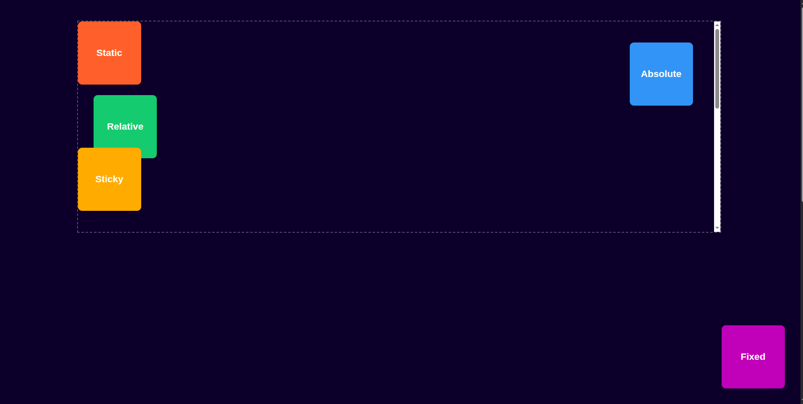
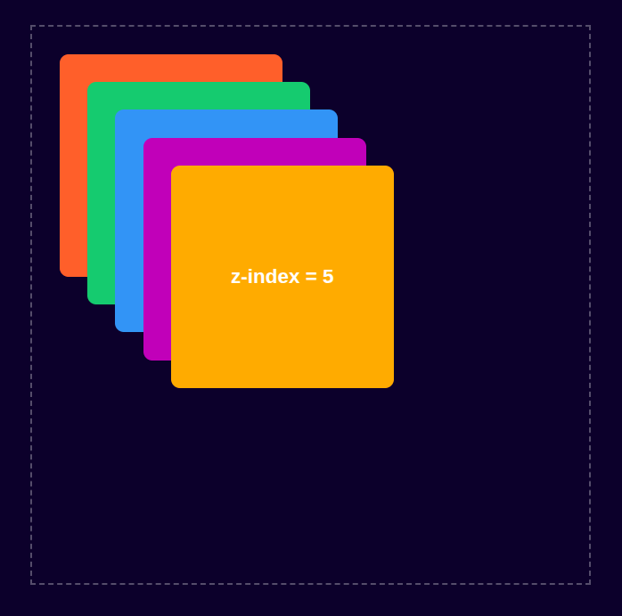
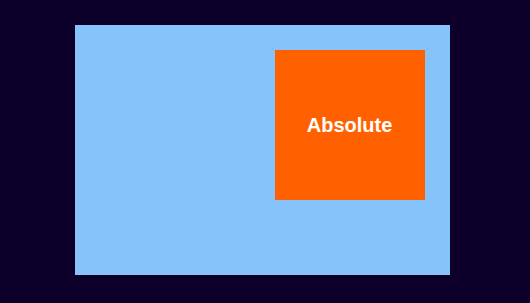
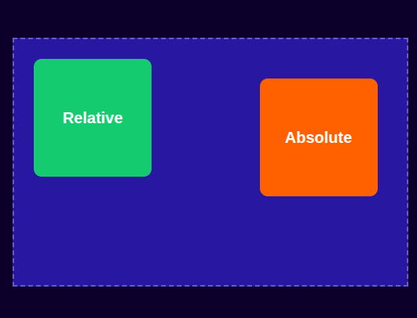
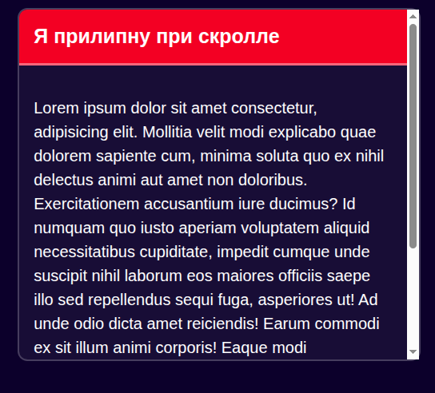
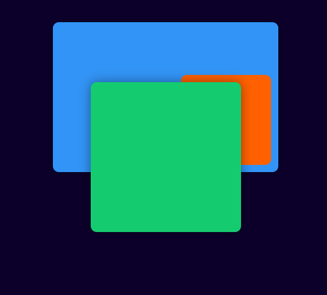

# Лекция 7. Основы позиционирования элементов


## Введение: зачем нужно позиционирование в веб-дизайне

Когда мы создаём веб-страницы, браузер автоматически располагает элементы один за другим - сверху вниз, слева направо. Это поведение называется естественным потоком документа (`document flow`). Каждый блок занимает своё место и «толкает» следующий элемент ниже.

Однако иногда нам нужно более точное управление расположением элементов на странице. Например, мы можем захотеть:

- разместить элемент поверх других (например, модальное окно или всплывающую подсказку);
- зафиксировать меню при прокрутке страницы;
- сместить элемент относительно его обычного положения;
- создать эффект наложения или фоновую картинку, перекрывающую контент.

Для этого и существует система позиционирования в `CSS`.

### Проблема стандартного потока

Представьте, что у нас есть три блока:

```html
<div class="box box1">Первый блок</div>
<div class="box box2">Второй блок</div>
<div class="box box3">Третий блок</div>
```

```css
.box {
  width: 200px;
  height: 100px;
  margin: 10px;
  background-color: #90caf9;
  border: 2px solid #1565c0;
}
```

Результат: блоки располагаются один под другим - стандартное поведение. Если же мы захотим, чтобы третий блок, например, частично перекрывал второй, стандартными средствами (`margin`, `padding`) сделать это невозможно. Здесь и вступает в игру свойство `position`.

### Когда требуется “вырвать” элемент из потока

Иногда дизайнеры требуют, чтобы кнопка, иконка или баннер были точно в нужной точке макета, независимо от других элементов.

Например:

- кнопка _“Назад наверх”_ внизу экрана;
- модальное окно поверх страницы;
- иконка корзины в правом верхнем углу;
- лейбл _“Sale”_ поверх карточки товара.

Такие задачи невозможно решить без позиционирования элементов.

### Роль позиционирования в макете

**Позиционирование** - это инструмент, который даёт разработчику полный контроль над расположением элементов:

- можно управлять координатами (`top`, `left`, `right`, `bottom`);
- задавать порядок перекрытия (`z-index`);
- фиксировать элемент при прокрутке (`fixed`);
- _«приклеивать»_ элемент в нужном месте при достижении границы (`sticky`).

Сегодня мы познакомимся с основными типами позиционирования и научимся применять их на практике, чтобы создавать более сложные и интересные макеты. Понимая все возможности позиционирования, вы сможете реализовывать любые дизайнерские задумки и улучшать пользовательский опыт на ваших сайтах.

### Основные свойства позиционирования в CSS

- `position` - определяет тип позиционирования элемента.
- `top`, `right`, `bottom`, `left` - задают смещение элемента относительно его нормального положения или относительно окна браузера (в зависимости от типа позиционирования).
- `z-index `- управляет порядком наложения элементов (какой элемент будет сверху).

## Типы позиционирования в CSS

В `CSS` свойство `position` определяет, как элемент будет располагаться на странице и как браузер будет учитывать его в потоке документа. В зависимости от значения `position`, элемент может оставаться в потоке, смещаться относительно своего места или полностью вырываться из него.

**Список основных типов позиционирования:**

| Значение   | Описание                                                                                        | Элемент остаётся в потоке?     |
| ---------- | ----------------------------------------------------------------------------------------------- | ------------------------------ |
| `static`   | Значение по умолчанию. Элемент располагается в обычном потоке.                                  | ✅ Да                          |
| `relative` | Смещает элемент относительно его обычного положения.                                            | ✅ Да                          |
| `absolute` | Вырывает элемент из потока и позиционирует относительно ближайшего предка с position ≠ static.  | ❌ Нет                         |
| `fixed`    | Фиксирует элемент относительно окна браузера. Не двигается при прокрутке.                       | ❌ Нет                         |
| `sticky`   | Комбинация `relative` и `fixed`. Элемент остаётся на месте, пока не достигнет заданной позиции. | ✅ / ❌ (зависит от контекста) |

### 1. position: static - значение по умолчанию

Все элементы в `HTML` изначально имеют `position: static`. Это означает, что они располагаются в потоке и игнорируют свойства `top`, `right`, `bottom`, `left`.

```css
.box {
  position: static;
}
```

Даже если вы напишете `top: 10px;`, элемент не сдвинется - браузер просто проигнорирует эти свойства.

### 2. position: relative - относительное позиционирование

Элемент остаётся в потоке, но может быть смещён относительно своего обычного положения.

```css
.box {
  position: relative;
  top: 20px;
  left: 30px;
}
```

**Важно:**

- Элемент занимает своё место в потоке, и другие элементы ведут себя так, как будто он не смещён. Но визуально он будет сдвинут на 20px вниз и 30px вправо.
- Можно использовать отрицательные значения для смещения вверх или влево.
- Полезно для небольших корректировок расположения элементов.
- `relative` часто используется как контейнер для абсолютного позиционирования вложенных элементов.

### 3. position: absolute - абсолютное позиционирование

Элемент выпадает из потока, и его положение задаётся координатами `top`, `right`, `bottom`, `left`. Но есть нюанс: он позиционируется относительно ближайшего предка с `position ≠ static`. Если такого нет - относительно окна браузера.

```css
.parent {
  position: relative;
  width: 400px;
  height: 200px;
  background-color: #bbdefb;
}

.child {
  position: absolute;
  top: 20px;
  right: 20px;
  background-color: #1e88e5;
  color: white;
  padding: 5px;
}
```

Особенности:

- Абсолютно спозиционированный элемент не влияет на других (они не «видят» его в потоке).
- Он «приклеен» к своему контейнеру, а не к странице целиком.
- Очень часто используется для всплывающих подсказок, иконок, карточек и т. д.
- Если в контейнере нет предка с `position: relative` или другим значением, элемент будет позиционироваться относительно окна браузера.
- Если в контейнере есть несколько вложенных элементов с абсолютным позиционированием, они будут взаимодействовать друг с другом в пределах своего ближайшего предка.

### 4. position: fixed - фиксированное позиционирование

Элемент вырывается из потока и привязывается к окну браузера, а не к документу. Он остаётся на месте даже при прокрутке.

```css
.button-top {
  position: fixed;
  right: 30px;
  bottom: 30px;
  background-color: #ef6c00;
  color: white;
  padding: 10px 15px;
  border-radius: 5px;
}
```

**Применение:**

- Кнопка _«наверх»_
- Фиксированная панель навигации
- Плавающие баннеры и уведомления

### 5. position: sticky - липкое позиционирование

Это гибрид `relative` и `fixed`. Пока элемент находится в пределах своего контейнера - он ведёт себя как `relative`. Но как только страница прокручивается и элемент достигает заданной позиции - он прилипает и становится `fixed`.

```css
.header {
  position: sticky;
  top: 0;
  background-color: #1565c0;
  color: white;
  padding: 10px;
}
```

**Особенности:**

- Работает только в пределах родительского контейнера.
- Требуется, чтобы у контейнера была высота больше, чем у элемента.
- Часто используется для закрепления шапки (`header`) или бокового меню.

Каждый тип позиционирования решает свою задачу.

- `static` - обычное поведение
- `relative` - локальные смещения
- `absolute` - точное позиционирование внутри контейнера
- `fixed` - элементы, которые всегда видны
- `sticky` - динамическое закрепление при скролле

### Пример: сравнение всех типов позиционирования на одной странице

```html
<div class="wrapper">
  <div class="box static">Static</div>
  <div class="box relative">Relative</div>
  <div class="box absolute">Absolute</div>
  <div class="box fixed">Fixed</div>
  <div class="box sticky">Sticky</div>

  <div class="scroll-content"></div>
</div>
```

```css
body {
  display: flex;
  flex-direction: column;
  align-items: center;
  justify-content: start;
  height: 200vh;
  margin: 0;
  background-color: rgb(5, 7, 43);
  color: white;
  font-family: sans-serif;
}

.wrapper {
  position: relative;
  width: 80%;
  height: 400px;
  border: 2px dashed rgba(255, 255, 255, 0.3);
  margin-top: 40px;
  overflow: auto;
}

.box {
  width: 120px;
  height: 120px;
  display: flex;
  justify-content: center;
  align-items: center;
  color: white;
  font-size: 18px;
  font-weight: bold;
  border-radius: 8px;
}

.static {
  background-color: #ff7043;
  position: static;
  top: 30px;
  left: 30px;
}

.relative {
  background-color: #66bb6a;
  position: relative;
  top: 20px;
  left: 30px;
}

.absolute {
  background-color: #42a5f5;
  position: absolute;
  top: 40px;
  right: 40px;
}

.fixed {
  background-color: #ab47bc;
  position: fixed;
  bottom: 30px;
  right: 30px;
}

.sticky {
  background-color: #ffa726;
  position: sticky;
  top: 10px;
}

.scroll-content {
  height: 600px;
  padding-top: 20px;
}
```



**Как работает этот пример**

- 🟧 `Static` - стандартное положение, без смещения.
- 🟩 `Relative` - сдвигается, но остаётся в потоке.
- 🟦 `Absolute` - позиционируется внутри контейнера `.wrapper`.
- 🟪 `Fixed` - всегда закреплён внизу экрана, независимо от прокрутки.
- 🟨 `Sticky` - двигается при прокрутке, но _«прилипает»_ к верхней границе контейнера.

Таким образом, мы можем наглядно увидеть, как каждый тип позиционирования влияет на расположение элементов на странице.

## Свойства для управления позицией элемента

Когда элемент получает одно из значений `position`, отличное от `static`, - он начинает реагировать на дополнительные координатные свойства:
`top`, `right`, `bottom`, `left`, а также `z-index`.

Эти свойства позволяют управлять положением и _"глубиной"_(порядком наложения) элементов на странице.

### Свойства смещения: top, right, bottom, left

Каждое из этих свойств задаёт расстояние от соответствующей стороны элемента до края его родительского контейнера (если у него есть контекст позиционирования) или окна браузера.

```css
.element {
  position: absolute; /* или relative, fixed, sticky */
  top: 20px; /* Смещение от верхней границы */
  left: 30px; /* Смещение от левой границы */
}
```

Как работают эти свойства:

- `top`: смещает элемент вниз от верхней границы на указанное значение.
- `left`: смещает элемент вправо от левой границы.
- Если указать `bottom` или `right`, то смещение идёт от нижнего и правого края соответственно.

**Важно:**
Если вы укажете одновременно противоположные стороны (например, `left` и `right`) и у элемента задана ширина, то браузер проигнорирует одно из значений, чтобы избежать конфликтов.

```css
.element {
  width: 100px;
  height: 100px;
  background-color: #c70404;
  position: absolute;
  left: 10px;
  right: 20px;
}
```

> Но если ширина не задана, то элемент растянется между этими двумя сторонами.

### Контекст позиционирования

Чтобы координаты (`top`, `left` и т.д.) работали предсказуемо, нужно понимать относительно чего они применяются.

Контекст задаётся ближайшим предком, у которого `position` не равно `static`.

```html
<div class="parent">
  <div class="child"></div>
</div>
```

```css
.parent {
  position: relative; /* создаёт контекст */
  width: 300px;
  height: 200px;
  background-color: #1565c0;
}

.child {
  position: absolute;
  top: 20px;
  left: 30px;
  width: 100px;
  height: 100px;
  background-color: #ff7043;
}
```

**Результат:**

- `.child` будет находиться на 20 пикселей ниже и 30 пикселей правее границ `.parent`, а не всей страницы.
- Если бы `.parent` не имел `position: relative`, `.child` спозиционировался бы относительно `body`.

### Свойство z-index: порядок наложения

Свойство `z-index` управляет тем, какой элемент находится _“поверх”_ других. Оно работает только для элементов с `position`, отличным от `static`.

```html
<div class="content">
  <div class="box box1">z-index = 1</div>
  <div class="box box2">z-index = 2</div>
  <div class="box box3">z-index = 3</div>
  <div class="box box4">z-index = 4</div>
  <div class="box box5">z-index = 5</div>
</div>
```

```css
.content {
  position: relative;
  width: 500px;
  height: 500px;
  margin-top: 50px;
  border: 2px dashed rgba(255, 255, 255, 0.3);
}

.box {
  width: 200px;
  height: 200px;
  position: absolute;
  top: 25px;
  left: 25px;
  border-radius: 8px;
  color: white;
  display: flex;
  justify-content: center;
  align-items: center;
  font-size: 18px;
  font-weight: bold;
  &:hover {
    z-index: 6;
  }
}

.box1 {
  background-color: #ff7043;
  z-index: 1;
}

.box2 {
  background-color: #66bb6a;
  z-index: 2;
  left: 50px;
  top: 50px;
}

.box3 {
  background-color: #42a5f5;
  z-index: 3;
  left: 75px;
  top: 75px;
}

.box4 {
  background-color: #ab47bc;
  z-index: 4;
  left: 100px;
  top: 100px;
}

.box5 {
  background-color: #ffa726;
  z-index: 5;
  left: 125px;
  top: 125px;
}
```



Чем больше значение `z-index`, тем выше элемент по оси `Z` (то есть ближе к пользователю).

Если `z-index` не указан, браузер использует порядок элементов в `DOM` - тот, что объявлен позже, перекрывает предыдущие.

**Особенности работы z-index**

1. `z-index` работает только в пределах своего контекста позиционирования. Если один контейнер находится выше другого, то вложенные элементы не смогут «перепрыгнуть» через него.

2. Можно использовать отрицательные значения (`z-index: -1;`), чтобы отправить элемент «назад».

3. `z-index` не наследуется, но создаёт собственный контекст наложения (особенно если у родителя есть `position` и `opacity < 1`).

**Вывод:**

- Свойства `top`, `right`, `bottom`, `left` управляют положением элемента,
- а `z-index `- тем, в каком порядке они перекрывают друг друга.
- Понимание этих принципов особенно важно при работе с меню, модальными окнами и всплывающими блоками.

## Относительное и абсолютное позиционирование

Эти два типа - `relative` и `absolute` - часто используются в паре, поэтому важно понимать не только их поведение по отдельности, но и взаимодействие между ними.

### position: relative - смещение без выхода из потока

Когда элемент получает `position: relative,` он остаётся в общем потоке, но его можно слегка сдвинуть относительно исходного положения.

```html
<div class="block relative">Relative</div>
```

```css
.block {
  width: 120px;
  height: 120px;
  background: #42a5f5;
  color: white;
  display: flex;
  justify-content: center;
  align-items: center;
  font-weight: bold;
}

.relative {
  position: relative;
  top: 30px;
  left: 40px;
}
```


**Что происходит:**

- Элемент смещается на 30 пикселей вниз и 40 вправо.
- Его “место” в потоке остаётся на прежнем месте - как будто он всё ещё там.
- Другие элементы по-прежнему занимают пространство, будто блок не двигался.

> Это часто используют, чтобы создать контекст позиционирования для вложенных элементов.

### position: absolute - элемент вне потока

Элемент с `position: absolute `выпадает из потока документа. Он позиционируется относительно ближайшего предка, у которого `position` не равен `static`.
Если таких предков нет - позиционирование идёт от `body` (или окна браузера).

```html
<div class="container">
  <div class="block absolute">Absolute</div>
</div>
```

```css
.container {
  position: relative; /* создаёт контекст позиционирования */
  width: 300px;
  height: 200px;
  background: #90caf9;
  margin-top: 20px;
}

.block {
  width: 120px;
  height: 120px;
  color: white;
  display: flex;
  justify-content: center;
  align-items: center;
  font-weight: bold;
}
.absolute {
  position: absolute;
  top: 20px;
  right: 20px;
  background: #ef6c00;
}
```



**Что происходит:**

- Блок с абсолютным позиционированием смещается на 20 пикселей вниз и 20 вправо от правого верхнего угла контейнера.
- Он не занимает места в потоке, поэтому другие элементы ведут себя так, будто его нет.

### Пример: разница между relative и absolute

```html
<div class="container">
  <div class="box relative">Relative</div>
  <div class="box absolute">Absolute</div>
</div>
```

```css
.container {
  position: relative;
  width: 400px;
  height: 250px;
  background: #0d47a1;
  margin: 40px auto;
  border: 2px dashed rgba(255, 255, 255, 0.3);
}

.box {
  width: 120px;
  height: 120px;
  display: flex;
  justify-content: center;
  align-items: center;
  color: white;
  font-weight: bold;
  border-radius: 8px;
}

.relative {
  background-color: #66bb6a;
  position: relative;
  top: 20px;
  left: 20px;
}

.absolute {
  background: #ef6c00;
  position: absolute;
  top: 40px;
  right: 30px;
}
```



**Что происходит:**

- Блок с `relative` смещается внутри контейнера, но сохраняет своё место в потоке.
- Блок с `absolute` позиционируется относительно контейнера и не влияет на расположение других элементов.

**Типичная ошибка начинающих**

Многие ставят `position: absolute`, ожидая, что элемент привяжется к своему родителю, но забывают добавить `position: relative` у этого родителя.

**Результат:** элемент “уезжает” в левый верхний угол страницы,так как он позиционируется относительно `body`.
**Решение:** всегда указывайте `position: relative` на родителе, если хотите позиционировать что-то внутри него.

## Фиксированное позиционирование (position: fixed)

Фиксированное позиционирование используется тогда, когда элемент должен оставаться на одном и том же месте на экране, независимо от прокрутки страницы.Такие элементы буквально *«приклеены»* к окну браузера.

### Как работает fixed

Когда элемент получает `position: fixed`:
- он выпадает из потока, как и `absolute`;
- позиционируется относительно окна браузера, а не контейнера;
- остаётся на месте при прокрутке страницы;
- может перекрывать другие элементы (часто увеличивают `z-index`).

```html
<div class="fixed-button">UP</div>
```

```css
.fixed-button {
  position: fixed;
  bottom: 30px;
  right: 30px;
  background: #ef6c00;
  color: white;
  padding: 12px 20px;
  border-radius: 6px;
  font-weight: bold;
  cursor: pointer;
  &:hover {
  background: #d84315;
  }
}
```

**Результат:** Кнопка всегда остаётся в правом нижнем углу, даже если прокручивать страницу вниз.

### Свойства top, bottom, left, right для fixed

Эти свойства определяют отступы от краёв окна браузера, а не от родителя:

- `top: 0` - кнопка прилипает к верхнему краю окна.
- `left: 20px` - будет на 20px от левого края.
- `bottom: 40px` - 40px от нижнего края, и т. д.

**Например:**

```css
.notice {
  position: fixed;
  top: 0;
  left: 0;
  right: 0;
  padding: 15px;
  color: white;
  background: #0d47a1;
  text-align: center;
  font-size: 18px;
}
```
Таким способом делают фиксированные шапки уведомлений.

**Когда использовать fixed**

Этот тип позиционирования используют, когда элемент должен всегда быть на виду:

- кнопка «наверх»;
- фиксированная навигация;
- панели уведомлений;
- всплывающие мессенджеры чат-поддержки;
- плавающие виджеты и баннеры.

**Типичная ошибка**

- Новички иногда пытаются использовать `position: fixed` внутри контейнера, ожидая, что элемент будет привязан к этому контейнеру. Однако `fixed` всегда привязывается к окну браузера, игнорируя родительские элементы.

- Если у фиксированного элемента нет `z-index`, его могут перекрыть другие блоки, например, слайдер или меню. Для решения этой проблемы обычно задают высокий `z-index`, чтобы элемент всегда был сверху.

```css
.fixed-menu {
  position: fixed;
  top: 0;
  width: 100%;
  z-index: 1000;
}
```

## Липкое позиционирование (position: sticky)

`position: sticky` - это один из самых удобных и «умных» механизмов позиционирования.
Он объединяет поведение `relative` и `fixed`:

- в начале элемент находится на своём обычном месте (как `relative`);
- при прокрутке страницы он «прилипает» к заданной позиции и остаётся там (как `fixed`);
- когда область его родителя заканчивается - он перестаёт быть фиксированным.

Именно поэтому `sticky` идеально подходит для фиксированных шапок, боковых меню и заголовков таблиц.

### Как работает sticky

Чтобы `sticky` заработал, необходимо:

1. у элемента должно быть `position: sticky`;
2. обязательна координата - `top`, `left`, `right` или `bottom`;
3. родитель должен иметь высоту больше, чем сам элемент.

**Пример:**

```html
<div class="box">
      <div class="sticky-header">Я прилипну при скролле </div>

      <div class="content">
        <p>
          Lorem ipsum dolor sit amet consectetur, adipisicing elit. Mollitia
          velit modi explicabo quae dolorem sapiente cum, minima soluta quo ex
          nihil delectus animi aut amet non doloribus. Exercitationem
          accusantium iure ducimus? Id numquam quo iusto aperiam voluptatem
          aliquid necessitatibus cupiditate, impedit cumque unde suscipit nihil
          laborum eos maiores officiis saepe illo sed repellendus sequi fuga,
          asperiores ut! Ad unde odio dicta amet reiciendis! Earum commodi ex
          sit illum animi corporis! Eaque modi dignissimos rerum assumenda nobis
          error deleniti atque, sed expedita dicta rem dolore esse, voluptate
          quod maiores tenetur nesciunt quo numquam nulla sunt quos cum
          accusantium eveniet et! Suscipit.
        </p>
      </div>
    </div>
```
```css
.box {
  margin-top: 300px;
  width: 400px;
  height: 350px;
  background: rgba(255, 255, 255, 0.05);
  border: 2px solid rgba(255, 255, 255, 0.2);
  border-radius: 10px;
  overflow-y: auto; /* скролл внутри */
  padding: 0;
}

.sticky-header {
  position: sticky;
  top: 0;
  background: crimson;
  padding: 15px;
  font-size: 20px;
  font-weight: bold;
  border-bottom: 3px solid rgba(255, 255, 255, 0.4);
  z-index: 10; 
}

.content {
  padding: 15px;
  line-height: 1.5;
  font-size: 16px;
}
```



**Что происходит:**

- Заголовок `.sticky-header` изначально находится вверху контейнера.
- При прокрутке вниз он прилипает к верхней части контейнера.
- Когда прокрутка достигает конца контейнера, заголовок перестаёт быть фиксированным и уходит вместе с остальным контентом.

### Частые ошибки и почему sticky «не работает»

1. **Отсутствие координаты**: Без указания `top`, `left`, `right` или `bottom` элемент не будет прилипать.
   
   ```css
   .sticky-header {
     position: sticky;
     /* Нужно добавить top, например: */
     top: 0;
   }
   ```

2. **Родитель с недостаточной высотой**: Если высота родителя меньше или равна высоте элемента, прилипание не сработает.

3. **Ошибка 3: родитель с overflow: hidden**

Если у контейнера стоит:
```css
.container {
  overflow: hidden; /* или auto */
}
```
то `position: sticky` не будет работать, так как элемент не сможет выйти за пределы видимой области родителя.

4. **Ошибка 4: z-index не хватает**

Иногда `sticky` перекрывают другие блоки.

Решение:
```css
position: sticky;
top: 0;
z-index: 100;
```

**Когда использовать sticky**

- фиксированные заголовки внутри длинных списков;
- закрепление меню сбоку при скролле;
- «липкие» фильтры, которые всегда остаются на виду;
- закрепление заголовков таблиц;
- секции с закрепляемыми подзаголовками.

## Z-index и порядок наложения элементов

Когда элементы пересекаются или располагаются поверх друг друга, важным становится вопрос: какой элемент должен быть сверху? Для управления этим используется свойство `z-index`, которое задаёт порядок отображения элементов по оси `Z` - «в глубину» экрана.

### Что такое z-index

`z-index` управляет тем, какой элемент окажется:
- ближе к пользователю (выше),
- дальше от пользователя (ниже).

Чем больше значение `z-index`, тем выше элемент:

```css
.box {
  position: absolute;
  z-index: 10;
}
```

> Но `z-index` работает только, если у элемента `position = relative`, `absolute`, `fixed` или `sticky`.

Для `position: static` свойство игнорируется.

### Как браузер выбирает порядок, если z-index не указа

Если `z-index` не задан, то:

1. абсолютные элементы перекрывают обычные статичные,
2. среди одинаковых - выигрывает тот, который стоит позже в `HTML`.

```html
<div class="a"></div>
<div class="b"></div>
```

`.b` будет поверх `.a`.

### Что такое «контекст наложения»

Каждый элемент с `position` и значением `z-index` создаёт свой уровень, внутри которого свои правила наложения

**Пример:**

```html
<div class="parent">
  <div class="child-a"></div>
</div>

<div class="another"></div>
```

```css
.parent {
  position: relative;
  z-index: 1;
  width: 300px;
  height: 200px;
  top: 40px;
  background: #42a5f5;
  margin-bottom: 40px;
  border-radius: 8px;
  box-shadow: 0 0 15px rgba(0,0,0,0.3);
  color: #fff;
  display: flex;
  justify-content: center;
  align-items: center;
  font-weight: bold;
}

.child-a {
  position: absolute;
  bottom: 10px;
  right: 10px;
  width: 120px;
  height: 120px;
  background: #ef6c00;
  color: white;
  display: flex;
  justify-content: center;
  align-items: center;
  font-weight: bold;
  border-radius: 8px;
  z-index: 9999;
}


.another {
  position: relative;
  z-index: 10;
  width: 200px;
  height: 200px;
  background: #66bb6a;
  color: white;
  display: flex;
  justify-content: center;
  align-items: center;
  font-weight: bold;
  border-radius: 8px;
  margin-top: -120px;
  box-shadow: 0 0 15px rgba(0,0,0,0.4);
}
```

> Даже несмотря на `z-index: 9999,` `child-a` **НИКОГДА** не перекроет `.another`.

Потому что `.another` находится в другом, более высоком контексте.



**Когда точно нужен z-index**

- модальные окна (`popup`)
- выпадающие меню
- всплывающие подсказки (`tooltip`)
- мобильные меню поверх контента
- баннеры / уведомления
- карточки с эффектами наведения
- элементы с абсолютным позиционированием в сложных макетах

## Практика

### Задание:

Сверстать *“панель профиля”* с аватаром, статусом, закреплённым меню и всплывающим уведомлением

**Что нужно сделать:**
1. **Фиксированную верхнюю панель (fixed)**
 Она всегда остаётся сверху экрана, даже при скролле.
2. **Карточку профиля (relative)**
 Внутри неё аватар и статус.
3. **Статус-индикатор на аватаре (absolute)**
 Маленький зелёный кружок в нижнем правом углу аватарки
4. **Липкое боковое меню (sticky)**
 В левой колонке меню, которое прилипает при прокрутке.
5. **Всплывающее уведомление поверх всего интерфейса (absolute + z-index)**
 Маленькое уведомление справа сверху над карточкой.

### Итоговый макет выглядит так:

- сверху - фиксированная синяя панель,
- слева - липкое меню навигации,
- справа - карточка профиля,
- на аватаре - индикатор “online”,
- на карточке - всплывающее уведомление поверх блоков,
- структура с использованием всех типов позиционирования.

## Заключение

В этой лекции Вы познакомились с ключевыми принципами позиционирования элементов в CSS.

**Позиционирование** - это основа управления пространством на веб-странице. Именно благодаря этим инструментам интерфейс становится динамичным, гибким и предсказуемым.

**Мы рассмотрели пять основных типов позиционирования:**

- `static` - стандартный поток документа;
- `relative` - смещение без выхода из потока и создание контекста;
- `absolute` - точное позиционирование внутри предка;
- `fixed` - привязка к окну браузера, независимо от прокрутки;
- `sticky` - «умное» сочетание `relative` и `fixed`, полезное для меню и заголовков.

Отдельное внимание уделяется свойствам `top`, `right`, `bottom`, `left`, а также `z-index`, которые позволяют точно управлять координатами и порядком наложения элементов.

Вы также узнали о том, что такое контекст наложения (`stacking context`) и почему иногда `z-index` работает не так, как ожидалось.
Понимание этих механизмов особенно важно при разработке реальных интерфейсов - модальных окон, меню, карточек, всплывающих подсказок и виджетов.

Заключительное практическое задание на верстку панели профиля объединило все типы позиционирования в одном небольшом, но реалистичном проекте.
Такой формат позволяет закрепить материал и обучиться применять его на практике.

Позиционирование - это инструмент, который Вы будете использовать постоянно.
Изучив его, Вы сможете уверенно выстраивать структуры любой сложности и контролировать расположение элементов на странице.

В следующей лекции мы перейдём к адаптивному дизайну и медиазапросам, где научимся создавать страницы, корректно работающие на разных устройствах и экранах.