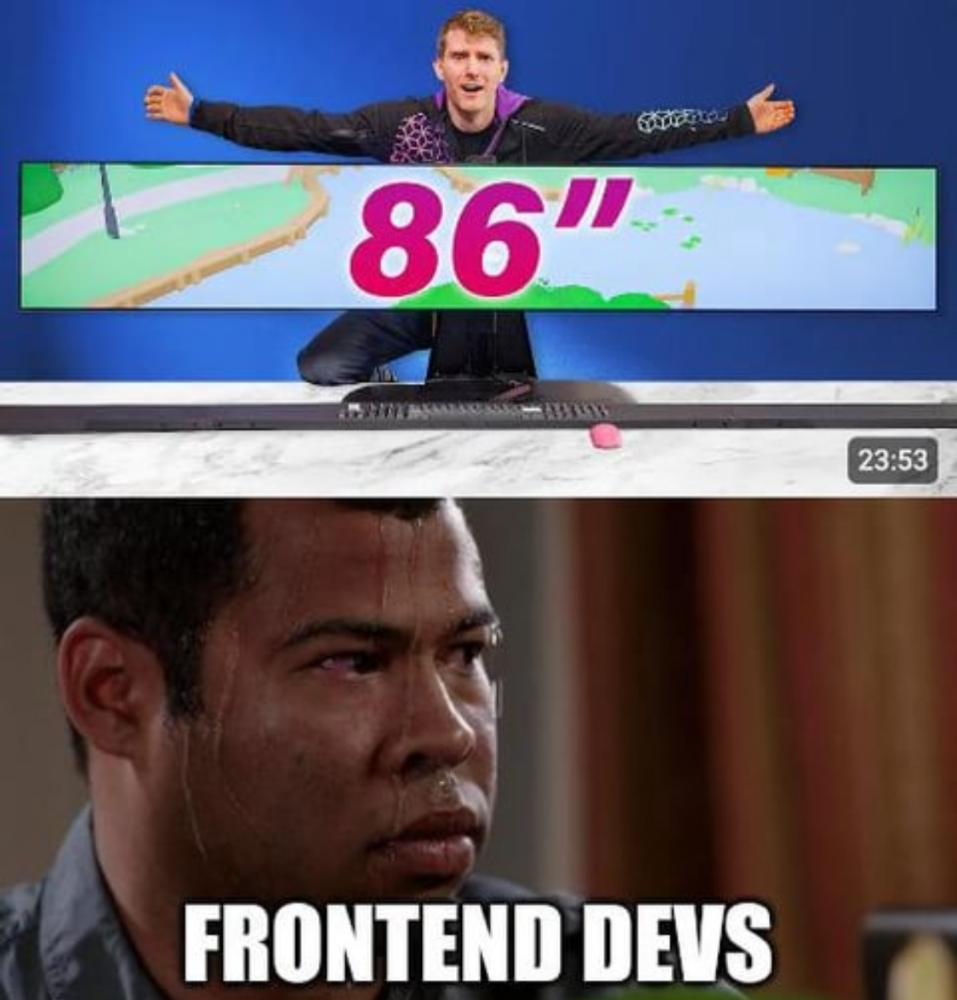
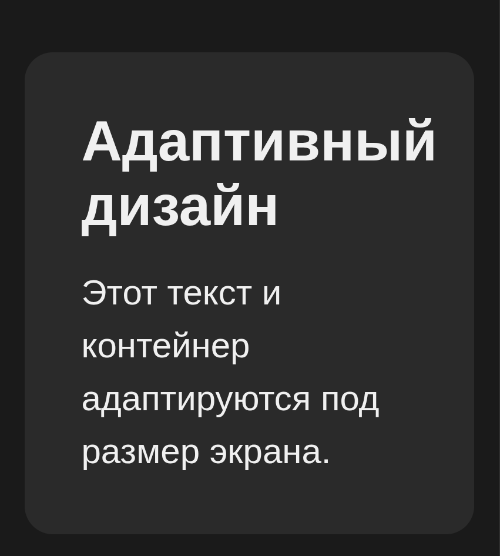

# Лекция 8. Адаптивный дизайн и медиазапросы


## Введение в адаптивный дизайн

Когда веб-разработка только начинала развиваться, все сайты создавались с фиксированной шириной, что означало, что они выглядели одинаково на всех устройствах. Однако с появлением различных устройств с разными размерами экранов (настольные компьютеры, планшеты, смартфоны) возникла необходимость в адаптивном дизайне.

**Адаптивный дизайн** - это подход к веб-дизайну, который позволяет веб-страницам автоматически подстраиваться под размер экрана устройства пользователя. Это обеспечивает оптимальный опыт просмотра независимо от того, используется ли настольный компьютер, планшет или смартфон.

Если сайт не адаптирован, пользователи могут столкнуться :

- Слишком маленьким текстом на мобильных устройствах
- Неудобной навигацией
- Длинными горизонтальными прокрутками, что ухудшает пользовательский опыт.
- Неправильным отображением изображений и других медиаэлементов.
- Медленные загрузки страниц из-за неподходящих ресурсов.

Адаптивность включает в себя два разных метода:

1. **Отзывчивый дизайн (Responsive Design)**: Использование гибких сеток, изображений и `CSS`-медиа-запросов для изменения макета в зависимости от размера экрана. Используются относительные единицы измерения, такие как проценты и `em`, вместо фиксированных пикселей.
2. **Адаптивный дизайн (Adaptive Design)**: Создание нескольких фиксированных макетов для различных размеров экранов и загрузка соответствующего макета в зависимости от устройства пользователя.

В реальных проектах часто используется комбинация обоих методов для достижения наилучших результатов.



## Основные принципы адаптивного дизайна

Адаптивный дизайн в основном состоит из медиазапросов, гибких сеток(Flexbox, Grid) и адаптивных изображений.
Вот основные принципы:

1. **Гибкие сетки (Flexible Grids)**: Использование относительных единиц измерения, таких как проценты, `em` или `rem`, для создания макетов, которые могут изменяться в зависимости от размера экрана.
2. **Адаптивные изображения (Responsive Images)**: Использование различных размеров изображений и форматов для обеспечения оптимальной загрузки и отображения на разных устройствах.
3. **Медиа-запросы (Media Queries)**: Использование `CSS`-медиа-запросов для применения различных стилей в зависимости от характеристик устройства, таких как ширина экрана, ориентация и разрешение.
4. **Приоритет контента (Content Prioritization)**: Определение наиболее важного контента для отображения на меньших экранах и обеспечение его доступности.

### Гибкие (резиновые) контейнеры

Гибкие контейнеры - это основа адаптивной вёрстки. Они позволяют элементам увеличиваться или уменьшаться в зависимости от ширины экрана. В отличие от фиксированных значений в пикселях, гибкие контейнеры используют относительные единицы, благодаря чему интерфейс остаётся удобным на любом устройстве.

Ранее мы могли использовать фиксированное значение:

```css
.container {
  width: 1200px;
}
```

Такой контейнер будет корректно выглядеть только на экране шире 1200 пикселей. На мобильном устройстве он просто вылезет за границы экрана, создавая горизонтальную прокрутку и ухудшая пользовательский опыт.

Правильный подход - гибкий контейнер:

```css
.container {
  width: 100%;
  max-width: 1200px;
  margin: 0 auto;
}
```

Теперь контейнер:

- занимает всю доступную ширину на маленьких экранах,
- остаётся аккуратным и «не растягивается» на больших,
- центрируется автоматически.

Этот подход позволяет использовать один и тот же блок во всех вариантах интерфейса.

#### Относительные единицы измерения

Относительные единицы - важная часть адаптивного дизайна. Они позволяют адаптировать размеры, отступы и шрифты под ширину и высоту окна браузера, а также под настройки пользователя.

##### Проценты (%)

Используются для задания ширины и высоты элементов относительно их родительского контейнера.

Чаще всего проценты используют для:

- ширины блоков (`width`),
- иногда для отступов (`padding`, `margin`),
- ширины колонок в сетке.

```css
.container {
  width: 90%; /* Занимает 90% ширины родительского элемента */
  margin: 0 auto; /* Центрирует контейнер */
}
```

Если родительский элемент имеет ширину 1200px, то ширина контейнера будет 1080px (90% от 1200px).

##### em

`em` - это относительная единица, зависящая от размера шрифта родителя.
Если у родительского элемента размер шрифта 16px, то `1em` будет равен 16px. Если у дочернего элемента задан размер шрифта в `2em`, то он будет равен 32px (2 \* 16px).

Обычно em используют:

- для отступов (`padding`, `margin`),
- для интерлиньяжа (`line-height`),
- иногда для размеров шрифта внутри компонентов.

```css
.card {
  font-size: 16px;
  padding: 1.5em; /* 1.5 * 16px = 24px */
}
```

Если размер шрифта родителя изменится, отступы внутри `.card` также изменятся, что помогает сохранять пропорции.

##### rem

`rem` - очень похож на em, но привязан не к родителю, а к корневому элементу `<html>`. `1rem` = `font-size` у `html`.
Часто делают вот так:

```css
html {
  font-size: 16px;
}
```

Это позволяет легко контролировать размеры по всему сайту, изменяя только одно значение.
Преимущество rem в том, что он не зависит от вложенности элементов, что упрощает управление размерами.

Это удобно для:

- базовых размеров шрифта (`body`, `h1`, `p`),
- основных отступов,
- повторяющихся расстояний.

##### vw и vh

`vw` и `vh` завязаны на размер окна браузера (`viewport`):

- `1vw` = `1%` от ширины окна браузера.
- `1vh` = `1%` от высоты окна браузера.

Они полезны для создания элементов, которые должны адаптироваться к размеру экрана.

```css
.hero {
  height: 60vh; /* блок по высоте занимает 60% экрана */
  padding: 5vh 5vw; /* отступы зависят от размеров экрана */
}
```

**Сравнение и применение**

Можно запомнить так:

`px` - жёсткий размер, редко хорошо смотрится в адаптиве, но всё ещё полезен для мелочей.
`%` - размеры относительно родителя, хорошо для ширины блоков и сеток.
`em` - зависит от шрифта родителя, удобно внутри компонентов (_“живущие”_ отступы).
`rem` - зависит от корневого шрифта, удобно для глобальной типографики и основных отступов.
`vw/vh` - зависят от окна браузера, хорошо для полноэкранных секций и крупных заголовков.

На практике их обычно комбинируют.

##### Практический пример

Пример использования относительных единиц:

```html
<div class="container">
  <h1>Адаптивный дизайн</h1>
  <p>Этот текст и контейнер адаптируются под размер экрана.</p>
</div>
```

```css
* {
  margin: 0;
  padding: 0;
  box-sizing: border-box;
  list-style: none;
  text-decoration: none;
  font-family: Arial, Helvetica, sans-serif;
}

body {
  color: #f0f0f0;
  background-color: #1a1a1a;
}

.container {
  margin: 2rem auto;
  width: 90%;
  max-width: 1200px;
  background-color: #2a2a2a;
  padding: 2rem;
  border-radius: 16px;
}

h1 {
  font-size: 2rem; /* примерно 32px при базовом 16px */
  margin-bottom: 1rem;
  /* word-wrap: break-word; */
}

p {
  width: 100%;
  font-size: 1.25rem; /* примерно 20px */
  line-height: 1.5;
}
```



Теперь блок и текст внутри него будут адаптироваться под размер экрана, обеспечивая удобочитаемость и комфортный просмотр на любых устройствах.

#### Адаптивные шрифты с помощью clamp()

В современном адаптивном дизайне важно, чтобы размеры шрифтов и заголовков подстраивались под ширину экрана. Если мы задаём шрифт в пикселях, он остаётся одинаковым на всех устройствах - и на маленьких смартфонах текст может оказаться слишком крупным, а на больших мониторах, наоборот, слишком маленьким.

Для решения этой проблемы используется функция `clamp()`.

Функция `clamp()` позволяет задать минимальное, предпочтительное и максимальное значение для свойства. В случае с шрифтами это позволяет динамически изменять размер текста в зависимости от ширины экрана.

```css
h1 {
  font-size: clamp(1.5rem, 2.5vw, 3rem);
}
```

В этом примере:

- `1.5rem` - минимальный размер шрифта (около 24px при базовом 16px).
- `2.5vw` - предпочтительный размер, который будет изменяться в зависимости от ширины окна браузера.
- `3rem` - максимальный размер шрифта (около 48px при базовом 16px).

Таким образом:

- на маленьком экране текст будет не меньше `1.5rem`,
- на больших - не больше `3rem,`,
- между этими значениями размер плавно изменяется за счёт `2.5vw`.

**Когда использовать `clamp()`:**

- Для заголовков, чтобы они оставались читаемыми на всех устройствах.
- Для основного текста, чтобы обеспечить комфортное чтение.
- Для кнопок и других элементов интерфейса, чтобы они были удобны для взаимодействия

**Базовый пример использования `clamp()` для заголовков и параграфов:**

```css
h1 {
  font-size: clamp(2rem, 4vw, 3rem);
}
p {
  font-size: clamp(1rem, 2.5vw, 1.5rem);
}
```

Этот подход позволяет создавать адаптивные интерфейсы, которые выглядят хорошо и читаемы на любых устройствах, от маленьких смартфонов до больших мониторов.

### Адаптивные (резиновые) изображения

Адаптивный дизайн невозможен без _“резиновых”_ изображений. Если картинка жёстко фиксирована в пикселях, она легко может “сломать” всю вёрстку: вылезти за пределы контейнера, создать горизонтальный скролл или сделать страницу неудобной на маленьких экранах.

Основная идея резинового изображения очень проста:
картинка должна подстраиваться под ширину родительского блока, не теряя свои пропорции.

Для этого в `CSS` обычно используют следующий базовый набор правил:

```css
img {
  max-width: 100%;
  height: auto;
  display: block;
}
```

- `max-width: 100%` - ограничивает ширину изображения шириной родительского контейнера. Если контейнер сужается, картинка тоже уменьшается.
- `height: auto` - сохраняет пропорции изображения при изменении ширины.
- `display: block` - убирает лишние отступы снизу, которые появляются из-за того, что по умолчанию изображения являются строчными элементами.

Давайте добавим изображение в наш адаптивный пример:

```html
<div class="container">
  <h1>Адаптивный дизайн</h1>
  
  <p>Этот текст, контейнер и изображение адаптируются под размер экрана.</p>
</div>
```

```css
/* наши стили из предыдущего примера */

img {
  max-width: 100%;
  height: auto;
  display: block;
  border-radius: 8px;
  margin-bottom: 1rem;
}

/* изменим размеры шрифтов с помощью clamp() */

h1 {
  font-size: clamp(2rem, 4vw, 3rem);
  margin-bottom: 1rem;
}
p {
  font-size: clamp(1rem, 2.5vw, 1.5rem);
  line-height: 1.5;
}
```

Теперь изображение будет адаптироваться под размер контейнера, сохраняя свои пропорции. На маленьких экранах оно уменьшится, а на больших - увеличится, не выходя за пределы родительского блока.

### Медиа-запросы (Media Queries)

_Медиазапросы_ - это основа адаптивного дизайна. Именно они позволяют применять разные стили в зависимости от ширины экрана, ориентации устройства или его характеристик. С их помощью мы можем перестраивать сетку, менять размеры текста, скрывать элементы, преобразовывать меню и делать интерфейс удобным на любых устройствах.

> Медиазапросы - это часть CSS, которая _“спрашивает”_: «Если ширина экрана такая-то - применить такие стили».

#### Что такое медиазапрос:

Минимальный синтаксис медиазапроса:

```css
@media (max-width: 768px) {
  /* Стили внутри сработают ТОЛЬКО когда ширина экрана <= 768px */
}
```

Любой код, помещённый внутрь, будет выполняться только при указанном условии. Это позволяет писать адаптивные версии для разных устройств.

**Зачем нужны медиазапросы?**

С их помощью мы можем:

- изменять размеры блоков и сеток;
- перестраивать макет (2 колонки → 1 колонка);
- уменьшать или увеличивать шрифты;
- показывать или скрывать элементы;
- добавлять мобильную версию меню (бургер);
- адаптировать отступы, кнопки, карточки, изображения и многое другое.

Медиазапросы задают точки перелома - `moments`, где макет должен меняться, чтобы оставаться удобным.

#### Mинимальные и максимальные ширины

Для адаптивного дизайна часто используют два основных типа медиазапросов:

1. **max-width**: Стили применяются, когда ширина экрана меньше или равна указанному значению. Обычно используется для мобильных устройств и планшетов.
2. **min-width**: Стили применяются, когда ширина экрана больше или равна указанному значению. Обычно используется для компьютеров и больших экранов.

**Пример использования `max-width`:**

```css
@media (max-width: 768px) {
  .container {
    width: 100%;
    padding: 1rem;
  }
  h1 {
    font-size: 1.5rem;
  }
}
```

В этом примере, когда ширина экрана становится 768px или меньше, контейнер занимает всю ширину экрана с меньшими отступами, а размер заголовка уменьшается для лучшей читаемости на маленьких устройствах.

**Пример использования `min-width`:**

```css
@media (min-width: 1200px) {
  .container {
    max-width: 1400px;
  }
  h1 {
    font-size: 3rem;
  }
}
```

Также можно указывать несколько условий одновременно, используя логические операторы `and`, `or` и `not`.

```css
@media (min-width: 768px) and (max-width: 1199px) {
  /* Стили для планшетов */
}

@media (min-width: 1200px) {
  /* Стили для десктопов */
}

@media (max-width: 767px) {
  /* Стили для мобильных устройств в горизонтальной ориентации */
}

@media (min-width: 320px) and (max-width: 767px) {
  /* Стили для мобильных устройств в вертикальной ориентации */
}
```

#### Типичные точки перелома (breakpoints)

Хотя в адаптивной вёрстке рекомендуется использовать контентный подход (то есть ставить брейкпоинт там, где макет реально ломается), на практике часто ориентируются на типовые размеры устройств. Такие значения помогают выстроить предсказуемую структуру и быстро адаптировать проект под основные группы экранов.

| Тип устройства                                              | Диапазон | Пример                                          |
| ------------------------------------------------------------------------ | ---------------- | ----------------------------------------------------- |
| Вертикальное расположение смартфона     | 320-480px        | `@media (max-width: 480px)`                         |
| Горизонтальное расположение смартфона | 480-768px        | `@media (max-width: 768px)`                         |
| Планшеты                                                         | 768-1024px       | `@media (min-width: 768px) and (max-width: 1024px)` |
| Малые ноутбуки                                              | 1024-1200px      | `@media (min-width: 1024px)`                        |
| Десктопы                                                         | 1200-1440px      | `@media (min-width: 1200px)`                        |
| Большие дисплеи                                            | 1440px+          | `@media (min-width: 1440px)`                        |

#### Основные типы медиапараметров

Медиазапросы позволяют адаптировать сайт не только под ширину экрана. В современном CSS можно учитывать ориентацию устройства, высоту, плотность пикселей, возможности ввода, соотношение сторон экрана и многое другое.
Эти дополнительные параметры делают адаптивность более точной и позволяют создавать по-настоящему удобный интерфейс.

##### width / height - ширина и высота окна

Это самые часто используемые параметры. Именно они позволяют задавать брейкпоинты для разных размеров экранов.

```css
@media (max-width: 768px) {
  /* Стили для экранов шириной до 768px : планшеты и мобильные */
}

@media (min-height: 600px) {
  /* Стили для экранов высотой от 600px : например, для больших мониторов и планшетов */
}
```

##### orientation - ориентация экрана

Параметр, который проверяет, находится ли устройство:

- в вертикальной ориентации
- или горизонтальной.

Этот параметр особенно полезен для планшетов и телефонов.

```css
@media (orientation: portrait) {
  .sidebar {
    display: none;
  }
}
```

В этом примере боковая панель скрывается, когда устройство находится в вертикальной ориентации.

```css
@media (orientation: landscape) {
  .gallery {
    grid-template-columns: repeat(4, 1fr);
  }
}
```

В этом примере галерея отображается в 4 колонки, когда устройство находится в горизонтальной ориентации.

##### aspect-ratio - соотношение сторон

Проверяет отношение ширины к высоте.

Примеры соотношений:

- `16 / 9` - большинство мониторов,
- `4 / 3` - старые мониторы и планшеты,
- `21 / 9` - ультраширокие мониторы.

**Применение:**

```css
@media (aspect-ratio: 16/9) {
  .video-container {
    max-width: 900px;
  }
}
```

Ещё пример - адаптация интерфейса под «высокие» телефоны (соотношение ~ 9:19):

```css
@media (max-aspect-ratio: 9/16) {
  .header {
    padding-top: 2rem;
  }
}
```

##### pointer / hover - возможности ввода

Один из самых полезных, но редко используемых медиапараметров.

**pointer**

Проверяет тип указателя:

- `pointer: fine` - точный указатель (мышь),
- `pointer: coarse` - неточный (палец),
- `pointer: none` - нет указателя.

```css
@media (pointer: coarse) {
  button {
    padding: 1.5rem; /* увеличиваем кнопки для пальцев */
  }
}
```

На телефоне кнопки должны быть крупнее, чтобы удобно нажимать пальцем.

**hover**

Проверяет, может ли устройство выполнять ховеры:

- `hover: hover` - мышь,
- `hover: none` - сенсорный экран.

```css
@media (hover: none) {
  .menu-item:hover {
    background-color: transparent; /* отключаем ховеры на сенсорных экранах */
  }
}
```

Это помогает убрать “залипающие” ховеры на телефонах.

---

## Создание адаптивной сетки (Flexbox и Grid) для всех экранов

Адаптивная сетка - один из важнейших элементов современного веб-дизайна.
Она позволяет автоматически перестраивать макет в зависимости от ширины экрана:
на десктопах отображать несколько колонок, на планшетах - меньше, а на смартфонах - одну колонку.

Сетки можно строить как на `Flexbox`, так и на `CSS Grid`. Ниже мы разберём оба варианта и покажем, как сделать полноценную адаптацию под маленькие смартфоны, обычные смартфоны, планшеты, ноутбуки и большие мониторы.

### Пример адаптивной сетки на Flexbox

`Flexbox` - это простой и понятный способ сделать гибкую сетку, которая сама перестраивается благодаря `flex-wrap` и медиазапросам.

```html
<ul class="cards">
  <li class="card">Карточка 1</li>
  <li class="card">Карточка 2</li>
  <li class="card">Карточка 3</li>
  <li class="card">Карточка 4</li>
</ul>
```

Базовые стили Flexbox-сетки

```css
* {
  margin: 0;
  padding: 0;
  box-sizing: border-box;
  list-style: none;
  text-decoration: none;
  font-family: Arial, Helvetica, sans-serif;
}

body {
  color: #f0f0f0;
  background-color: #1a1a1a;
}

.cards {
  display: flex;
  flex-wrap: wrap;
  gap: 20px;
  margin: 2em 2em;
}

/* Красочные карточки */
.card {
  flex: 1 1 100%;
  padding: 2rem;
  border-radius: 20px;

  /* Стеклянный эффект */
  background: rgba(255, 255, 255, 0.05);
  backdrop-filter: blur(6px);

  /* Контур */
  border: 1px solid rgba(255, 255, 255, 0.1);

  box-shadow:
    0 8px 20px rgba(0, 0, 0, 0.4),
    0 0 10px rgba(0, 255, 255, 0.1);
    text-align: center;
    &:hover {
  box-shadow:
    0 12px 25px rgba(0, 0, 0, 0.5),
    0 0 20px rgba(0, 255, 255, 0.2);
  border-color: rgba(0, 255, 255, 0.3);
}
}

/* --- Адаптивность --- */

/* Маленькие смартфоны (до 480px) */
@media (max-width: 480px) {
  .card {
    flex: 1 1 100%;
  }
}

/* Обычные смартфоны (480–768px) */
@media (min-width: 480px) and (max-width: 768px){
  .card {
    flex: 1 1 48%;
  }
}

@media (hover: none) {
  .card:hover {
    box-shadow: none;
    border-color: rgba(255, 255, 255, 0.1);
  }
}

/* Планшеты (768–1024px) */
@media (min-width: 768px) and (max-width: 1024px) {
  .card {
    flex: 1 1 45%;
  }
}

/* Ноутбуки (1024–1200px) */
@media (min-width: 1024px) and (max-width: 1200px) {
  .card {
    flex: 1 1 30%;
  }
}

/* Десктопы 1200px+ */
@media (min-width: 1200px) {
  .card {
    flex: 1 1 22%;
  }
}
```

Теперь наша сетка автоматически перестраивается под разные размеры экранов, обеспечивая удобный просмотр на всех устройствах.

### Адаптивная сетка на CSS Grid

`Grid` позволяет строить сетки ещё гибче и мощнее, часто без большого количества медиазапросов.

```html
<div class="grid">
  <div class="item">Блок 1</div>
  <div class="item">Блок 2</div>
  <div class="item">Блок 3</div>
  <div class="item">Блок 4</div>
</div>
```

```css
.grid {
  display: grid;
  gap: 24px;
  grid-template-columns: repeat(auto-fit, minmax(260px, 1fr));
}

/* Красочная стеклянная карточка */
.item {
  padding: 2rem;
  border-radius: 20px;

  /* Стеклянный эффект */
  background: rgba(255, 255, 255, 0.06);
  backdrop-filter: blur(6px);
  -webkit-backdrop-filter: blur(6px);

  /* Контур */
  border: 1px solid rgba(255, 255, 255, 0.12);

  /* Красивый объём */
  box-shadow:
    0 8px 20px rgba(0, 0, 0, 0.4),
    0 0 10px rgba(0, 255, 255, 0.1);

  color: #fff;
    &:hover {
  box-shadow:
    0 12px 28px rgba(0, 0, 0, 0.45),
    0 0 18px rgba(0, 255, 255, 0.25);
  border-color: rgba(0, 255, 255, 0.35);
}
}

/* ----------- Адаптивность ----------- */

/* Маленькие смартфоны (до 480px) */
@media (max-width: 480px) {
  .grid {
    grid-template-columns: 1fr;
  }
}

/* Обычные смартфоны (480–768px) */
@media (min-width: 480px) and (max-width: 768px) {
  .grid {
    grid-template-columns: repeat(2, 1fr);
  }
}

/* Планшеты (768–1024px) */
@media (min-width: 768px) and (max-width: 1024px) {
  .grid {
    grid-template-columns: repeat(2, 1fr);
  }
}

/* Небольшие ноутбуки (1024–1200px) */
@media (min-width: 1024px) and (max-width: 1200px) {
  .grid {
    grid-template-columns: repeat(3, 1fr);
  }
}

/* Десктопы 1200px+ */
@media (min-width: 1200px) {
  .grid {
    grid-template-columns: repeat(4, 1fr);
  }
}

```

**Результат** - гибкая сетка, которая автоматически подстраивается под размер экрана, обеспечивая удобный и красивый интерфейс на всех устройствах.

---

## Практический пример

Типичный пример адаптивного сайта с использованием медиазапросов, гибких контейнеров под все экраны.

```html
<!DOCTYPE html>
<html lang="ru">
<head>
  <meta charset="UTF-8" />
  <title>Adaptive Studio</title>
  <meta name="viewport" content="width=device-width, initial-scale=1.0" />
  <link rel="stylesheet" href="style2.css" />
</head>
<body>
  <header class="header">
    <div class="logo">Adaptive Studio</div>
    <nav class="nav">
      <a href="#">Главная</a>
      <a href="#">Услуги</a>
      <a href="#">О нас</a>
      <a href="#">Контакты</a>
    </nav>
    <div class="burger">
      
    </div>
  </header>

  <main class="main">
    <section class="hero">
      <div class="hero-text">
        <h1>Адаптивный дизайн под любые экраны</h1>
        <p>
          Создаём сайты, которые одинаково удобны на смартфонах, планшетах и компьютерах.
        </p>
        <button class="btn">Оставить заявку</button>
      </div>
      <div class="hero-image">
        Здесь может быть изображение или иллюстрация.
      </div>
    </section>

    <section class="features">
      <h2>Преимущества</h2>
      <div class="features-list">
        <article class="feature-card">
          <h3>Мобильная версия</h3>
          <p>Сайт удобно читать и использовать на телефоне.</p>
        </article>
        <article class="feature-card">
          <h3>Быстрая загрузка</h3>
          <p>Лёгкая вёрстка и оптимизированные ресурсы.</p>
        </article>
        <article class="feature-card">
          <h3>Современный подход</h3>
          <p>Используем Flexbox, медиазапросы и резиновые блоки.</p>
        </article>
      </div>
    </section>
  </main>


  <footer class="footer">
    © 2025 Adaptive Studio. Все права защищены.
  </footer>
</body>
</html>
```

```css
* {
  margin: 0;
  padding: 0;
  box-sizing: border-box;
}

body {
  font-family: Arial, Helvetica, sans-serif;
  color: #f5f5f5;
  background-color: #1a1a1a;
  display: flex;
  flex-direction: column;
  justify-content: space-between;
  align-items: center;
  min-height: 100vh;
}

a {
  color: inherit;
  text-decoration: none;
}

.main,
.header,
.footer {
  width: 100%;
  margin: 0 auto;
  padding: 1rem 1rem;
}

.header {
  display: flex;
  align-items: center;
  justify-content: space-between;
}

.logo {
  font-weight: bold;
  font-size: 1.2rem;
}

.nav {
  display: flex;
  gap: 1rem;
}

.burger {
  display: none;
  width: 20px;
  height: 20px;
}

.burger img {
  width: 100%;
  height: 100%;
}


.nav a {
  font-size: 0.95rem;
  opacity: 0.9;
}

.nav a:hover {
  opacity: 1;
}

/* ---------- HERO ---------- */

.hero {
  display: flex;
  flex-wrap: wrap;
  gap: 1.5rem;
  padding: 2rem 1rem;
}

.hero-text {
  flex: 1 1 250px;
  display: flex;
  flex-direction: column;
  gap: 1rem;
}

.hero-text h1 {
  font-size: 1.8rem;
}

.hero-text p {
  font-size: 1rem;
  line-height: 1.5;
}

.btn {
  align-self: flex-start;
  padding: 0.7rem 1.5rem;
  border-radius: 999px;
  border: none;
  background-color: #007bff;
  color: #fff;
  font-weight: 600;
  cursor: pointer;
}

.btn:hover {
  background-color: #005fcc;
}

/* Блок-заглушка вместо картинки */

.hero-image {
  flex: 1 1 250px;
  min-height: 180px;
  background-color: #252525;
  border-radius: 12px;
  padding: 1rem;
  display: flex;
  align-items: center;
  justify-content: center;
  text-align: center;
  font-size: 0.95rem;
  color: #cccccc;
}

/* ---------- FEATURES ---------- */

.features {
  padding: 1rem;
}

.features h2 {
  font-size: 1.5rem;
  margin-bottom: 1rem;
}

.features-list {
  display: flex;
  flex-wrap: wrap;
  gap: 1rem;
}

.feature-card {
  flex: 1 1 250px;
  background-color: #252525;
  border-radius: 12px;
  padding: 1rem;
}

.feature-card h3 {
  font-size: 1.1rem;
  margin-bottom: 0.5rem;
}

.feature-card p {
  font-size: 0.95rem;
  line-height: 1.5;
}

/* ---------- FOOTER ---------- */

.footer {
  font-size: 0.85rem;
  text-align: center;
  padding: 1.5rem 1rem 2rem;
  color: #aaaaaa;
}

/* ---------- АДАПТИВНОСТЬ ---------- */

/* Мобильные устройства (по умолчанию уже хорошо) */
/* Дальше улучшаем для более широких экранов */

@media  (max-width: 500px) {
  .nav {
    display: none;
  }
  .burger {
    display: block;
  }
}


@media (min-width: 768px) {
  .hero {
    padding: 3rem 1rem;
  }

  .hero-text h1 {
    font-size: 2.2rem;
  }

  .features-list {
    gap: 1.5rem;
  }
}

@media (min-width: 1024px) {
  .hero-text h1 {
    font-size: 2.5rem;
  }

  .feature-card {
    padding: 1.5rem;
  }
  
}
```

Этот пример демонстрирует, как создать адаптивный сайт с использованием медиазапросов, гибких контейнеров и адаптивных изображений. Сайт будет выглядеть хорошо и быть удобным на любых устройствах - от маленьких смартфонов до больших мониторов.

---

## Практика

### Цель задания

Разработать главную страницу, которая одинаково удобно выглядит на мобильных устройствах, планшетах и компьютерах. Страница должна корректно перестраиваться при изменении ширины экрана и включать мобильное меню.

### Структура страницы

Готовая страница должна состоять из четырёх основных блоков:

1. **Шапка сайта (Header)**:

- Логотип (текст, например: `Adaptive Studio`);
- Горизонтальное меню из 3–4 ссылок (для планшетов и десктопов);
- Бургер-меню, которое отображается только на мобильных устройствах;

2. **Главный блок (Hero)**:

Блок состоит из двух колонок:
  - Левая часть: Заголовок, абзац текста, кнопка действия(Можно использовать `<button>` или ссылку `<a>`);
  - Правая часть: Изображение или блок-заглушка;

Требование:
  - На маленьких экранах блок должен перестраиваться в одну колонку.
  - На планшетах и выше - две колонки.

3. **Блок преимуществ (Features)**:

Секция должна включать:

   - Заголовок;
   - Три карточки с преимуществами.

Требования к адаптивности:
   - На мобильных - карточки идут в одну колонку;
   - На планшетах - в две колонки;
   - На компьютерах - в три колонки.

4. **Footer**

Простой футер с текстом копирайта:
```html
© 2025 Example Studio. Все права защищены.
```

### Требования к адаптивности

1. Обязательно использование `Flexbox` для постойки сеток и `медиазапросов` для адаптации под разные экраны шапки, главного блока и списка карточек.
2. Резиновые блоки.
3. Медиа-запросы. Минимум для трёх диапазонов: 
    - до 480px - мобильные телефоны;
    - 481px–768px - планшеты;
    - 769px+ - десктопы.
    - можно сделать больше но не меньше!!!

## Заключение

**Адаптивный дизайн** - это фундамент современного веб-разработчика. Независимо от того, создаётся ли простой лендинг или сложное веб-приложение, пользователь должен получать удобный интерфейс на любом устройстве: от смартфона до широкоформатного монитора.

В этой лекции мы подробно разобрали основные инструменты, которые позволяют добиться адаптивности:

- **Резиновые (гибкие) контейнеры** - позволяют блокам подстраиваться под доступную ширину экрана, сохраняя читабельность и структуру.
- **Относительные единицы (`%`, `em,` `rem`, `vw`, `vh`)** - обеспечивают гибкость размеров и типографики.
- **Медиазапросы (`@media`)** - позволяют изменять макет в зависимости от ширины, высоты, ориентации или других характеристик устройства.
- **`Flexbox` и `CSS Grid`** - современные инструменты для построения адаптивных сеток любой сложности.
- **Адаптивные изображения** - предотвращают *“поломку” *вёрстки на маленьких экранах.
- **Мобильное меню (бургер)** - важный элемент навигации для смартфонов.

Освоив эти техники, вы сможете создавать сайты, которые будут выглядеть профессионально и удобно на любых устройствах.
