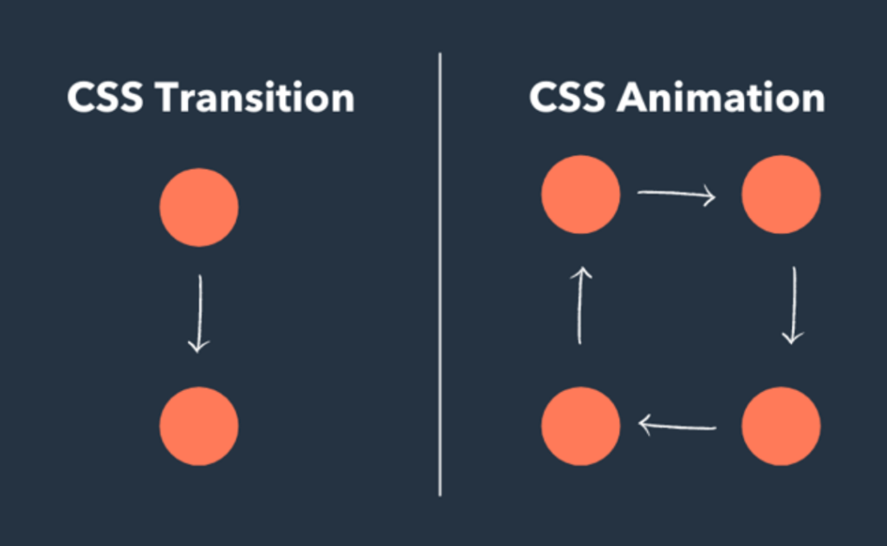
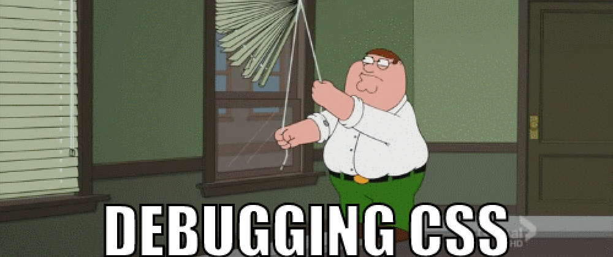
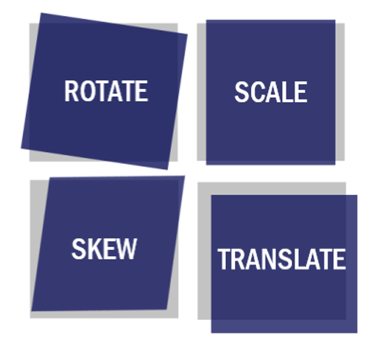

# Лекция 9. Анимации и переходы в CSS


## Введение в анимации

Когда сайты только начали развиваться визуально, интерфейсы были статичными: элементы просто появлялись на странице, меняли цвет или позицию без плавности. Со временем стало ясно, что пользователи лучше воспринимают динамичные интерфейсы - они дают подсказки, создают ощущение взаимодействия и делают сайт более «живым».

**Анимации и переходы в CSS** позволяют создавать такую динамику без использования `JavaScript`. Это мощный инструмент, который помогает улучшить пользовательский опыт при минимальной нагрузке на разработку и производительность.

### Зачем нужны анимации в интерфейсе

**Анимации** - это не только эстетика. Они решают важные `UX`-задачи(`User Experience`) - улучшение взаимодействия пользователя с интерфейсом. Вот несколько ключевых причин использовать анимации:

- Подсказывают пользователю, что элемент интерактивен (например, кнопка слегка увеличивается при наведении).
- Объясняют изменения на странице (например, карточка плавно раскрывается или появляется).
- Уменьшают резкость переходов, делая интерфейс _«мягким»_, комфортным. Создают визуальную иерархию: что важно - появляется мягко, что второстепенно - быстрее.
- Повышают внимание и удерживают пользователя, если используются правильно.

### Основные понятия



- **Переходы (transitions)** - это плавные изменения свойств `CSS` при взаимодействии с элементом (например, при наведении курсора). Они позволяют задать длительность и тип анимации для изменения стилей. Переходы обычно используются для простых эффектов, таких как изменение цвета, размера или прозрачности.
- **Анимации (animations)** - это более сложные эффекты, которые позволяют создавать последовательные изменения стилей с помощью ключевых кадров. Они могут быть запущены автоматически или по определённым событиям. Анимации дают больше контроля над процессом, позволяя создавать сложные эффекты, такие как вращение, перемещение и изменение формы.

## Переходы в CSS (transition)

Переходы позволяют сделать изменение `CSS`-свойств плавным. Без перехода свойство меняется мгновенно: цвет, размер, фон - всё переключается резко. С `transition` мы можем управлять:

- скоростью изменения
- временем анимации
- эффектом ускорения
- задержкой(это пауза перед началом анимации)

### Что такое transition

`transition` - это механизм, который делает любое изменение свойства плавным в момент изменения его значения.

Это значит:

- Вы указываете свойство, которое должно анимироваться.
- Когда это свойство меняется (например, при `:hover`), браузер применяет плавный переход.

**Важно понимать:**
`transition` - не запускает анимацию сам по себе. Он работает только в момент изменения свойств.


### Основные свойства transition

Синтаксис свойства `transition` выглядит так:

```css
.selector {
  transition: property duration timing-function delay; / * Пример полной записи * /
}
```

Переходы состоят из четырёх ключевых настроек:

- **transition-property** - какое свойство будет анимироваться
- **transition-duration** - как долго будет длиться анимация
- **transition-timing-function** - функция ускорения (как будет меняться скорость анимации)
- **transition-delay** - задержка перед началом анимации

Давайте разберём каждое из этих свойств подробнее.

#### transition-property

Определяет, какое свойство будет анимироваться. Можно указать одно или несколько свойств, разделённых запятыми, или использовать `all`, чтобы анимировать все изменяющиеся свойства.

```css
.element {
  transition-property: color; /* Анимируем только цвет */
  transition-property: width, height; /* Анимируем ширину и высоту */
  transition-property: all; /* Анимируем все свойства */
}
```

Чаще всего анимируют свойства, связанные с визуальным отображением, такие как `color`, `background-color`, `width`, `height`, `opacity`, `transform` и другие.

#### transition-duration

Определяет, как долго будет длиться анимация. Значение указывается в секундах (`s`) или миллисекундах (`ms`).

```css
.element {
  transition-duration: 0.5s; /* Анимация длится полсекунды */
  transition-duration: 200ms; /* Анимация длится 200 миллисекунд */
}
```

Чем больше значение, тем медленнее будет происходить анимация.

#### transition-timing-function

Определяет функцию ускорения, которая влияет на скорость анимации в течение её выполнения. Вот несколько распространённых значений:

- `linear` - анимация происходит с постоянной скоростью.
- `ease` - анимация начинается медленно, ускоряется и затем замедляется.
- `ease-in` - анимация начинается медленно и затем ускоряется.
- `ease-out` - анимация начинается быстро и затем замедляется.
- `ease-in-out` - анимация начинается и заканчивается медленно, а в середине ускоряется.
- `cubic-bezier(n,n,n,n)` - позволяет задать собственную кривую ускорения.

Пример:

```css
.element {
  transition-timing-function: ease-in-out; /* Плавное начало и конец */
}
```

Данные функции основаны на кривых Безье, которые позволяют создавать различные эффекты ускорения. У них есть визуальные представления, которые помогают понять, как будет вести себя анимация.



Красочный и понятные сайты для генерации кривых Безье:

- [Easing Wizard](https://easingwizard.com/) - визуальный редактор кривых Безье.
- [EpicEasing](https://epiceasing.com/) - коллекция готовых функций ускорения с примерами.

Как использовать уже готовые функции:

```css
.element {
  transition-timing-function: cubic-bezier(
    0.25,
    0.1,
    0.25,
    1
  ); /* Пример пользовательской кривой Безье */
}
```

Заходим на сайты, выбираем кривую, копируем значения и вставляем в `cubic-bezier()`.

Пример использования различных функций ускорения:

```css
.element {
  transition: all 0.5s ease-in-out; /* Плавное начало и конец */
  /* или */
  transition: all 0.5s cubic-bezier(0.25, 0.1, 0.25, 1); /* Пользовательская кривая Безье */
}
```

#### transition-delay

Определяет задержку перед началом анимации. Значение указывается в секундах (`s`) или миллисекундах (`ms`).

```css
.element {
  transition-delay: 0.2s; /* Анимация начнётся через 0.2 секунды */
  transition-delay: 100ms; /* Анимация начнётся через 100 миллисекунд */
}
```

Чем больше значение, тем дольше будет пауза перед началом анимации.

#### Полная запись свойства transition

Все четыре свойства можно записать в одной строке с помощью сокращённой записи `transition`:

Пример:

```css
.element {
  transition: background-color 0.3s ease-in-out 0.1s; /* Анимируем background-color за 0.3 секунды с функцией ease-in-out и задержкой 0.1 секунды */
}
```

Если нужно анимировать несколько свойств с разными настройками, можно указать их через запятую:

```css
.element {
  transition: width 0.5s ease-in, height 0.5s ease-out; /* Анимируем ширину и высоту с разными функциями ускорения */
}
```

Или все свойства сразу:

```css
.element {
  transition: all 0.4s ease; /* Анимируем все свойства за 0.4 секунды с функцией ease */
}
```

#### Примеры использования transition

**Пример 1.Плавное изменение цвета фона при наведении:**

```html
<div class="box">Наведи на меня</div>
```

```css
.box {
  width: 200px;
  height: 200px;
  background-color: blue;
  transition: background-color 0.5s linear; /* Плавный переход цвета фона */
  &:hover {
    background-color: red; /* Цвет меняется на красный при наведении */
  }
}
```

**Пример 2: Плавное изменение размера блока**

```css
.box {
  width: 100px;
  height: 100px;
  background: #4caf50;
  transition: all 1s cubic-bezier(0.39, 0.575, 0.565, 1); /* Плавный переход всех свойств с пользовательской кривой Безье */
}

.box:hover {
  width: 150px;
  height: 150px;
}
```

**Пример 3: Плавное появление элемента при наведении**

Тут стоит рассказать о `opacity`. Это свойство отвечает за прозрачность элемента. Значение `0` - полностью прозрачный, `1` - полностью видимый. с помощью `transition` можно плавно изменять прозрачность.

```css
.box {
  width: 100px;
  height: 100px;
  background: #4caf50;
  opacity: 0;
  transition: opacity 0.5s ease-in-out; /* Плавный переход прозрачности */
  &:hover {
    opacity: 1; /* Элемент становится видимым при наведении */
  }
}
```

**Что важно помнить**

- Переходы работают только при изменении свойства.
- Если свойство не меняется - анимации не будет.
- Не стоит анимировать `width/height/left/top` без необходимости - это влияет на производительность. (Подробнее об этом в блоке о `performance`.)

### Свойство transform в CSS

Переходы (`transition`) сами по себе не задают движение - они только делают плавным изменение свойства.
А вот `transform` - это основа подавляющего большинства анимаций, потому что он позволяет:

- перемещать элементы
- вращать
- увеличивать и уменьшать
- наклонять
- комбинировать несколько эффектов

При этом `transform` работает быстро и не нагружает верстку - он не вызывает перерасчёт размеров блока (`reflow`), что делает его оптимальным для анимаций.

#### Что делает transform?

Свойство `transform` позволяет изменять геометрию элемента, не влияя на соседние элементы. Это значит:

- Элемент может визуально увеличиваться или вращаться
- Но его фактическое место в потоке остаётся тем же
- Поэтому трансформации всегда безопаснее, чем изменение `width`, `height`, `left` и т.д.

Cинтаксис:

```css
.element {
  transform: function(value); /* Применяет трансформацию к элементу */
}
```

Давайте рассмотрим основные виды трансформаций.

#### Основные виды трансформаций



CSS предоставляет несколько ключевых функций трансформации.

##### translate - перемещение элемента по осям X и Y

Позволяет сдвигать элемент относительно его текущего положения.

```css
.element {
  transform: translateX(50px); /* Сдвигает элемент на 50px вправо по оси X */
  transform: translateX(-50px); /* Сдвигает элемент на 50px влево по оси X */
  transform: translateY(100px); /* Сдвигает элемент на 100px вниз по оси Y*/
  transform: translateY(-100px); /* Сдвигает элемент на 100px вверх по оси Y*/
  transform: translate(
    50px,
    100px
  ); /*Сдвигает элемент на 50px вправо и 100px вниз */
}
```

Почему это лучше, чем `left/top`: `translate` не вызывает пересчёт разметки - это просто визуальное смещение.

##### scale - изменение размера элемента

С помощью `scale` можно увеличивать или уменьшать элемент.

```css
transform: scale(1.2); /* Увеличение */
transform: scale(0.8); /* Уменьшение */
transform: scaleX(1.5);
transform: scaleY(0.5);
```

Частый пример использования - увеличение кнопки при наведении:

```css
.button {
  transition: transform 0.3s ease;
}
.button:hover {
  transform: scale(1.1); /* Увеличение кнопки на 10% при наведении */
}
```

##### rotate - вращение элемента

С помощью `rotate` можно поворачивать элемент вокруг его центра. Угол задается в градусах (`deg`).

```css
transform: rotate(45deg);
transform: rotate(-90deg);
```

На основе `rotate` строятся многие `UI`-эффекты: стрелки, иконки, загрузчики.

Частый пример поворота стрелочки при наведении:

```html
    <div class="Box" ></div>
```

```css
.arrow {
  transition: transform 0.3s ease;
  &:hover {
    transform: rotate(90deg); /* Поворот стрелки на 90 градусов при открытии */
  }
}
```

##### skew - наклон элемента

`Skew` позволяет наклонять элемент по осям X и Y.

```css
transform: skewX(15deg); /* Наклон по оси X */
transform: skewY(-10deg); /* Наклон по оси Y */
transform: skew(10deg, 5deg); /* Наклон по обеим осям */
```

Используется реже, но помогает создавать интересные эффекты.

##### Комбинирование трансформаций

Трансформации можно комбинировать, перечисляя их через пробел:

```css
transform: translateX(50px) rotate(45deg) scale(1.2); /* Сдвиг, поворот и масштабирование одновременно */
``` 

Браузер применит все указанные трансформации последовательно с лева направо.

#### Пример использования transform с transition

Пример - карточка увеличивается и поднимается вверх:

```css
.card {
  transition: transform 0.3s ease;
}

.card:hover {
  transform: translateY(-10px) scale(1.05);
}
```

**Почему transform - это основа современных анимаций**

- работает на `GPU`(графическом процессоре)
- не вызывает `reflow`/`performance` лагов, что важно для плавности и отзывчивости
- даёт плавность
- безопасен для адаптивной верстки
- позволяет сочетать несколько эффектов
- не ломает сетку страницы

Поэтому `transform` всегда рассматривается до изучения сложных анимаций.

## Анимации в CSS


Переходы (`transition`) позволяют плавно менять свойства только при событии.
Но иногда нужно, чтобы элемент:

- двигался сам по себе
- воспроизводил последовательность действий
- повторялся бесконечно
- изменял несколько свойств пошагово
- запускался сразу при загрузке страницы

Тогда используется механизм `CSS`-анимаций, основанный на ключевых кадрах.

### Что такое keyframes?

`Keyframes` (ключевые кадры) - это набор состояний элемента в разные моменты времени. По сути, вы описываете сценарию, что должно происходить:

- В начале (0%) элемент в одном состоянии
- В середине (50%) - в другом
- В конце (100%) - в третьем

В браузере эти состояния плавно интерполируются, создавая анимацию.

Общий синтаксис создания анимации с помощью `@keyframes` выглядит так:

```css
@keyframes animation-name { /* Тут вызываем keyframes и даем ему название*/
  0% {
    /* Начальное состояние */
  }
  50% {
    /* Среднее состояние */
  }
  100% {
    /* Конечное состояние */
  }
}
```

Можно использовать проценты (`0%`, `50%`, `100%`) или ключевые слова (`from` и `to`):

```css
@keyframes animation-name {
  from {
    /* Начальное состояние */
  }
    to {
    /* Конечное состояние */
  }
}
```

Важно: `keyframes` - это описание, но сама анимация не запустится, пока вы не примените `animation` к элементу.

### Свойство animation

Свойство `animation` позволяет применить созданные ключевые кадры к элементу и настроить параметры анимации.

Синтаксис свойства `animation` выглядит так:

```css
.selector {
  animation: name duration timing-function delay iteration-count direction fill-mode; /* Полная запись свойства animation */
}
```

Теперь давайте разберём каждое из этих свойств подробнее.

#### animation-name

Определяет имя анимации, которая будет применена к элементу. Имя должно совпадать с именем, указанным в `@keyframes`.

```css.element {
  animation-name: animation-name; /* Название анимации которую мы создали в keyframes */
}
```

#### animation-duration

Время, за которое анимация выполняется от начала до конца. Значение указывается в секундах (`s`) или миллисекундах (`ms`).

```css
.element {
  animation-duration: 2s; /* Анимация длится 2 секунды */
}
```

#### animation-timing-function
Определяет функцию ускорения для анимации, аналогично `transition-timing-function`. Вот несколько распространённых значений:
- `linear` - анимация происходит с постоянной скоростью.
- `ease` - анимация начинается медленно, ускоряется и затем замедляется
- `ease-in` - анимация начинается медленно и затем ускоряется.
- `ease-out` - анимация начинается быстро и затем замедляется.
- `ease-in-out` - анимация начинается и заканчивается медленно, а в
- `cubic-bezier(n,n,n,n)` - позволяет задать собственную кривую ускорения.

Это все те же свойства, что и для переходов. Пример использования:

```css
.element {
  animation-timing-function: ease-in-out; /* Плавное начало и конец */
}
```

#### animation-delay
Определяет задержку перед началом анимации. Значение указывается в секундах (`s`) или миллисекундах (`ms`).

```css
.element {
  animation-delay: 1s; /* Анимация начнётся через 1 секунду */
}
```

Аналогично свойству `transition-delay`.

#### animation-iteration-count

Определяет, сколько раз анимация будет повторяться. Можно указать конкретное число или использовать значение `infinite` для бесконечного повторения.

```css
.element {
  animation-iteration-count: 3; /* Анимация повторится 3 раза */
  animation-iteration-count: infinite; /* Анимация будет повторяться бесконечно */
}
```

#### animation-direction
Определяет направление анимации. Вот возможные значения:
- `normal` - анимация выполняется в прямом направлении (по умолчанию).
- `reverse` - анимация выполняется в обратном направлении.
- `alternate` - анимация чередуется: сначала в прямом, затем в обратном направлении.
- `alternate-reverse` - анимация чередуется, начиная с обратного направления.

```css
.element {
  animation-direction: alternate; /* Анимация чередуется */
}
```

#### animation-fill-mode
Определяет, как анимация влияет на стили элемента до начала и после окончания анимации. Вот возможные значения:
- `none` - элемент возвращается к исходным стилям после окончания анимации (по умолчанию).
- `forwards` - элемент сохраняет стили, заданные в последнем ключевом кадре, после окончания анимации.
- `backwards` - элемент применяет стили из первого ключевого кадра до начала анимации.
- `both` - сочетание `forwards` и `backwards`: элемент сохраняет стили из первого ключевого кадра до начала анимации и стили из последнего ключевого кадра после окончания анимации.

Пример использования:

```css
.element {
  animation-fill-mode: forwards; /* Сохраняет стили после окончания анимации */
  animation-fill-mode: both; /* Сохраняет стили до и после анимации */
  animation-fill-mode: backwards; /* Применяет стили до начала анимации */
  animation-fill-mode: none; /* Не сохраняет стили после анимации */
}
```

**Важно:** `animation-fill-mode` полезен, когда нужно, чтобы элемент оставался в конечном состоянии анимации или имел определённые стили до её начала.

#### animation-play-state

Определяет состояние воспроизведения анимации. Вот возможные значения:
- `running` - анимация воспроизводится (по умолчанию).
- `paused` - анимация приостановлена.

```css
.element {
  animation-play-state: paused; /* Анимация приостановлена */
  animation-play-state: running; /* Анимация воспроизводится */
}
```

Пример использования `animation-play-state` для управления анимацией:

```css
.element {
  animation: slideIn 2s ease-in-out infinite;
}
.element:hover {
  animation-play-state: paused;
}
```

#### Полная запись свойства animation
Все свойства можно записать в одной строке с помощью сокращённой записи `animation`:
```css
.element {
    animation: slideIn 2s ease-in-out 1s infinite alternate forwards; /* Полная запись свойства animation */
}
```
Порядок такой:
```text
animation: name duration timing-function delay iteration-count direction fill-mode;
```

#### Примеры использования animation

**Пример 1. Простая анимация изменения цвета фона:**

```css
@keyframes changeColor {
  0% {
    background-color: blue;
  }
  50% {
    background-color: green;
  }
  100% {
    background-color: red;
    }
}

.element {
  width: 200px;
  height: 200px;
  animation: changeColor 4s ease-in-out infinite; /* Анимация изменения цвета фона */
}
```

**Пример 2. Анимация движения элемента:**

```css
@keyframes moveRight {
    0% {
        transform: translateX(0);
    }
    100% {
        transform: translateX(300px);
    }
}
.element {
    width: 100px;
    height: 100px;
    background: #ff5722;
    animation: moveRight 3s ease-in-out infinite alternate; /* Анимация движения вправо и обратно */
}
```

**Пример 3. Анимация вращения элемента:**

```css
@keyframes rotateElement {
    from {
        transform: rotate(0deg);
    }
    to {
        transform: rotate(360deg);
    }
}
.element {
    width: 100px;
    height: 100px;
    background: #3f51b5;
    animation: rotateElement 5s linear infinite; /* Анимация вращения */
}
```

**Пример 4. Несколько анимаций одновременно:**

```css
@keyframes moveAndRotate {
  0% {
    transform: translateX(0) rotate(0deg) scale(1);
  }
  100% {
    transform: translateX(300px) rotate(360deg) scale(1.5);
  }
}

.element {
    width: 100px;
    height: 100px;
    background: #3f51b5;
    animation: moveAndRotate 5s ease-in-out infinite alternate;
}
```

`element` будет одновременно двигаться, вращаться и увеличиваться в размере.

## Типовые примеры анимаций

Анимации в `CSS` позволяют быстро создавать популярные визуальные эффекты, которые часто встречаются в веб-интерфейсах. В этом блоке мы рассмотрим готовые паттерны, которые можно использовать в проектах без дополнительных библиотек и `JavaScript`.

### Плавное появление элемента (fade-in)

Самая распространённая анимация - элемент постепенно становится видимым.

```css
@keyframes fadeIn {
  from {
    opacity: 0;
  }
  to {
    opacity: 1;
  }
}

.element {
  animation: fadeIn 1s ease-in forwards; /* Плавное появление элемента */
}
```

### Плавное исчезновение (fade-out)

Элемент постепенно становится прозрачным и исчезает.

```css
@keyframes fadeOut {
  from {
    opacity: 1;
  }
  to {
    opacity: 0;
  }
}

.element {
  animation: fadeOut 1s ease-out forwards; /* Плавное исчезновение элемента */
}
```

### Перемещение элемента (move)

Элемент плавно смещается вправо:

```css
@keyframes moveRight {
  from {
    transform: translateX(0);
  }
  to {
    transform: translateX(200px);
  }
}
.element {
  animation: moveRight 1s ease-in-out forwards; /* Перемещение элемента вправо */
}
```

Сверху вниз:

```css
@keyframes moveDown {
  0%   { transform: translateY(-20px); }
  100% { transform: translateY(0); }
}
```

### Пульсация (pulse)

Элемент увеличивается и уменьшается, создавая эффект пульсации.

```css
@keyframes pulse {
  0% {
    transform: scale(1);
  }
  50% {
    transform: scale(1.1);
  }
  100% {
    transform: scale(1);
  }
}
.element {
  animation: pulse 1s ease-in-out infinite; /* Пульсация элемента */
}
```

### Вращение (spin) - для лоадеров

```css
@keyframes spin {
  from { transform: rotate(0deg); }
  to   { transform: rotate(360deg); }
}

.spin {
  animation: spin 1s linear infinite;
}
```

### Bounce-эффект (прыжок)

Позволяет создать лёгкий *"прыгучий"* эффект - часто используется в анимациях иконок.

```css
@keyframes bounce {
  0%   { transform: translateY(0); }
  50%  { transform: translateY(-10px); }
  100% { transform: translateY(0); }
}

.bounce {
  animation: bounce 0.6s ease infinite;
}
```

### Мигание (blink)

```css
@keyframes blink {
  0%, 100% { opacity: 1; }
  50%      { opacity: 0; }
}

.blink {
  animation: blink 1s step-start infinite; /* Мигание элемента */
}
```

### Анимация кнопки при наведении

```css
.button {
  transition: transform 0.3s ease;
}

.button:hover {
  transform: scale(1.05);
}
```

Пружинка (использует keyframes):

```css
@keyframes btnSpring {
  0%   { transform: scale(1); }
  40%  { transform: scale(1.1); }
  60%  { transform: scale(0.95); }
  100% { transform: scale(1); }
}

.button:hover {
  animation: btnSpring 0.3s ease-out;
}
```

### Анимация карточки

Лёгкое поднятие карточки вверх с масштабом:

```css
.card {
  transition: transform 0.4s ease, box-shadow 0.4s ease;
}

.card:hover {
  transform: translateY(-8px) scale(1.02);
  box-shadow: 0 12px 24px rgba(0, 0, 0, 0.2);
}
```

### Пример сложной анимации: «Прыгающая волна из 5 шариков»

Анимация покажет, как можно:

- сочетать `transform` и `animation-delay`
- делать мягкую физику прыжка
- запускать элементы по очереди
- создавать эффект «волны»

Такой приём часто используется в загрузчиках и интерфейсных микроанимациях.

```html
<div class="balls">
  <div class="ball"></div>
  <div class="ball"></div>
  <div class="ball"></div>
  <div class="ball"></div>
  <div class="ball"></div>
</div>
```

```css
.balls {
  display: flex;
  gap: 20px;
  justify-content: center;
  align-items: flex-end;
  height: 150px;
  padding-top: 40px;
  &:hover .ball {
    animation-play-state: paused; /* Запуск анимации при наведении на контейнер */
  }
}

.ball {
  width: 30px;
  height: 30px;
  background: #3f51b5;
  border-radius: 50%;
  animation: bounce 0.6s ease-in-out infinite;
}

/* Каждому шарику задаём задержку, чтобы создать «волну» */
.ball:nth-child(1) { animation-delay: 0s;   }
.ball:nth-child(2) { animation-delay: 0.1s; }
.ball:nth-child(3) { animation-delay: 0.2s; }
.ball:nth-child(4) { animation-delay: 0.3s; }
.ball:nth-child(5) { animation-delay: 0.4s; }

/* Ключевые кадры прыжка */
@keyframes bounce {
  0%   { transform: translateY(0); }
  35%  { transform: translateY(-80px); } /* прыжок вверх */
  55%  { transform: translateY(0); }     /* приземление */
  70%  { transform: translateY(-25px); } /* маленький отскок */
  100% { transform: translateY(0); }
}
```

**Как работает эта анимация**

1. Все шарики используют одинаковую анимацию `bounce` 
    Прыжок → приземление → маленький отскок → снова вниз.

2. Разные `animation-delay` создают волну
    Каждый шарик начинает прыжок чуть позже предыдущего.

3. Выбранная кривая `ease-in-out` создаёт натуральную «физику»
    Замедление в верхней точке, ускорение вниз.

4. Анимация бесконечная но при наведении на контейнер останавливается
    Это позволяет пользователю сфокусироваться на элементах.

**Как можно улучшить этот пример (опционально)**

- Добавить тень, которая тоже прыгает (`box-shadow`)
- Поменять высоту прыжка для разных шариков
- Сделать волны туда-обратно (`reverse`)

### Пример: «Прыгающий» текст (Bouncing Text)

Разобьём текст на отдельные буквы в `<span>`:

```html
<h1 class="bouncing-text">
  <span>А</span>
  <span>н</span>
  <span>и</span>
  <span>м</span>
  <span>а</span>
  <span>ц</span>
  <span>и</span>
  <span>и</span>
</h1>
```

Можно написать любое слово - главное, чтобы каждая буква была в отдельном `span`.

```css
.bouncing-text {
  display: inline-flex;
  gap: 4px;
  font-size: 48px;
  font-weight: 700;
  letter-spacing: 2px;
}

/* Базовый стиль буквы */
.bouncing-text span {
  display: inline-block;
  animation: bounceText 0.7s ease-in-out infinite;
}

/* Задержки для волны */
.bouncing-text span:nth-child(1) { animation-delay: 0s; }
.bouncing-text span:nth-child(2) { animation-delay: 0.05s; }
.bouncing-text span:nth-child(3) { animation-delay: 0.1s; }
.bouncing-text span:nth-child(4) { animation-delay: 0.15s; }
.bouncing-text span:nth-child(5) { animation-delay: 0.2s; }
.bouncing-text span:nth-child(6) { animation-delay: 0.25s; }
.bouncing-text span:nth-child(7) { animation-delay: 0.3s; }
.bouncing-text span:nth-child(8) { animation-delay: 0.35s; }

/* Ключевые кадры «подпрыгивания» букв */
@keyframes bounceText {
  0%   { transform: translateY(0); }
  30%  { transform: translateY(-12px); }
  60%  { transform: translateY(0); }
  80%  { transform: translateY(-4px); }
  100% { transform: translateY(0); }
}
```

**Как работает эта анимация**
1. Каждая буква в отдельном `span` позволяет анимировать их по отдельности.
2. Анимация `bounceText` заставляет буквы подпрыгивать.
3. Разные `animation-delay` создают эффект волны, когда буквы подпрыгивают по очереди.
4. Анимация бесконечная, что создаёт живой эффект.

## Performance и оптимизация анимаций

Анимации делают интерфейс живым, но при неправильном использовании могут «убить» производительность:

- страница начинает подлагивать при скролле
- анимации дергаются
- на слабых устройствах всё ощущается тяжёлым

В этом блоке мы разберём, какие анимации *«лёгкие»*, какие - *«тяжёлые»*, и как писать анимации так, чтобы они не тормозили интерфейс.

### Как браузер отрисовывает страницу (упрощённо)

Чтобы понимать, почему одни свойства анимировать можно, а другие нельзя, важно хотя бы на высоком уровне понимать этапы отрисовки:

1. `Layout (reflow)` - расчёт размеров и позиционирования элементов.
2. `Paint` - прорисовка пикселей (цвета, шрифты, фоны, границы).
3. `Composite` - сборка слоёв, применение transform и opacity.

Если анимация каждый кадр заставляет браузер:

- пересчитывать размеры (`width`, `height`, `margin`, `top`, `left`) → это дорого
- перекрашивать большие области → тоже может быть тяжело

А вот изменение уже готового слоя (`transform`, `opacity`) - самое лёгкое.

### Свойства, которые лучше всего анимировать

Золотое правило: анимируем `transform` и `opacity`.

Эти свойства:
- не вызывают пересчёт `layout`
- могут обрабатываться на уровне `GPU`
- дают плавные анимации даже на слабых устройствах

Примеры *«правильных»* анимаций:

```css
/* Положение через translate */
transform: translateX(...), translateY(...);

/* Масштабирование */
transform: scale(...);

/* Вращение */
transform: rotate(...);

/* Непрозрачность */
opacity: 0 → 1
```

Практически все современные UI-анимации можно построить только на основе `transform` + `opacity`.

### Свойства, которые лучше НЕ анимировать

Следующие свойства могут сильно нагружать страницу, особенно если анимация:

- длится долго
- применяется к большому количеству элементов
- к элементам, которые занимают большую часть экрана

К таким свойствам относятся:

- `width`, `height`
- `margin`, `padding`
- `top`, `left`, `right`, `bottom`
- `border-width`
- `box-shadow` (особенно на больших блоках)

Пример *«плохой»* анимации:

```css
.box {
  transition: width 0.5s;
}

.box:hover {
  width: 400px;
}
```

Эта анимация заставит браузер каждый кадр пересчитывать размеры и перерисовывать соседние элементы, что может привести к тормозам.

гораздо лучше: 

```css
.box {
  width: 200px;
  transition: transform 0.5s;
}

.box:hover {
  transform: scaleX(2);
}
```

### Переписываем анимации «как правильно»

Было (не оптимально):

```css
.block {
  position: relative;
  transition: left 0.3s;
}

.block:hover {
  left: 50px;
}
```

Стало (лучше):

```css
.block {
  transition: transform 0.3s;
}

.block:hover {
  transform: translateX(50px);
}
```

Визуально эффект тот же, но производительность лучше.

### Практические рекомендации

- Анимируйте `transform` и `opacity` - почти всегда этого достаточно.
- Избегайте `width/height/left/top` и сложных box-shadow в анимации.
- Не перегружайте интерфейс анимациями без смысла.
- Используйте короткие, понятные эффекты (до `0.5–0.7s`).
- Проверяйте анимации на мобильных устройствах.
- Для важного контента продумывайте вариант без анимаций (`prefers-reduced-motion`).

## Заключение

*Анимации* - важная часть современного веб-интерфейса. Они помогают не только *«украсить»* сайт, но и улучшить взаимодействие пользователя с интерфейсом, создавая более интуитивное, живое и понятное поведение элементов.

В рамках этой лекции Вы познакомились с двумя основными инструментами динамики в `CSS`:

- `transition` - механизм плавного изменения свойств при взаимодействии пользователя или изменении состояния элемента;
- `animation` и @`keyframes` - мощный инструмент для создания многоэтапных, независимых и повторяющихся анимаций.

Мы подробно рассмотрели:

- основы работы переходов и их параметры;
- ключевые особенности анимаций и полный набор свойств `animation-*`;
- свойство `transform` как основу для большинства визуально плавных и производительных эффектов;
- типовые паттерны анимаций, которые используются в реальных интерфейсах (`fade`, `move`, `spin`, `bounce`, `pulse`, `loaders`);
- создание сложных анимационных сценариев с комбинированием `transform`, задержек, многоступенчатых `keyframes`;
- практические примеры: волна из прыгающих шариков и волна из прыгающего текста;
- основы `performance` - какие свойства безопасно анимировать и как избежать лагов.

Главная идея, которую важно унести из этой лекции: анимации - это инструмент интерфейса, а не украшение.
Они должны быть логичными, умеренными, помогать пользователю ориентироваться и не мешать основному контенту.

Грамотно использованные анимации:
- делают интерфейс приятнее,
- повышают удобство взаимодействия,
- помогают строить визуальную иерархию,
- и, при необходимости, подчёркивают ключевые действия (кнопка, уведомление, загрузка).

Следуя рекомендациям по оптимизации (анимируем только `transform` и `opacity`, следим за частотой кадров, используем короткие и понятные эффекты), можно добиться плавных, профессиональных и эффективных интерфейсов.