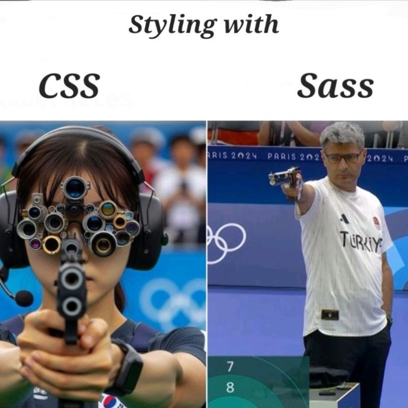
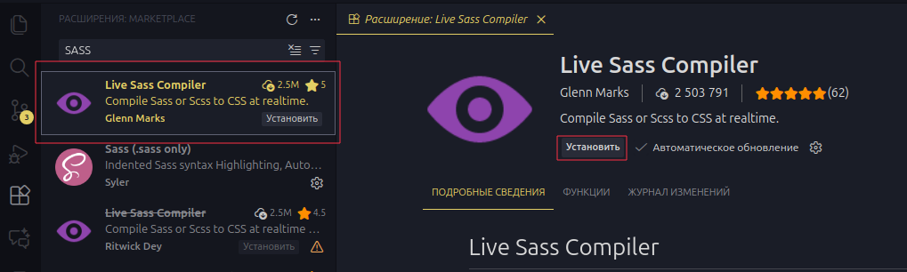
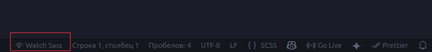
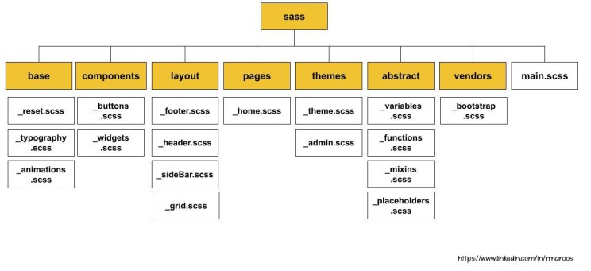

# Лекция 10. Углублённое изучение SCSS (Advanced SCSS)


## Введение в SCSS

Когда разработчик только начинает изучать вёрстку, ему кажется, что `CSS` - это простой и понятный инструмент. Есть селекторы, свойства, значения - вроде бы всё логично. Но по мере роста проекта ситуация начинает меняться.

Файл стилей увеличивается, селекторов становится всё больше, одни и те же значения начинают повторяться, а любые правки начинают требовать всё больше времени и внимания. В какой-то момент становится очевидно, что проблема не в знаниях разработчика, а в ограничениях самого подхода.

Именно здесь появляется необходимость в инструментах, которые помогают структурировать `CSS`, а не просто писать его дальше.

### Какие проблемы возникают в “чистом” CSS?



В реальных проектах чаще всего появляются следующие сложности:

- одни и те же цвета, размеры и отступы повторяются десятки раз;
- стили кнопок, карточек и форм частично дублируются;
- сложно понять, какие стили относятся к какому блоку;
- любое изменение дизайна требует ручного поиска и правки множества мест;
- файл стилей превращается в набор несвязанных правил.

При этом сам `CSS` не даёт инструментов для:

- переменных (в классическом смысле);
- логики;
- переиспользования кода;
- модульной структуры.
- вложенности(Хотя в новых версиях `CSS` появляются некоторые возможности вложенности, они всё ещё ограничены по сравнению с препроцессорами).
- функций и миксинов.
- математических операций.

Все эти проблемы решаются с помощью препроцессоров, которые расширяют возможности `CSS` и делают его более удобным для крупных проектов.

### Что такое SCSS и какую задачу он решает?

`SCSS` - это препроцессор, который расширяет возможности `CSS`, добавляя инструменты для удобной работы с кодом.

Тут сразу нужно понять что `SCSS` не меняет сам `CSS`, а лишь добавляет к нему новые возможности. В итоге из `SCSS`-файлов компилируется обычный CSS, который понимают все браузеры.

`SCSS` нужен разработчику, а не браузеру. Его задача - сделать процесс написания стилей более удобным, структурированным и эффективным.

Он позволяет:

- использовать переменные для хранения значений (цветов, размеров и т.д.);
- создавать вложенные правила для лучшей организации кода;
- писать функции и миксины для переиспользования кода;
- использовать математические операции для вычисления значений;
- импортировать файлы для модульной структуры.

В итоге `SCSS` компилируется в обычный `CSS`, который уже подключается к странице. Под словом "компиляция" понимается процесс преобразования SCSS-кода в `CSS`-код, который может быть прочитан браузером.

Очень часто `SCSS` воспринимают как *"сахар над `CSS`"*, который просто делает код более и красивым. Но на самом деле `SCSS` - это полноценный инструмент для управления стилями, который помогает решать реальные задачи в разработке. И по мере роста проекта он становится не просто полезным, а необходимым.

### SCSS в реальных проектах

Сегодня `SCSS` широко используется в веб-разработке. Многие крупные проекты и фреймворки, такие как React, Angular, Bootstrap и другие, активно применяют `SCSS` для управления стилями.

Также его можно использовать в обыкновенных лендингах и сайтах, особенно когда проект начинает расти и требует более сложной структуры стилей.
Использование `SCSS` позволяет разработчикам:

- быстрее вносить изменения в дизайн;
- поддерживать код в чистоте и порядке;
- легко переиспользовать стили между разными частями проекта;
- улучшать производительность за счёт оптимизации стилей.

В итоге `SCSS` становится неотъемлемой частью современного веб-разработчика, помогая создавать качественные и поддерживаемые проекты.

## Подготовка окружения для работы с SCSS

Прежде чем писать `SCSS`-код, необходимо подготовить рабочее окружение. В отличие от обычного `CSS`, `SCSS` не может использоваться браузером напрямую - его нужно предварительно скомпилировать в обычный `CSS`.

Поэтому первым шагом всегда является настройка инструментов, которые будут автоматически выполнять эту компиляцию.

### Установка SASS

Для работы с `SCSS` нам понадобится установить препроцессор `SASS`. Это можно сделать несколькими способами, но самым распространённым является расширение 'Live Sass Compiler' для редактора кода `Visual Studio Code`.



1. Откройте `Visual Studio Code`.
2. Перейдите в раздел расширений (иконка квадратов слева или `Ctrl+Shift+X`).
3. Введите в поиске "Live Sass Compiler" или "SASS".
4. Найдите расширение от `Glenn Marks` и нажмите "Установить".
5. После установки перезапустите `Visual Studio Code`, если потребуется.

- Проверка установки
  Чтобы убедится что `SASS` установлен правильно, создайте новый файл с расширением `.scss` у вас в проекте. Например, `styles.scss`. Затем внизу окна редактора появится кнопка "Watch Sass".



Для начала работы создайте папку `scss` в корне вашего проекта и внутри неё файл `styles.scss`. В этом файле вы можете начать писать SCSS-код. После нажмите на эту кнопку, и если всё настроено правильно, в вашем проекте появится новый файл `styles.css`, который будет автоматически обновляться при изменении `styles.scss`.

### Настройка структуры проекта

Для удобной работы с `SCSS` рекомендуется придерживаться определённой структуры проекта. Это поможет вам лучше организовать код и упростит его поддержку.

Пример структуры проекта:

```text
project/
│
├── index.html
│
├── scss/
│   └── style.scss
│
└── css/
    └── style.css
```

В этой структуре:

- `index.html` - основной HTML-файл вашего проекта. Тут вы подключаете скомпилированный CSS.
- `scss/` - папка, где вы храните все SCSS-файлы.
- `css/` - папка, куда будут сохраняться скомпилированные CSS-файлы.

Пример подключения стилей в `index.html`:

```html
<!DOCTYPE html>
<html lang="ru">
  <head>
    <meta charset="UTF-8" />
    <meta name="viewport" content="width=device-width, initial-scale=1.0" />
    <title>SCSS Example</title>
    <link rel="stylesheet" href="css/style.css" />
  </head>
</html>
```

> Чаще всего подключают файл `style.min.css`, так это в нём уже применены оптимизации и минификация, что уменьшает размер файла и ускоряет загрузку страницы.

```css
    <link rel="stylesheet" href="css/style.min.css">
```

- Запуск и компиляция `SCSS`

1. После создания структуры проекта и установки расширения `Live Sass Compiler`, откройте файл `style.scss`.
2. Внизу редактора нажмите на кнопку `"Watch Sass"`.
3. Расширение автоматически скомпилирует ваш `SCSS`-код в `CSS` и сохранит его в папке `css`.

Теперь вы можете писать `SCSS`-код в файле `style.scss`, а скомпилированный `CSS` будет автоматически обновляться в файле `style.css`.

- Быстрая проверка

Чтобы убедиться, что всё работает правильно, добавьте в `style.scss` следующий код:

```scss
body {
  background-color: #f2f2f2;
}
```

Сохраните файл и проверьте, что в `style.css` появился соответствующий CSS-код:

```css
body {
  background-color: #f2f2f2;
}
```

**Важно помнить**

- `SCSS` никогда не подключается напрямую к HTML.
- Браузер работает только с `CSS`.
- `Live Sass Compiler` - инструмент для разработки, а не продакшена.
- Кнопка `Go Live` относится к `Live Server` и не имеет отношения к `Sass`.

### Архитектура SCSS-проекта

На этом этапе у многих возникает ощущение: "Ну всё, `SCSS` настроен - можно просто писать код".

Именно здесь чаще всего и совершается главная ошибка: весь `SCSS` начинают писать в одном файле. Формально это работает. Практически - приводит к тем же проблемам, от которых мы пытались уйти, используя `SCSS`.

- Почему один `style.scss` - плохая идея?

В небольшом учебном примере один файл может быть допустим. Но в реальном проекте это быстро приводит к проблемам:

- файл растёт и становится плохо читаемым;
- сложно понять, где какие стили описаны;
- одни и те же значения начинают дублироваться;
- правки в одном месте ломают стили в другом;
- новый разработчик не понимает структуру проекта.

`SCSS` решает эти проблемы не автоматически, а только если мы правильно организуем архитектуру.

- Основная идея архитектуры `SCSS`



Ключевая идея - разбить стили на логические части и хранить их в отдельных файлах. Затем эти файлы импортируются в главный `style.scss`, который компилируется в `CSS`.

Мы не пишем всё подряд в одном файле. Мы делим стили на логические части и собираем их в один итоговый файл.

- Базовая архитектура `SCSS` (упрощённый вариант)

Начнём с простой и понятной структуры, которая подойдёт для большинства проектов:

```scss
scss/
│
├── base/
│   ├── _reset.scss
│   ├── _typography.scss
│   └── _base.scss
│
├── variables/
│   ├── _colors.scss
│   ├── _fonts.scss
│   └── _sizes.scss
│
├── components/
│   ├── _buttons.scss
│   ├── _cards.scss
│   └── _forms.scss
│
├── layout/
│   ├── _header.scss
│   ├── _footer.scss
│   ├── _grid.scss
│   ├── _flex.scss
│   └── _media.scss
│
└── style.scss
```

Давайте разберёмся, что здесь к чему:

- `base/` - базовые стили, которые применяются ко всему проекту.
  - `_reset.scss` - сброс стилей браузера.
  - `_typography.scss` - стили для текста (шрифты, размеры, отступы).
  - `_base.scss` - общие стили для элементов (`body`, `a`, `p` и т.д.).
- `variables/` - переменные и константы.
  - `_colors.scss` - цвета проекта.
  - `_fonts.scss` - шрифты и их настройки.
  - `_sizes.scss` - размеры и отступы.
- `components/` - стили для отдельных компонентов.
  - `_buttons.scss` - стили для кнопок.
  - `_cards.scss` - стили для карточек.
  - `_forms.scss` - стили для форм.
- `layout/` - стили для основных частей страницы.
  - `_header.scss` - стили для шапки сайта.
  - `_footer.scss` - стили для подвала сайта.
  - `_grid.scss` - сетка и основные контейнеры.
  - `_flex.scss` - стили для flex-контейнеров.
  - `_media.scss` - стили для медиа запросов.
- `style.scss` - главный файл, который импортирует все остальные.

- `Style.scss` - главный файл
  Главный файл, который ничего **не стилизует напрямую**, а только собирает проект.

```scss
// Импортируем переменные
@use "variables/colors";
@use "variables/fonts";
@use "variables/sizes";

@use "base/reset";
@use "base/base";
@use "base/typography";

@use "layout/header";
@use "layout/footer";
@use "layout/grid";

@use "components/buttons";
@use "components/cards";
@use "components/forms";
```

Именно этот файл компилируется в `style.css`.

- Почему файлы начинаются с **\_**

Файлы с подчёркиванием называются `partials`.

`SCSS` понимает, что:

- такие файлы не нужно компилировать отдельно;
- они используются только через `@use` или `@forward`.

Это позволяет избежать генерации десятков лишних `CSS-файлов`.

- @use и @forward

В `SCSS` есть несколько способов импортировать код из других файлов. Два основных - это `@use` и `@forward`. Они пришли на смену старому `@import`, который теперь считается устаревшим.

Давайте разберёмся, в чём разница между ними:

- `@use` - импортирует файл и создаёт его собственное пространство имён. Это помогает избежать конфликтов имён и делает код более организованным. Например:

```scss
@use "variables/colors";
@use "variables/fonts";
@use "variables/sizes";
```

- `@forward` - позволяет переэкспортировать содержимое одного файла в другой. Это полезно для создания "агрегирующих" файлов, которые собирают несколько модулей в один. Например:

```scss
// В файле variables/_index.scss
@forward "colors";
@forward "fonts";
@forward "sizes";
```

Затем в главном файле можно использовать:

```scss
@use "variables/index";
```

Пример структуры с использованием `@forward`:

```scss
scss/
│├── variables/
│   ├── _colors.scss
│   ├── _fonts.scss
│   ├── _sizes.scss
│   └── _index.scss
```

Тут `_index.scss` собирает все переменные в одном месте, а главный файл `style.scss` импортирует только его:

```scss
@use "variables/index";
```

Использование `@use` и `@forward` помогает лучше структурировать код и избегать проблем с конфликтами имён.

## Переменные в SCSS как дизайн-токены

Когда мы говорим о переменных в `SCSS`, важно сразу уйти от восприятия в стиле _«это просто удобные константы»_. На практике переменные - это формализация дизайна в коде.

В реальных проектах переменные часто называют **дизайн-токенами**. Это не просто значения, а часть системы дизайна, которая помогает поддерживать консистентность и управляемость стилей.

### Что такое дизайн-токены?

Дизайн-токены - это абстрактные значения, которые описывают дизайн независимо от конкретной реализации.
Они включают в себя:

- цвета;
- размеры;
- отступы;
- шрифты;
- тени;
- и другие параметры.

### Почему нельзя использовать "жёстко прописанные" значения?

Рассмотрим типичную ситуацию в CSS:

```css
.button {
  background: #1e90ff;
  padding: 12px 20px;
  border-radius: 8px;
}
```

Формально - всё работает. Практически - возникает сразу несколько проблем:

- непонятно, почему именно` #1e90ff`;
- этот цвет может использоваться ещё в `20` местах;
- любое изменение требует поиска по всему проекту;
- легко получить несколько _“почти одинаковых”_ значений.

`SCSS` решает это через переменные.

### Базовые переменные в SCSS

В `SCSS` мы можем определить переменные для всех ключевых параметров дизайна. Например:

```scss
$color-primary: #1e90ff;
$radius-md: 8px;
$spacing-sm: 12px;
$spacing-md: 20px;

.button {
  background: $color-primary;
  padding: $spacing-sm $spacing-md;
  border-radius: $radius-md;
}
```

Теперь:

- значения имеют смысловые имена;
- изменение делается в одном месте;
- код читается как описание дизайна, а не набор чисел.

### Где хранить переменные?

Переменные никогда не хранятся в `style.scss`. Для этого создаётся отдельный слой архитектуры.

Обычно это папка variables/:

```text
scss/
│
├── variables/
│   ├── _colors.scss
│   ├── _fonts.scss
│   ├── _spacing.scss
│   ├── _radius.scss
│   └── _z-index.scss
```

Каждый файл отвечает за одну категорию токенов.

- `_colors.scss` - все цветовые переменные.
- `_fonts.scss` - шрифты и их настройки.
- `_spacing.scss` - отступы и размеры.
- `_radius.scss` - радиусы скругления.
- `_z-index.scss` - уровни наложения.

Также можно создать файл `_index.scss`, который будет собирать все переменные вместе:

```scss
// variables/_index.scss
@forward "colors";
@forward "fonts";
@forward "spacing";
@forward "radius";
@forward "z-index";
```

В главном файле `style.scss` мы импортируем только этот файл:

```scss
@use "variables/index";
```

В старых проектах часто встречается структура с одним файлом переменных, но по мере роста проекта это становится неудобным. Разделение на категории помогает лучше организовать код и упростить его поддержку.

Пример старого варианта:

```text
scss/
│
├── root/
│   └── _root.scss
```

Не пугайтесь слова "root" - это просто старая практика, которая сейчас считается менее удобной по сравнению с разделением на категории.

### Как назначать имена переменным?

Имена переменных должны отражать их роль в дизайне, а не конкретное значение. Вот несколько рекомендаций:

- Цвета как токены, а не как палитра

Плохой подход:

```scss
$blue: #1e90ff;
$dark-blue: #1565c0;
$light-blue: #90caf9;
```

Хороший подход:

```scss
$color-primary: #1e90ff;
$color-primary-hover: #1565c0;
$color-background: #ffffff;
$color-text-primary: #1a1a1a;
$color-border: #e0e0e0;
```

Почему так важно?

- имена отражают роль цвета в дизайне, а не его оттенок;
- при изменении дизайна не нужно думать о цветах, а только о ролях;
- упрощается поддержка и масштабирование проекта.

- Размеры и отступы

Анналогично с размерами и отступами.

```css
$spacing-xs: 4px;
$spacing-sm: 8px;
$spacing-md: 16px;
$spacing-lg: 24px;
$spacing-xl: 32px;
```

Теперь отступы:

- согласованы между собой;
- повторяются осознанно;
- легко масштабируются.

- Шрифты и типографика

```scss
$font-family-base: "Inter", sans-serif;
$font-size-base: 16px;
$line-height-base: 1.5;

$font-size-sm: 14px;
$font-size-lg: 20px;
```

Это позволяет:

- централизованно управлять типографикой;
- быстро адаптировать проект под новый дизайн;
- избегать хаотичных размеров шрифтов.

- Почему это особенно важно для Figma

В современных процессах разработки дизайн часто создаётся в инструментах вроде `Figma`. Дизайнеры используют определённые палитры, размеры и стили, которые должны быть точно перенесены в код.

> SCSS-переменные - это следующий логичный шаг: перенос дизайн-решений из макета в код.

На практике разработчик:

- смотрит макет;
- выписывает повторяющиеся значения;
- превращает их в переменные;
- использует их по всему проекту.

### Как работают переменные в SCSS

Важно понимать, как именно работают переменные в SCSS.

`SCSS`-переменные существуют только на этапе разработки. Они используются для организации и упрощения кода, а затем исчезают в процессе компиляции.

На выходе браузер получает обычный `CSS`, без переменных `SCSS`.

Это означает:

- браузер не знает, что такое `$color-primary`;
- все значения подставляются заранее;
- логика переменных нужна только разработчику.

#### Почему это нормально и даже правильно

`SCSS`-переменные решают архитектурные задачи, а не задачи рантайма(выполнения кода в браузере). Они:

- уменьшают дублирование;
- делают код читаемым;
- позволяют централизованно менять дизайн;
- помогают работать в команде.

Для большинства задач вёрстки этого более чем достаточно.

- Важное ограничение SCSS-переменных

Так как `SCSS`-переменные:

- не существуют в браузере,
- не могут изменяться после загрузки страницы,

мы используем их для описания дизайна, а не для динамического поведения. Это осознанное ограничение, а не недостаток.

## Вложенность в SCSS и оператор &:

Одна из самых заметных возможностей `SCSS` - это вложенность.
Она позволяет группировать стили логически и писать код так, чтобы было сразу видно, какие элементы относятся к одному компоненту.

Важно сразу зафиксировать один момент.

> В современном `CSS` действительно появилась нативная вложенность, и по синтаксису она во многом похожа на `SCSS`.
> Но в рамках курса мы используем вложенность именно как часть `SCSS`, потому что `SCSS` даёт нам не только вложенность, но и переменные, миксины, функции и модульную архитектуру.
> После компиляции такой код будет работать одинаково в любом проекте и в любом браузере.

Поэтому дальше мы рассматриваем вложенность в контексте `SCSS` и архитектуры стилей, а не как экспериментальную возможность `CSS`.

### Исходная HTML-разметка

Начнём с обычной, простой разметки:

```html
<nav class="navbar">
  <ul class="navbar__menu">
    <li class="navbar__item">
      <a href="#" class="navbar__link">Home</a>
    </li>
    <li class="navbar__item">
      <a href="#" class="navbar__link">About</a>
    </li>
    <li class="navbar__item">
      <a href="#" class="navbar__link">Services</a>
    </li>
    <li class="navbar__item">
      <a href="#" class="navbar__link">Contact</a>
    </li>
  </ul>
</nav>
```

Это типичный компонент:

- есть корневой блок `.navbar`;
- есть элементы (`menu`, `item`, `link`);
- компонент должен быть переиспользуемым и независимым от страницы.

#### Как бы мы писали стили в обычном CSS?

```css
.navbar {
  background-color: #333;
}

.navbar__menu {
  list-style: none;
  display: flex;
  gap: 16px;
}

.navbar__item {
}

.navbar__link {
  color: #fff;
  text-decoration: none;
}

.navbar__link:hover {
  color: #ff0;
}
```

Код рабочий, но:

- имя `.navbar` и его элементы разбросаны по файлу;
- логическая связь между стилями читается не сразу;
- при росте проекта файл быстро становится хаотичным.

- Первый соблазн в SCSS (наивный подход)
  Часто, увидев HTML, начинают писать так:

```scss
.navbar {
  background-color: #333;

  ul {
    list-style: none;
    display: flex;
    gap: 16px;

    li {
      a {
        color: #fff;
        text-decoration: none;

        &:hover {
          color: #ff0;
        }
      }
    }
  }
}
```

На первый взгляд - удобно. На практике - это плохой подход к написанию `SCSS`.

Почему:

- стили зависят от тегов (`ul`, `li`, `a`);
- изменение HTML ломает стили;
- компонент невозможно переиспользовать;
- `SCSS` описывает DOM, а не компонент.

**Главная ошибка такого подхода**

> `SCSS` начинает повторять `HTML`-иерархию,вместо того чтобы описывать структуру компонента.

Это прямой путь к `CSS`-аду, только написанному быстрее.

- Правильный подход к вложенности в SCSS

Теперь перепишем этот же компонент архитектурно правильно, используя классы и оператор `&`:

```scss
.navbar {
  background-color: #333;

  &__menu {
    list-style: none;
    display: flex;
    gap: 16px;
  }
  &__link {
    color: #fff;
    text-decoration: none;

    &:hover {
      color: #ff0;
    }
  }
}
```

**Что здесь важно:**

- `SCSS` не зависит от `HTML`-тегов;
- все стили компонента собраны в одном месте;
- `&` подставляет имя текущего селектора;
- компонент легко переносится и расширяется.

После компиляции мы получим обычный, предсказуемый `CSS`.

#### Что делает оператор &

Оператор & - это ссылка на текущий селектор, а не “переход внутрь DOM”.

Пример:

```scss
.navbar {
  &--fixed {
    position: fixed;
    top: 0;
  }
}
```

Компилируется в:

```css
.navbar--fixed {
  position: fixed;
  top: 0;
}
```

Здесь `&--fixed` создаёт новый класс `.navbar--fixed`, а не пытается вложиться в `.navbar`.

**Допустимая глубина вложенности**

Практическое правило:

- 1 уровень - нормально;
- 2 уровня - допустимо;
- 3 уровня - повод задуматься;
- 4 и более - почти всегда ошибка.

В нашем примере глубина минимальна и полностью оправдана.

- Итог по вложенности в SCSS

Вложенность в `SCSS` - это инструмент организации, а не способ _“повторить HTML”_.

Хороший `SCSS`:

- описывает компонент;
- не зависит от структуры страницы;
- остаётся читаемым и переиспользуемым.

Если вложенность начинает копировать HTML - значит SCSS используется неправильно.

## Миксины в SCSS

По мере роста проекта становится заметно, что некоторые `CSS`-конструкции начинают повторяться. Это могут быть одинаковые отступы, выравнивание элементов, медиазапросы или стили кнопок.

В обычном `CSS` такие повторы чаще всего решаются копированием кода. Это работает, но со временем приводит к тем же проблемам:

- изменения нужно делать в нескольких местах;
- легко забыть обновить один из вариантов;
- код становится труднее поддерживать.

`SCSS` решает эту проблему с помощью миксинов.

### Что такое миксины в SCSS?

Миксин - это именованный блок стилей, который можно подключать в разных местах проекта.
По сути, миксин - это:

- шаблон CSS-кода;
- который можно переиспользовать;
- при необходимости - с параметрами.

Важно сразу зафиксировать:

> Миксины нужны не для “красоты”, а для устранения повторяющейся логики.

### Как создать и использовать миксины?

Пример создания миксина:

```scss
@mixin flex-center {
  display: flex;
  justify-content: center;
  align-items: center;
}
```

Использование миксина:

```scss
.card {
  @include flex-center;
}
```

После компиляции:

```css
.card {
  display: flex;
  justify-content: center;
  align-items: center;
}
```

Каждый раз, когда мы используем `@include flex-center;`, в код вставляется набор стилей из миксина.

### Миксины с параметрами

Миксины могут принимать параметры, что делает их ещё полезнее. Это позволяет создавать более универсальные шаблоны.

```scss
@mixin flex($justify: center, $align: center) {
  display: flex;
  justify-content: $justify;
  align-items: $align;
}
```

Использование:

```scss
.navbar {
  @include flex(space-between, center);
}
```

После компиляции:

```css
.navbar {
  display: flex;
  justify-content: space-between;
  align-items: center;
}
```

Такой миксин:

- остаётся универсальным;
- легко адаптируется под разные случаи;
- не требует копирования кода.

### Где хранить миксины?

Миксины обычно хранятся в отдельном файле или папке, чтобы их было легко найти и использовать.

**Пример структуры:**

```text
scss/
│
├── mixins/
│   ├── _flex.scss
│   ├── _media.scss
│   └── _buttons.scss
```

И подключаются они через `@use`:

```scss
@use "mixins/flex";

.card {
  @include flex.flex-center;
}
```

Также можно создать файл `_index.scss`, который собирает все миксины вместе:

```scss
// mixins/_index.scss
@forward "flex";
@forward "media";
@forward "buttons";
```

Тогда в файле где нужно использовать миксины, можно просто написать:

```scss
@use "mixins";

.card {
  @include mixins.flex-center;
}
```

### Миксины для медиазапросов (очень частый кейс)

Один из самых практичных примеров - медиазапросы.

Без миксинов:

```scss
.card {
  width: 100%;

  @media (max-width: 768px) {
    width: 100%;
  }
}
```

С миксином:

```scss
@mixin mobile {
  @media (max-width: 768px) {
    @content;
  }
}
```

Использование:

```scss
.card {
  width: 50%;

  @include mobile {
    width: 100%;
  }
}
```

Такой подход:

- уменьшает дублирование кода;
- делает медиазапросы более читаемыми;
- упрощает поддержку.

### Полезные заметки по использованию миксинов

**Миксины оправданы, если:**

- код реально повторяется;
- есть логика (параметры, условия);
- конструкция используется в нескольких местах;
- изменение должно применяться везде.

**Когда миксины - плохая идея**

Миксины не стоит использовать, если:

- они оборачивают один-два свойства без логики;
- используются только в одном месте;
- создают лишнюю абстракцию;
- заменяют обычный класс.

В таких случаях проще и понятнее использовать обычные классы или просто писать стили напрямую.

**Миксины и размер итогового CSS**

Важно понимать:

- Каждый `@include` вставляет код миксина заново.
- Если миксин используется 20 раз - код появится 20 раз.
- Поэтому миксины нужно использовать осознанно, особенно в больших проектах.

## Placeholder-селекторы (%) и @extend

Когда разработчик только знакомится с `SCSS`, миксины кажутся универсальным решением для любого повторяющегося кода. Но по мере роста проекта становится заметно, что не все повторения одинаковы.

Иногда нам нужно:

- переиспользовать набор свойств как есть;
- без параметров;
- без логики;
- без дублирования `CSS` в итоговом файле.

Для таких случаев в `SCSS` существуют placeholder-селекторы и директива `@extend`.

### Что такое placeholder-селекторы (%)?

**Placeholder-селектор** - это селектор, который начинается с символа `%` и никогда не попадает в итоговый `CSS` напрямую.
Он служит шаблоном для других селекторов, которые могут его расширять с помощью `@extend`.

Пример создания placeholder-селектора:

```scss
%flex-center {
  display: flex;
  justify-content: center;
  align-items: center;
}
```

**Важно сразу зафиксировать:**

> Placeholder-селектор - это не класс и не тег. Он существует только на этапе компиляции `SCSS`.

### Как используется @extend

Чтобы использовать placeholder-селектор, применяется директива `@extend`:

```scss
.card {
  @extend %flex-center;
}
```

После компиляции получится:

```css
.card {
  display: flex;
  justify-content: center;
  align-items: center;
}
```

Сам `%flex-center` в `CSS` не появится.

### В чём ключевое отличие от миксинов

На первый взгляд, `placeholder` и `миксин` делают одно и то же. Но механизм у них принципиально разный.

**Миксин `(@mixin + @include)`**

- код вставляется каждый раз;
- `CSS` увеличивается;
- подходит для логики и параметров.

**Placeholder `(% + @extend)`**

- селекторы объединяются;
- код не дублируется;
- подходит для статичных наборов свойств.

### Пример разницы на практике

**С миксином:**

```scss
@mixin box {
  padding: 20px;
  border-radius: 8px;
}

.card {
  @include box;
}

.modal {
  @include box;
}
```

После компиляции:

```css
.card {
  padding: 20px;
  border-radius: 8px;
}

.modal {
  padding: 20px;
  border-radius: 8px;
}
```

Код повторился дважды. Это не всегда плохо, но может привести к увеличению размера файла.

**С placeholder:**

```scss
%box {
  padding: 20px;
  border-radius: 8px;
}

.card {
  @extend %box;
}

.modal {
  @extend %box;
}
```

В результате компиляции:

```css
.card,
.modal {
  padding: 20px;
  border-radius: 8px;
}
```

Один набор правил - несколько селекторов.

### Когда использовать placeholder и @extend

**Когда `@extend` - хорошая идея**

`@extend` оправдан, если:

- набор свойств одинаковый;
- нет параметров;
- логика не меняется;
- элементы концептуально похожи.

Типичные примеры:

- выравнивание (`flex-center`);
- скрытие элементов (`visually-hidden`);
- базовые карточки;
- иконки одного типа.

**Когда `@extend` использовать НЕ стоит**

`@extend` опасен, если:

- селекторы сложные;
- используется внутри вложенности;
- ожидается разное поведение;
- важна предсказуемость специфичности.

Например, плохая идея:

```scss
.navbar {
  &__item {
    @extend %flex-center;
  }
}
```

Это может привести к неожиданным результатам из-за специфичности и структуры селекторов.

**Главное правило @extend**

`@extend` работает с селекторами, а не с блоками кода.

Он объединяет селекторы, а не “копирует стили”.

Поэтому:

- результат зависит от контекста;
- порядок и вложенность имеют значение.

**Миксины или @extend - что выбрать?**

Короткое практическое правило:

- есть параметры или логика → `@mixin`
- одинаковый набор свойств → `%` + `@extend`
- сомневаешься → миксин (безопаснее)

### Где хранить placeholder-селекторы

Как и миксины, placeholder-селекторы выносят в отдельные файлы:

```text
scss/
│
├── placeholders/
│   ├── _layout.scss
│   ├── _helpers.scss
│   └── _index.scss
```

```В файле `\_index.scss` собираются все placeholder-селекторы:

```scss
// placeholders/_index.scss
@forward "layout";
@forward "helpers";
```

Использование:

```scss
@use "placeholders";

.card {
  @extend placeholders.flex-center;
}
```

## Функции в SCSS (@function) и вычисления

До этого мы уже использовали:

- переменные - чтобы не повторять значения;
- миксины - чтобы переиспользовать блоки стилей и логику;
- placeholders - чтобы объединять селекторы без дублирования.

Следующий уровень - это функции.

Функции нужны в тех случаях, когда мы хотим не _“вставить кусок `CSS”`_, а посчитать значение и вернуть результат.

### Что такое @function?

`@function` - это пользовательская функция `SCSS`, которая:

- принимает параметры;
- выполняет вычисления/логику;
- возвращает значение через `@return`.

Функция не генерирует `CSS`, она возвращает значение, которое потом используется в свойствах.

**Простейший пример функции:**

```scss
@function double($value) {
  @return $value * 2;
}

.box {
  width: double(50px);
}
```

Результат в `CSS` будет:

```css
.box {
  width: 100px;
}
```

**Зачем это нужно, если есть calc()?**

`calc()` работает в **браузере**, и это нормально.

Но `@function` позволяет:

- вычислять значения на этапе компиляции;
- стандартизировать _“правила”_ внутри проекта;
- скрывать формулы за понятным именем;
- избегать копипаста одинаковых вычислений.

### Условная логика в SCSS (@if, @else)

До этого момента мы использовали SCSS в основном как инструмент для организации и переиспользования кода. Но `SCSS` позволяет делать больше - он даёт возможность принимать решения на этапе компиляции.

Для этого используется условная логика: `@if`, `@else if`, `@else`.

#### Зачем вообще нужна логика в стилях

На первый взгляд может показаться, что условия в стилях - это что-то избыточное. Но в реальных проектах они решают вполне практичные задачи:

- выбор значений в зависимости от параметров;
- защита от некорректных входных данных;
- стандартизация поведения компонентов;
- уменьшение количества _“магических чисел”_.

Важно понимать:

> Условия в `SCSS` не работают в браузере. Они отрабатывают во время компиляции и влияют на итоговый `CSS`.

### Как использовать @if, @else if, @else

```scss
@function spacing($size) {
  @if $size == small {
    @return 8px;
  }

  @if $size == medium {
    @return 16px;
  }

  @if $size == large {
    @return 32px;
  } @else {
    @return 0;
  }
}
```

Использование:

```scss
.container {
  padding: spacing(medium);// вернёт 16px
}
```

Результат в `CSS`:

```css
.container {
  padding: 16px;
}
```

### Использование @else if и @else
Чаще всего условия записываются одной цепочкой:

```scss
@function spacing($size) {
  @if $size == small {
    @return 8px;
  } @else if $size == medium {
    @return 16px;
  } @else if $size == large {
    @return 32px;
  } @else {
    @return 16px;
  }
}
```

Здесь важно:
- функция всегда возвращает значение;
- `@else` выступает как значение *“по умолчанию”*;
- код становится предсказуемым.

### Условия как защита от ошибок

Очень полезный приём - страховка от **неправильных значений**.

```scss
@function columns($n) {
  @if $n == 1 { @return 100%; }
  @else if $n == 2 { @return 50%; }
  @else if $n == 3 { @return 33.333%; }
  @else { @return 25%; }
}
```
Использование:

```scss
.grid-item {
  width: column-width(5); // вернёт 25%
}
```

### Условия в миксинах

Условная логика особенно хорошо работает внутри миксинов.

```scss
@mixin button($variant) {
  padding: 12px 20px;
  border-radius: 6px;

  @if $variant == primary {
    background-color: #007bff;
    color: #fff;
  } @else if $variant == danger {
    background-color: #dc3545;
    color: #fff;
  } @else {
    background-color: #e0e0e0;
    color: #000;
  }
}
```

Использование:

```scss
.btn-primary {
  @include button(primary);
}

.btn-danger {
  @include button(danger);
}
```

**Почему это “по-взрослому”**

Здесь происходит важный сдвиг мышления:
- мы перестаём писать “наборы стилей”;
- начинаем описывать правила поведения;
- дизайн становится системой, а не набором случайных значений.

Это особенно важно в больших проектах, где:

- много компонентов;
- несколько разработчиков;
- дизайн часто меняется.

### Типичные ошибки при использовании @if
- Слишком сложная логика
`SCSS` - не язык программирования общего назначения. Если условия становятся слишком сложными - это повод упростить архитектуру.
- Отсутствие значения по умолчанию
Функция или миксин всегда должны возвращать предсказуемый результат.
- Попытка заменить `JS`-логику
`SCSS` не реагирует на действия пользователя. Все условия отрабатывают один раз - при **компиляции**.

## (Опционально) Списки и карты в SCSS

На этом этапе у нас уже есть:
- переменные как дизайн-токены;
- `миксины` и `placeholders` для переиспользования;
- функции и условия для логики.

Следующий уровень - это коллекции данных: списки и карты. Они используются не всегда, но в некоторых проектах позволяют значительно сократить код и повысить его системность.

Сразу обозначим позицию:

> Списки и карты - это не обязательная часть `SCSS` для каждого проекта. Это инструмент, который стоит применять осознанно, когда появляется повторяющаяся структура данных.

### Списки (List) в SCSS

**Список** - это упорядоченный набор значений.

Пример списка:

```scss
$colors: red, green, blue, yellow;
$sizes: 8px, 16px, 32px, 64px;
$fonts: "Inter", "Roboto", "Arial";
```

Списки могут быть полезны, но в реальной архитектуре SCSS они используются реже, чем карты. Поэтому мы не будем на них зацикливаться.

Пример получения значения:

```scss
$first-color: nth($colors, 1); // вернёт 'red'
$second-size: nth($sizes, 2); // вернёт '16px'
$first-font: nth($fonts, 1); // вернёт 'Inter'
```
Важно:
- индексация начинается с `1`;
- `nth()` - встроенная функция `SCSS`.

### Карты (Map) в SCSS - ключевая идея

Карта - это структура вида: **ключ-значение**.

Пример карты:
```scss
$colors: (
  primary: #1e90ff,
  secondary: #6c757d,
  danger: #dc3545,
  success: #28a745
);
```

Здесь:
- `primary`, `danger`, `success` - смысловые роли;
- значения - конкретная реализация дизайна.
Это очень близко к тому, как дизайнеры думают в `Figma`.

### Получение значения из карты
Чтобы взять значение из карты, используется функция `map-get()`:

```scss
.button {
  background-color: map-get($colors, primary);
}
```

Результат в CSS:

```css
.button {
  background-color: #1e90ff;
}
```

Важно:

- браузер не знает, что такое карта;
- все вычисления происходят во время компиляции.

### Почему карты лучше набора переменных

**Без карты:**

```scss
$color-primary: #1e90ff;
$color-secondary: #6c757d;
$color-danger: #dc3545;
```

**С картой:**

```scss
$colors: (
  primary: #1e90ff,
  secondary: #6c757d,
  danger: #dc3545
);
```

Преимущества карт:
- логически связанные значения собраны в одном месте;
- проще поддерживать и расширять;
- удобнее передавать в функции;
- меньше *“разбросанных”* токенов по проекту.

### Карты + функции + @if (всё, что мы уже знаем)
Самый правильный и практичный кейс использования карт без циклов - это функции.

```scss
$spacing-map: (
  xs: 4px,
  sm: 8px,
  md: 16px,
  lg: 32px
);

@function spacing($size) {
  @if map-has-key($spacing-map, $size) {
    @return map-get($spacing-map, $size);
  } @else {
    @return map-get($spacing-map, md);
  }
}
```

Использование:

```scss
.container {
  padding: spacing(sm); // вернёт 8px
}
```

Что здесь важно:
- значения централизованы;
- есть защита от ошибок;
- используется уже знакомый `@if`;

**Когда карты - хорошая идея**

Карты оправданы, если:

- есть дизайн-система;
- значения логически связаны;
- нужен единый источник истины;
- проект развивается и масштабируется.

**Когда карты не нужны**

Не стоит использовать карты, если:
- значений мало;
- код становится сложнее для чтения;
- проще использовать обычные переменные.

## Практика. Архитектура и логика SCSS

Цель этой практики - закрепить подход к написанию структурированного, масштабируемого `SCSS`, а не просто синтаксис.

Вы будете работать не с “одним файлом стилей”, а с небольшой архитектурой, похожей на реальный проект.

### Задание 1. Подготовка структуры проекта
Создайте следующую структуру папок:

```text
scss/
│
├── variables/
│   ├── _colors.scss
│   ├── _spacing.scss
│   └── _index.scss
│
├── mixins/
│   ├── _flex.scss
│   └── _index.scss
│
├── components/
│   └── _card.scss
│
└── style.scss
```

Требования:

- Все файлы с `_` (partials).
- Компилируется только `style.scss`.
- Импорты делаются через `@use` и `@forward`.

### Задание 2. Дизайн-токены (переменные)

В файле `variables/_colors.scss` опишите карту цветов:

```scss
$colors: (
  primary: #1e90ff,
  background: #ffffff,
  text: #1a1a1a,
  border: #e0e0e0
);
```
В файле `variables/_spacing.scss` опишите карту отступов:

```scss
$spacing: (
  sm: 8px,
  md: 16px,
  lg: 24px
);
```
В файле `variables/_index.scss` используйте `@forward`, чтобы собрать токены.

### Задание 3. Функция с @if
В файле `variables/_spacing.scss` создайте функцию `spacing($size)`, которая возвращает значение из карты `$spacing`. Если ключ не найден, возвращает значение по умолчанию `md`.

Пример использования:

```scss
.container {
  padding: spacing(sm); // вернёт 8px
}
```

### Задание 4. Миксины

В файле `mixins/_flex.scss` создайте миксин:

```scss
@mixin flex-center {
  display: flex;
  justify-content: center;
  align-items: center;
}
```

Подключите его через `@use` в `mixins/_index.scss`.

### Задание 5. Компонент Card (архитектурно правильно)

В файле `components/_card.scss` создайте стили для компонента `.card`, используя:
- Использует переменные из `variables`;
- Использует функцию `space()`;
- Использует миксин `flex-center`;
- Описан через вложенность и `&`;
- Не зависит от `HTML`-тегов.

Пример ожидаемой структуры:

```scss
.card {
  // базовые стили

  &__title {
    // заголовок
  }

  &__content {
    // контент
  }
}
```

### Задание 6. Сборка проекта

В файле `style.scss`:
- подключите `variables`;
- подключите `mixins`;
- подключите `components/card`.

После выполнения всех заданий у вас должна получиться структурированная архитектура `SCSS`, которая легко поддерживается и масштабируется.