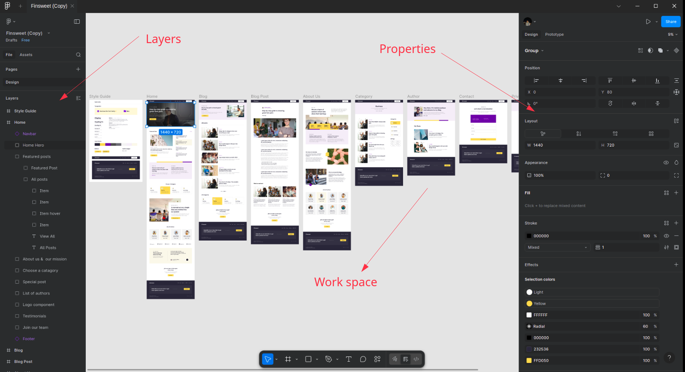
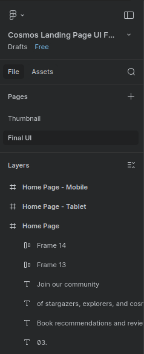
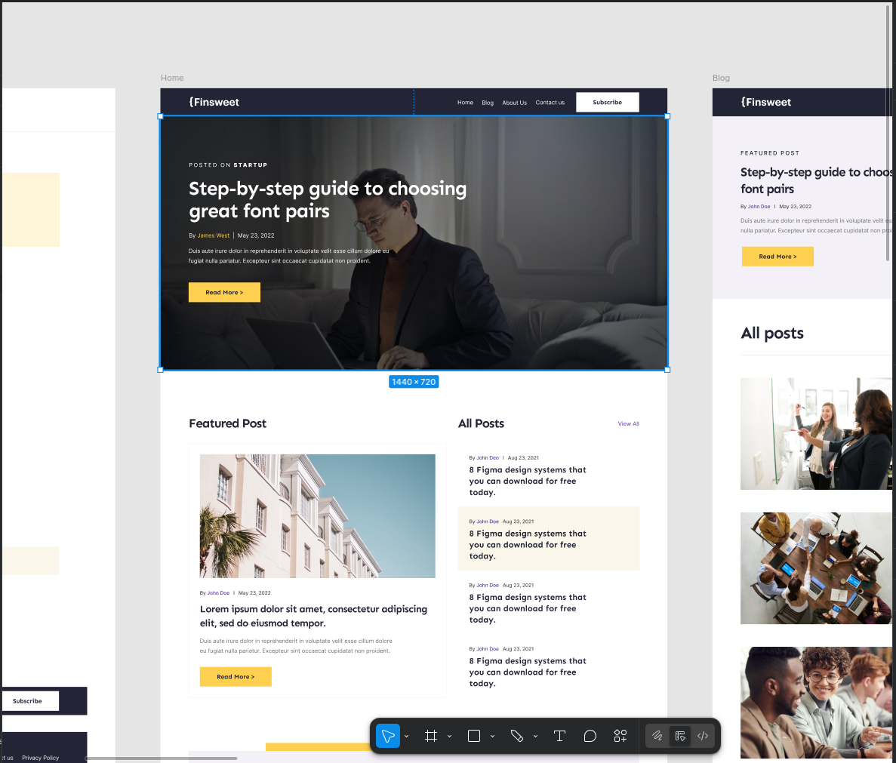
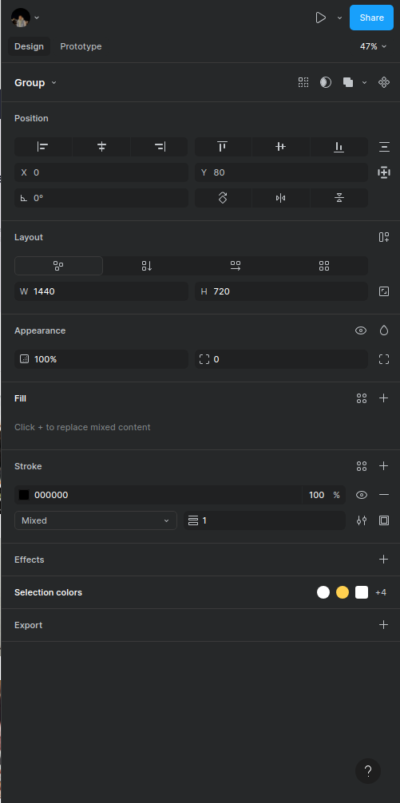
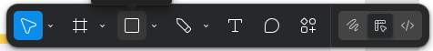
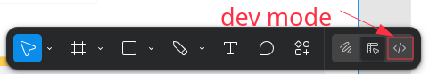

# Лекция 11. Figma для веб-разработчика

## Введение

Когда разработчик получает задачу сверстать страницу, он почти всегда работает с готовым макетом **Но это идеальный мир :)**. Это может быть простая `Landing Page` (Одностраничный сайт), интернет-магазин, админ-панель или мобильный интерфейс. Главная цель разработчика - понять, как именно должен выглядеть интерфейс: структура, отступы, размеры, цвета, шрифты, расположение элементов.

Чтобы всё это увидеть и корректно воспроизвести в `HTML/CSS`, используется `Figma`. Это графический инструмент, в котором дизайнеры создают макеты сайтов, а разработчики - изучают их и переводят в код.

Важно сразу подчеркнуть: в рамках курса мы не становимся дизайнерами и не учимся рисовать интерфейсы. Наша задача - читать макет, понимать его структуру и доставать из него нужную информацию для верстки. `Figma` - универсальный инструмент, который позволяет делать это быстро, удобно и без специальных дизайнерских навыков.

### Зачем разработчику знать Figma?

Когда Вы открываете макет, Вы получаете доступ ко всем деталям будущего сайта. По сути, это техническое задание, только визуальное. Через `Figma` разработчик может увидеть:

1. Точную сетку страницы
   Количество колонок, отступы между ними, границы области контента. Это важно для адаптивной верстки и повторения структуры дизайна.
2. Размеры каждого блока
   Высота и ширина элементов, что помогает правильно расположить их на странице.
3. Шрифты и их свойства
   Название шрифта, насыщенность, размер, межстрочный интервал, трекинг, выравнивание. Все эти параметры затем переносятся в `CSS`.
4. Цвета и стили
   `Figma` позволяет увидеть точный `hex`-код, `rgb`-значения, градиенты, тени, радиусы скругления.
5. Состояния элементов
   Как выглядят кнопки, поля ввода и другие интерактивные элементы в разных состояниях: наведение, нажатие, отключено и т.д.
6. Иконки и изображения
   Можно экспортировать графику в нужном формате и качестве. Что особенно важно для оптимизации загрузки страниц и экономии времени разработчика на поиск нужных ресурсов.
7. Анимации и взаимодействия
   В некоторых макетах можно увидеть, как элементы должны анимироваться или реагировать на действия пользователя.
8. Готовые компоненты
   Повторяющиеся элементы, такие как кнопки, карточки товаров, формы. Это помогает поддерживать консистентность дизайна и ускоряет процесс верстки.

### Почему Figma стала стандартом в веб-разработке

`Figma` - это инструмент, который работает прямо в браузере. Вам не нужно устанавливать тяжелые программы, покупать лицензию или синхронизировать файлы. Всё хранится в облаке, а проект открывается по ссылке.

Кроме того, `Figma` поддерживает совместную работу. Это означает:

- дизайнер вносит правки;
- Вы обновляете страницу - и сразу видите изменения;
- над проектом может работать вся команда.

Разработчику это даёт уверенность, что он всегда работает с актуальной версией макета.

### Фигма как универсальный визуальный документ

Можно сказать, что `Figma` - это место, где дизайнер объясняет разработчику, как должен выглядеть сайт, но делает это визуально. Не словами, не техническим текстом, а готовыми экранами, где всё уже расставлено, выровнено и оформлено.

Разработчику остаётся:

- понять структуру;
- прочитать параметры элементов (отступы, цвета, размеры);
- воспроизвести это в `HTML` и `CSS`.

Именно поэтому базовых знаний о `Figma` достаточно, чтобы работать эффективно. Мы не углубляемся в создание дизайна, не изучаем инструменты рисования - наша задача научиться использовать макет так, чтобы быстро и качественно перенести его в верстку.

### Что такое UI/UX дизайн?

`UI/UX дизайн` - это процесс создания пользовательских интерфейсов и опыта взаимодействия с ними. `UI` (User Interface) - это визуальная часть, то, что видит пользователь: кнопки, формы, меню, цвета, шрифты. `UX` (User Experience) - это общий опыт пользователя при взаимодействии с продуктом: насколько удобно пользоваться сайтом, как быстро находить нужную информацию, насколько приятен сам процесс использования.

Роль разработчика в этом процессе заключается в том, чтобы точно воспроизвести дизайн, созданный дизайнером, и обеспечить его функциональность. Разработчик должен понимать, как элементы интерфейса должны выглядеть и вести себя, чтобы пользовательский опыт был максимально положительным.

Исходя из этого, знание `Figma` помогает разработчику лучше понимать замысел дизайнера и создавать качественные веб-продукты, которые не только выглядят хорошо, но и обеспечивают отличный пользовательский опыт.

> Но на практике часто бывает так, что дизайнеры создают макеты, которые сложно или невозможно реализовать с технической точки зрения. В таких случаях разработчику приходится искать компромиссы между дизайном и функциональностью, чтобы достичь наилучшего результата для пользователя. Это ещё одна причина, почему разработчику важно уметь читать макеты в `Figma` и понимать, как они соотносятся с реальными возможностями веб-технологий.

Перед тем как начинать писать код, нужно внимательно изучить макет в `Figma`, потому что часто (**Нет!!! Очень часто!!!практически всегда :(**  ) дизайнеры делают ошибки или упускают важные детали. Если разработчик сразу не заметит эти недочёты, то в процессе верстки могут возникнуть проблемы, которые будет сложно исправить без переделки большого объёма работы. Поэтому важно:

1. Сравнить все размеры и отступы
   Убедиться, что все элементы правильно выровнены и соответствуют заданной сетке.
2. Проверить шрифты и стили
   Убедиться, что используются правильные шрифты, размеры и цвета.
3. Протестировать интерактивные элементы
   Убедиться, что кнопки, ссылки и формы работают так, как задумано.
4. Посмотреть адаптивность
   Убедиться, что макет корректно отображается на разных устройствах и экранах.
5. Проверить экспортируемые ресурсы
   Убедиться, что все изображения и иконки доступны в нужных форматах и разрешениях.

**А самое главное чтобы присутствовало понимание того, как всё это должно работать в реальном мире. Ведь макет - это только визуальное представление, а реальный сайт должен быть функциональным, удобным и быстрым.**

## Интерфейс Figma глазами разработчика

Когда разработчик открывает `Figma` впервые, впечатление может быть два: либо это *“что-то очень сложное”*, либо “просто красивая картинка”. На самом деле интерфейс `Figma` устроен достаточно логично, и разработчику важно знать только часть инструментов - те, что помогают читать макет.

Наша задача - понять структуру проекта, увидеть размеры элементов, отступы, цвета и шрифты. Поэтому в этом блоке мы пройдёмся по интерфейсу `Figma` именно с позиции разработчика: какие панели и инструменты Вам действительно нужны, а какие можно полностью игнорировать.

### Три основные области интерфейса

Figma состоит из трёх ключевых частей:

1. **Левая панель (Layers и Assets)**
   Здесь отображается структура макета: все страницы, фреймы, группы и отдельные элементы. Разработчик может быстро найти нужный блок и понять его иерархию.
2. **Центральная область (Canvas)**
   Это основное рабочее пространство, где отображается сам макет. Здесь можно просматривать дизайн, увеличивать и уменьшать масштаб, а также взаимодействовать с элементами.
3. **Правая панель (Properties)**
   Здесь отображаются свойства выбранного элемента: размеры, цвета, шрифты, отступы и другие параметры. Это ключевая часть для разработчика, так как именно здесь можно найти всю необходимую информацию для верстки.

#### Левая панель (Layers и Assets)

Слои - это дерево элементов. Всё, что есть на странице, собрано здесь:

- **Frames** (Фреймы) - это основные контейнеры, которые содержат другие элементы. Обычно фреймы соответствуют отдельным страницам или секциям сайта.
- **Groups** (Группы) - это объединения нескольких элементов в один блок для удобства перемещения и управления.
- **Components** (Компоненты) - это повторяющиеся элементы, такие как кнопки или карточки товаров, которые можно использовать многократно по всему проекту.

Все эти элементы можно разворачивать и сворачивать, чтобы быстро находить нужный блок. Благодаря этому разработчик может легко ориентироваться в структуре макета и понимать, как всё устроено.

Для разработчика слои важны по двум причинам:

**1. Формируют структуру страницы**
Здесь можно быстро найти:

- отдельные экраны (Desktop, Mobile);
- основные блоки (хедер, футер, секции);
- вложенные элементы (кнопки, изображения, текстовые блоки).

Эти знания помогают понять, как будет устроена верстка и какие элементы нужно реализовать.

**2. Помогают находить нужные элементы**
Когда на макете много мелких объектов, легче найти элемент по названию в слоях, чем щёлкать по макету вручную.

Пример структуры отдельного экрана в слоях:

> Это не идеальный пример, но уже видно, что дизайнер постарался структурировать слои по блокам и элементам. Это облегчает работу разработчику. Если встречается хотя бы такой уровень организации, то уже хорошо :)

**Хороший принцип:**

> Если дизайнер аккуратен в слоях - верстка проходит быстрее. Если же слои не структурированы, то разработчику приходится тратить время на поиск нужных элементов и понимание их назначения(что встречается очень часто :(  ).

##### Frame и Group - фундаментальное различие

Эта часть интерфейса особенно важна для разработчика, потому что:

**Frame (Фрейм)**

Это полноценный контейнер. Аналог в верстке - `div`, `section`, `header` и т. д. , которые имеют:

- размеры,
- позиционирование,
- фон,
- сетку,
- auto-layout,
- вложенность.

Страница дизайна почти всегда начинается с фрейма: `Desktop 1440`, `Mobile 375`, и т. д.

**Group (Группа)**

Группа не является контейнером. Она просто объединяет несколько элементов для удобства.

Она не имеет:

- внутренних отступов,
- собственной сетки,
- auto-layout.

А в верстке такой конструкции нет - поэтому группы дизайнеров часто путают новичков.

**Простое правило:**

> `Frame` важен для разработчика, `Group` - только вспомогательная упаковка.

#### Центральная область (Canvas)

Здесь находится сам макет. Важные навыки для разработчика:

- умение перемещаться по экранам (скролл + зажатый пробел);
- приближение/отдаление (`Ctrl` + колесо);
- выделение элементов (простой клик или клик зажимая `Ctrl` для “пробивания” через слои).
- просмотр отступов между элементами (зажать `Alt` и навести на элемент).

Разработчик чаще всего делает три вещи:

- выделяет элемент;
- наводится для просмотра размеров и отступов;
- смотрит его параметры справа;
- сравнивает с версткой.

#### Правая панель - Properties: самое важное место для разработчика

Правая панель показывает все свойства выбранного элемента. Это ключевой источник информации, которую мы переносим в `CSS`.

Здесь Вы можете увидеть:

**1. Размеры (Width / Height)**
   Например: 1280 × 720
**2. Позиционирование**
   Абсолютное, относительное, координаты X/Y.
**3. Отступы и внутренние paddings**
   Если элемент в `auto-layout`, они отображаются прямо под ним.
**4. Стиль текста**
   Шрифт, размер, жирность, line-height, letter-spacing.
**5. Цвета (Fill)**
   Hex-коды, rgba, градиенты.
**6. Скругление углов (Border Radius)**
   Например: 8px, 24px, или миксовые значения.
**7. Тени, обводки, эффекты**
   Обычно - `box-shadow` и `stroke`.
**8. Auto-layout (если используется)**
   Самое важное для понимания поведения элементов:

- направление (горизонтальное/вертикальное),
- выравнивание,
- расстояние между элементами.
  `Auto-layout` - это фактически аналог `flexbox`.

Мы будем подробно разбирать это на практике.

#### Что можно игнорировать разработчику

Большая часть инструментов дизайнера Вам не нужна:

- `Pen tool`,
- `Boolean operations` (объединение фигур),
- редактирование узлов,
- переменные,
- сложные компоненты,
- прототипирование.

Эти инструменты предназначены для создания дизайна. Разработчику важно только читать и интерпретировать макет.

### Сетки и адаптивность

Когда разработчик открывает макет в `Figma`, первое, на что стоит обратить внимание, - это сетка страницы. Именно сетка определяет, как элементы выравниваются, где находятся границы контента и почему блоки расположены именно так, а не иначе.

Очень важно понять: сетка в `Figma` - это не просто вспомогательная разметка для дизайнера. Для разработчика это прямая подсказка, как строить `layout` в `HTML` и `CSS`.

> Тут важно понимать что все дизайнеры разные. Кто-то делает аккуратные сетки, кто-то нет. Кто-то использует `auto-layout`, кто-то просто рисует блоки и не думает о том, как это будет реализовано в коде. Поэтому разработчику нужно уметь читать макет и адаптироваться к разным стилям работы дизайнеров.

#### Что такое сетка и зачем она нужна

**Сетка** - это система колонок, отступов и промежутков, которая задаёт структуру страницы. Она помогает:

- выравнивать элементы по одной линии;
- соблюдать одинаковые отступы между блоками;
- делать дизайн аккуратным и предсказуемым;
- упрощать адаптивную верстку.
- Большинство веб-макетов строятся на основе колоночной сетки, чаще всего - 12 колонок.

Для разработчика это означает следующее:

- страница делится на логические вертикальные области;
- блоки занимают определённое количество колонок;
- при верстке это легко переносится в `grid` или `flex`.

#### Где смотреть сетку в Figma

Сетка всегда привязана к Frame, а не к отдельным элементам.

Алгоритм работы простой:

1. Выделяем основной фрейм страницы (например, `Desktop 1440`).
2. В правой панели находим раздел `Layout Grid`.
3. Смотрим:
   - тип сетки (`columns`);
   - количество колонок;
   - ширину `gutter` (промежутки);
   - `margin` (внешние отступы).

Очень часто можно увидеть:

- 12 колонок;
- фиксированную ширину контента;
- большие внешние отступы слева и справа.

Это сразу даёт понимание: где заканчивается контент и начинается “пустое пространство”.

#### Сетка и верстка: прямая связь

Важно сразу провести параллель между `Figma` и `CSS`.

Если Вы видите в макете:

- сетку из колонок,
- одинаковые отступы между элементами,
- блоки, которые ровно занимают половину или треть ширины,

значит, дизайнер ожидает, что в верстке будет использован:

- `CSS Grid`,
- или `flexbox` с ограничением ширины контейнера.

Например:

- карточка занимает 3 из 12 колонок → в `CSS` это будет `25%`;
- секция по центру с отступами → `max-width + margin: 0 auto`.

`Figma` не говорит напрямую, какой инструмент использовать, но очень чётко показывает логику расположения элементов.

> Данный пример скорее описывает идеальный сценарий. На практике дизайнеры часто пренебрегают сетками или делают их “на глаз”. В таких случаях разработчику приходится самому решать, как лучше реализовать верстку, исходя из общего вида макета и стандартных практик веб-разработки.

#### Отступы, расстояния и визуальные группы

Кроме колонок, разработчику важно смотреть на:

- расстояние между секциями;
- расстояние между элементами внутри блока;
- визуальные группы.

В Figma это удобно делать так:

- выделить один элемент;
- навести курсор на соседний элемент;
- зажать `Alt` (Option на macOS).

Figma покажет точное расстояние между элементами в пикселях.

Это помогает:

- не “придумывать” отступы;
- не ставить margin на глаз;
- добиться точного соответствия макету.

#### Адаптивность в Figma

Часто дизайнеры делают несколько фреймов:

- Desktop;
- Tablet;
- Mobile.

Для разработчика это очень ценно, потому что:

- видно, как перестраивается `layout`;
- понятно, какие блоки меняют порядок;
- можно увидеть, какие элементы скрываются или упрощаются.

При работе с адаптивным макетом важно:

1. Сравнивать версии экранов.
2. Смотреть, что меняется, а что остаётся.
3. Делать выводы:
   - где нужен `flex-wrap`;
   - где grid;
   - где менять направление (`row → column`).

Это напрямую связано с `media queries` в `CSS`.

#### Auto-layout как подсказка для адаптивности

Если дизайнер использует `auto-layout` (Как Вы уже читали выше, это происходит далеко не всегда), это огромный плюс для разработчика.

- вертикальный `auto-layout → flex-direction: column;`
- горизонтальный `auto-layout → flex-direction: row;`
- `gap → gap` в `CSS`;
- `padding` → внутренние отступы контейнера.

`Auto-layout` показывает намерение дизайнера:
как элементы должны вести себя при изменении ширины экрана.

Даже если Вы не копируете поведение один в один, auto-layout даёт чёткое понимание логики блока.

#### Типичные ошибки начинающих разработчиков

На этом этапе часто допускают ошибки:

- игнорируют сетку и “верстают на глаз”;
- не смотрят на отступы между секциями;
- не сравнивают `desktop` и `mobile` версии;
- пытаются копировать размеры буквально, не понимая логики.

Важно помнить:

> Figma - это не инструкция “копируй и вставляй”, а визуальное описание структуры интерфейса. Разработчик должен уметь читать макет, понимать его логику и переносить это в код с учётом реальных возможностей веб-технологий. И на этом моменте часто, Нет Очень часто возникают споры между разработчиком , дизайнером и заказчиком) Нужно уметь находить компромиссы и объяснять свои решения.

### Получение данных из макета без Dev Mode

Несмотря на то, что в `Figma` существует отдельный режим для разработчиков (`Dev Mode`), важно понимать: для верстки он не является обязательным. Большую часть информации разработчик может получить, используя бесплатный функционал `Figma`.

На практике большинство начинающих и даже опытных разработчиков работают именно так: выделяют элементы, смотрят их свойства в правой панели и используют измерения между объектами.

#### Что доступно разработчику бесплатно

Даже без подписки Figma позволяет:

- смотреть размеры элементов;
- измерять расстояния между объектами;
- получать данные по шрифтам;
- смотреть цвета, радиусы, тени;
- экспортировать изображения и `SVG`.

Этого более чем достаточно для качественной верстки.

#### Размеры и расстояния между элементами

Самый простой и часто используемый способ получить данные из макета:

- Выделить элемент.
- Навести курсор на соседний элемент.
- Зажать `Alt` (`Option` на `macOS`).

`Figma` покажет:

- расстояние между элементами;
- размеры выделенного объекта;
- относительное расположение.

Это основной инструмент разработчика при работе с макетом.

#### Правая панель - источник всех параметров

При выборе любого элемента в правой панели отображаются его свойства:

**Размеры**

- ширина и высота;
- иногда min/max размеры.

**Позиция**

координаты X и Y (используются скорее для анализа, чем для копирования).

**Текст**

- `font-family;`
- `font-size;`
- `font-weight;`
- `line-height;`
- `letter-spacing;`
- `text-align;`
- `цвет текста.`

**Визуальные свойства**

- `background (Fill);`
- `border-radius;`
- `stroke;`
- `box-shadow (Effects).`

Все эти параметры напрямую используются в `CSS`.

#### Auto-layout как бесплатная подсказка для верстки

`Auto-layout` полностью доступен бесплатно и является огромной подсказкой для разработчика.

Он показывает:

- направление элементов (горизонталь / вертикаль);
- отступы между элементами (`gap`);
- внутренние отступы (`padding`);
- выравнивание.

Для разработчика это почти готовая схема:

- auto-layout по горизонтали → `display: flex; flex-direction: row;`
- auto-layout по вертикали → `flex-direction: column;`
- расстояние `→ gap`

#### Экспорт изображений и иконок

Экспорт доступен в бесплатной версии:

- выбираем элемент;
- в правой панели находим раздел `Export`;
- выбираем формат (`SVG` / `PNG` / `JPG`);
- экспортируем.

Правило простое:

- иконки → `SVG`;
- изображения → оптимизированные растровые форматы.

## Практика работы с макетом в Figma

Когда разработчик получает макет в `Figma`, важно не просто открыть его и начать верстать. Нужно систематически пройтись по всем ключевым аспектам дизайна, чтобы убедиться, что всё понятно и готово к реализации. Это помогает избежать ошибок, недоразумений и лишних правок в процессе разработки.

### Шаг 1. Идентифицируем исходный фрейм

- Находим корневой `Frame` (чаще всего `Desktop 1440`, `Home page` и т. п.) и проверяем, какие вариации экранов доступны: desktop/tablet/mobile.
- Активируем сетку (`Shift+G`) и фиксируем параметры `Layout Grid`: тип, количество колонок, `gutter`, `margin`. Отсутствие сетки заносим в список уточнений.

> Если сетка присутствует, делаем скриншот/заметки с параметрами - это ускорит сравнение макета и итоговой верстки при ревью.

### Шаг 2. Формируем карту секций

1. Проходим по структуре слоя (`Layers`) и выписываем все основные секции: `header`, hero, контентные блоки, формы, `footer`.
2. Переводим список в чек-лист - он станет рабочим `scope` для верстки.
3. При необходимости нормализуем названия (дизайнерские подписи не всегда совпадают с терминологией фронтенда) и фиксируем порядок отображения.

### Шаг 3. Снимаем параметры блоков

#### Структура

- Для каждой секции определяем контейнер верхнего уровня (Frame с `auto-layout` или статическая группа).
- Фиксируем направление `auto-layout`, `gap`, `padding`, правила выравнивания. Эти данные напрямую транслируются в `flexbox`/`grid` конфигурацию.

#### Типографика

- Для всех заголовков, подзаголовков и параграфов выписываем `font-family`, `font-weight`, `font-size`, `line-height`, `letter-spacing`.
- Сразу группируем повторяющиеся значения - набор стилей позже можно перенести в переменные или утилитарные классы.

#### Цвета и эффекты

- Фиксируем `hex`/`rgba` ключевых цветов: фон, текст, акценты, состояния.
- Проверяем наличие `drop shadow`, `inner shadow`, градиентов, асимметричных радиусов. Для расхождений между схожими элементами заводим уточнения.

### Шаг 4. Нормируем отступы

- Используем измерение (`Alt` + ховер) для построения таблицы вертикальных и горизонтальных отступов.
- По секциям фиксируем базовые вертикальные интервалы (например, 120px между блоками) и конвертируем их в `margin`/`padding` правил.
- При обнаружении “шума” (118px, 123px, 115px) выбираем эталонное значение и синхронизируем его с дизайнером до старта верстки.

### Шаг 5. Экспортируем графику

- Векторные элементы (иконки, логотипы) выгружаем в `SVG` с корректными `Export Settings`.
- Растровый контент сохраняем в `PNG` или `JPG` в зависимости от необходимости прозрачности и качества градиентов.
- Все экспортированные ассеты складываем в структуру проекта, чтобы не возвращаться к макету при настройке сборки.

### Шаг 6. Валидируем верстку по макету

- Во время разработки держим макет открыт и сверяем ключевые блоки в DevTools (размеры, межблочные расстояния, базовые состояния).
- При расхождениях проверяем, нет ли выключенных или дублированных слоев за пределами основного `Frame`, и актуальны ли данные авто-лейаута.

### Шаг 7. Фиксируем вопросы

- Все неочевидные сценарии (hover/active, адаптивное поведение, условные элементы) заносим в отдельный список.
- Формулируем вопросы точечно: “`Features`, desktop - 4 карточки, mobile - 2. Нужен слайдер или пересборка сетки?” Это ускоряет ответ и упрощает согласование.

### Мини-чек-лист перед стартом верстки

- Зафиксирована структура секций и их порядок.
- Определены параметры сетки и ширина контейнера.
- Сняты ключевые параметры блоков: отступы, авто-лейаут, типографика, цвета.
- Сформирован набор типографских стилей.
- Собраны цвета, радиусы, эффекты.
- Экспортированы все необходимые ассеты.
- Все вопросы и неясности согласованы с дизайнером.

Если чек-лист закрыт, разработка проходит предсказуемо: все параметры уже формализованы, и время тратится на реализацию, а не на постоянное возвращение в макет.

> Важно: даже если макет неидеален, наличие чёткой структуры и параметров значительно ускоряет процесс верстки и снижает количество правок на этапе тестирования.

## Заключение

`Figma` - это мощный инструмент, который помогает разработчикам эффективно работать с макетами дизайна. Понимание структуры интерфейса, умение читать параметры элементов и использовать сетки - всё это ключевые навыки для успешной верстки.

Даже без глубоких дизайнерских знаний разработчик может быстро и точно переносить визуальные концепции в код, обеспечивая качественный пользовательский опыт.

Освоение `Figma` с позиции разработчика - это не только навык работы с инструментом, но и понимание того, как визуальные решения трансформируются в технические реализации. Чем лучше разработчик умеет читать макеты, тем быстрее и качественнее он сможет создавать веб-продукты, которые соответствуют ожиданиям пользователей и требованиям бизнеса.
