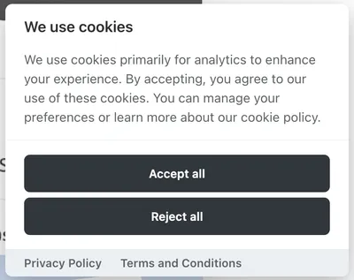

# Лекция 12. Формы и модальные окна. Таблицы. Встраиваемые элементы


## Вступление

Формы, модальные окна, таблицы и встраиваемые элементы - это те части интерфейса, которые встречаются почти в каждом проекте. И именно на них чаще всего видно разницу между “страница выглядит нормально” и “страница сделана как продукт”.

В этой лекции мы поговорим о четырех блоках, которые обычно идут вместе:

- **Формы** - ввод данных пользователем: регистрация, логин, обратная связь, фильтры, оформление заказа.
- **Модальные окна** - быстрые сценарии поверх страницы: подтверждение, уведомление, форма без перехода на новую страницу.
- **Таблицы** - структурированные данные: заявки, пользователи, заказы, прайсы, расписания, отчёты.
- **Встраиваемые элементы**- внешний или медиа-контент: изображения, видео, iframe (карты, YouTube), SVG-иконки.

Сегодня мы рассмотрим основные элементы и приёмы работы с ними, а также обсудим лучшие практики и распространённые ошибки.

## Формы: базовая семантика и структура

Формы - это основной способ взаимодействия пользователя с веб-приложением. Они позволяют собирать данные, которые затем обрабатываются на сервере или в клиентском приложении.

### Как создавать формы

Форма создаётся с помощью тега `<form>`, который содержит различные элементы ввода, именно он отвечает за отправку данных на сервер и взаимодействие с пользователем. Браузер автоматически обрабатывает отправку формы и может выполнять валидацию данных.

Пример базовой формы:

```html
<form action="/send" method="post">
  <!-- поля формы -->
</form>
```

Ключевые атрибуты тега `<form>`:

- `action` - `URL`, на который будут отправлены данные формы (Адрес куда будут отправлены данные при отправке формы).
- `method` - `HTTP`-метод для отправки данных (обычно "GET" или "POST"). О методах мы будем говорить позже в курсе.

### Элементы формы

Внутри `<form>` обычно находятся:

- Элементы ввода - поля, где пользователь вводит/выбирает данные.
- Подписи к полям - чтобы пользователь понимал, что именно вводить.
- Кнопка отправки - чтобы отправить данные формы.
- (Иногда) подсказки и ошибки - текст, который помогает заполнить форму правильно.

Разберём эти элементы по порядку.

#### Элементы ввода - Input elements

Элементы ввода создаются с помощью различных тегов, таких как `<input>`, `<textarea>`, `<select>`, и других. Каждый из этих тегов предназначен для определённого типа данных. Благодаря элементам ввода, пользователи могут взаимодействовать с формой и предоставлять необходимую информацию.

#### Универсальный элемент ввода - `<input>`

Тег `<input>` является универсальным элементом ввода и может принимать различные типы данных в зависимости от значения атрибута `type`. Вот некоторые из наиболее распространённых типов:

- `text` - однострочное текстовое поле.
- `password` - поле для ввода пароля (символы скрыты).
- `email` - поле для ввода электронной почты с базовой валидацией.
- `number` - поле для ввода чисел.
- `phone` - поле для ввода телефонного номера.
- `date` - поле для выбора даты.
- `time` - поле для выбора времени.
- `datetime-local` - поле для выбора даты и времени.
- `checkbox` - флажок для выбора одного или нескольких вариантов.
- `radio` - переключатель для выбора одного варианта из группы.
- `file` - поле для загрузки файлов.
- `submit` - кнопка для отправки формы.

Давайте подробно рассмотрим пример использования различных типов `<input>`:

**Текстовое поле `type="text"`:**

```html
<form action="/send" method="post">
  <input type="text" name="username" />
</form>
```

Здесь создаётся текстовое поле для ввода имени пользователя. `name` - это имя поля, которое будет использоваться при отправке данных на сервер.

> Атрибут name важен для элементов ввода: именно по нему сервер получает значение поля. Обычно name делают уникальным в пределах формы, но есть исключения (например, группа `radio`, где `name` одинаковый).

**Поле для ввода пароля `type="password"`:**

```html
<form action="/send" method="post">
  <input type="password" name="password" />
</form>
```

Здесь создаётся поле для ввода пароля. Символы, введённые пользователем, будут скрыты.

**Поле для ввода электронной почты `type="email"`:**

```html
<form action="/send" method="post">
  <input type="email" name="email" />
</form>
```

Здесь создаётся поле для ввода электронной почты. Браузер может выполнять базовую валидацию, чтобы убедиться, что введённый текст соответствует формату электронной почты.

**Поле для ввода числа `type="number"`:**

```html
<form action="/send" method="post">
  <input type="number" name="age" />
</form>
```

Здесь создаётся поле для ввода чисел. Пользователь сможет вводить только числовые значения.

**Поле для ввода номера телефона `type="tel"`:**

```html
<form action="/send" method="post">
  <input type="tel" name="phone" />
</form>
```

Здесь создаётся поле для ввода телефонного номера. В браузерах на мобильных устройствах может появляться клавиатура, оптимизированная для ввода номеров.

**Поле для выбора даты `type="date"`:**

```html
<form action="/send" method="post">
  <input type="date" name="birthdate" />
</form>
```

Данный элемент позволяет пользователю выбрать дату из календаря. Это стандартный элемент HTML5. На самом деле, в проектах часто используются сторонние библиотеки для выбора даты, так как нативные элементы могут выглядеть по-разному в разных браузерах и не всегда соответствуют дизайну проекта.

**Поле для выбора времени `type="time"`:**

```html
<form action="/send" method="post">
  <input type="time" name="appointment_time" />
</form>
```

Здесь создаётся поле для выбора времени.

**Поле для выбора даты и времени `type="datetime-local"`:**

```html
<form action="/send" method="post">
  <input type="datetime-local" name="meeting_datetime" />
</form>
```

Здесь создаётся поле для выбора даты и времени.

**Флажок `type="checkbox"`:**

```html
<form action="/send" method="post">
  <input type="checkbox" name="subscribe" value="yes" /> Подписаться на новости
</form>
```

В этом примере добавляется новый атрибут `value`, который определяет значение, отправляемое на сервер, если флажок установлен. Если флажок не установлен, то данные с этим именем не будут отправлены. Чаще в этом случае используют значение "true" или "yes".

Пользователь может установить или снять флажок, чтобы выбрать или отказаться от подписки на новости, подтвердить согласие с условиями и т.д.

**Переключатель `type="radio"`:**

```html
<form action="/send" method="post">
  <input type="radio" name="gender" value="male" /> Мужчина
  <input type="radio" name="gender" value="female" /> Женщина
  <input type="radio" name="gender" value="other" /> Другой
</form>
```

С помощью переключателей пользователь может выбрать один вариант из группы. Все переключатели, относящиеся к одной группе, должны иметь одинаковое значение атрибута `name`.

**Поле для загрузки файлов `type="file"`:**

```html
<form action="/send" method="post" enctype="multipart/form-data">
  <input type="file" name="profile_picture" />
</form>
```

Здесь создаётся поле для загрузки файлов. Обратите внимание на атрибут `enctype="multipart/form-data"` в теге `<form>`, который необходим для правильной отправки файлов на сервер. Он указывает, что форма будет содержать файлы.

**Кнопка отправки `type="submit"`:**

Кнопка отправки формы создаётся с помощью элемента `<input>` с атрибутом `type="submit"` или с помощью тега `<button>` с атрибутом `type="submit"`. Без этой кнопки пользователь не сможет отправить данные формы на сервер.

```html
<form action="/send" method="post">
  <input type="text" name="username" />
  <input type="submit" value="Отправить" />
</form>
```

Очень важно понимать, что кнопка отправки должна находиться внутри тега `<form>`, чтобы она могла корректно отправлять данные формы.

Чаще всего для кнопок используют тег `<button>`, так как он более гибкий и позволяет добавлять внутрь другие элементы, например, иконки.

```html
<form action="/send" method="post">
  <input type="text" name="username" />
  <button type="submit">Отправить</button>
</form>
```

это более предпочтительный способ создания кнопок отправки, так как он позволяет легко стилизовать кнопку и добавлять дополнительные элементы внутри неё.

У кнопки могут быть разные состояния например: неактивная (`disabled`), при наведении (`hover`), при нажатии (`active`) и т.д. Эти состояния можно стилизовать с помощью `CSS`, чтобы улучшить пользовательский опыт.

Приведём пример стилизации кнопки отправки:

```css
button {
  background-color: #4caf50;
  color: white;
  padding: 10px 20px;
  border: none;
  border-radius: 4px;
  cursor: pointer;
}
button:hover {
  background-color: #45a049; /* Темно-зеленый при наведении */
}
button:disabled {
  background-color: #cccccc; /* Серый фон для неактивной кнопки */
  cursor: not-allowed; /* Курсор запрещен */
}
button:active {
  background-color: #3e8e41; /* Еще темнее при нажатии */
}
```

#### Многострочный ввод - `<textarea>`:

Если пользователю нужно написать текст длиннее одной строки (сообщение, комментарий, описание), используется тег `<textarea>`.

```html
<form action="/send" method="post">
  <textarea name="message" rows="4" cols="50"></textarea>
</form>
```

Здесь создаётся многострочное текстовое поле. Атрибуты `rows` и `cols` определяют количество видимых строк и столбцов соответственно.
**Под столбцами подразумеваются символы, а не пиксели.**

По умолчанию `textarea` можно изменять по размеру, перетаскивая уголок. Если это не нужно, можно отключить с помощью `CSS`:

```css
textarea {
  resize: none;
}
```

#### Выпадающий список - `<select>`

Если нужно выбрать один или несколько вариантов из списка, используется тег `<select>`, внутри которого находятся теги `<option>` для каждого варианта.

```html
<form action="/send" method="post">
  <select name="language">
    <option value="en">Английский</option>
    <option value="ru">Русский</option>
    <option value="es">Испанский</option>
  </select>
</form>
```

Здесь создаётся выпадающий список для выбора языка. Атрибут `value` в каждом `<option>` определяет значение, которое будет отправлено на сервер при выборе этого варианта.

Для выбора нескольких вариантов можно добавить атрибут `multiple` к тегу `<select>`:

```html
<form action="/send" method="post">
  <select name="languages" multiple>
    <option value="en">Английский</option>
    <option value="ru">Русский</option>
    <option value="es">Испанский</option>
  </select>
</form>
```

Теперь пользователь сможет выбрать несколько языков, удерживая клавишу `Ctrl` (или `Cmd` на Mac) при выборе. Появится скроллбар, если вариантов много. Для того чтобы убрать скроллбар и показывать все варианты сразу, можно задать фиксированную высоту с помощью `CSS`.

```css
select {
  height: 100px;
  &::-webkit-scrollbar {
    width: 0; // выключает скроллбар в вебкит браузерах
  }
}
```

#### Подписи к полям - placeholder и Label

После того как мы разобрались с элементами ввода, важно понять, как правильно подписывать поля формы, чтобы пользователи понимали, что именно от них требуется.

> Главное правило: Каждое поле формы должно иметь подпись!!!

Для стандартных полей ввода (например, текстовое поле, поле для пароля, поле для электронной почты) можно использовать атрибут `placeholder`, который отображает текст внутри поля до тех пор, пока пользователь не начнёт вводить данные.

```html
<form action="/send" method="post">
  <input type="text" name="username" placeholder="Введите ваше имя" />
</form>
```

Здесь текст _"Введите ваше имя"_ будет отображаться внутри текстового поля до тех пор, пока пользователь не начнёт вводить данные.

Этот подход не всегда удобен, так как при вводе текста placeholder исчезает, и пользователь может забыть, что именно нужно было ввести. Поэтому для важных полей лучше использовать тег `<label>`, который создаёт явную подпись для поля ввода.

```html
<form action="/send" method="post">
  <label for="username">Имя пользователя:</label>
  <input type="text" id="username" name="username" />
</form>
```

Здесь тег `<label>` создаёт подпись _"Имя пользователя:"_ для текстового поля. Атрибут `for` в `<label>` должен совпадать с атрибутом `id` в соответствующем элементе ввода. Это связывает подпись с полем, что улучшает доступность и удобство использования формы.

#### Пример: label на рамке input

Иногда в интерфейсе нужно сделать _“плавающую подпись”_: пока поле пустое - текст находится внутри поля, а когда пользователь кликает в `input` или вводит значение - подпись поднимается вверх и _“ложится”_ на рамку поля. Такой приём часто используется в формах авторизации и регистрации.

```html
<form>
  <div class="field">
    <input
      id="username"
      name="username"
      type="text"
      placeholder=" "
      autocomplete="off"
    />
    <label for="username">Имя пользователя</label>
  </div>
</form>
```

**Что здесь важно:**

- `label` связан с полем через `for="username"` и `id="username"`.
  Это означает, что `label` относится именно к этому input.

- `label` должен идти сразу после `input`, потому что дальше в `CSS` используется селектор `input + label`.
  Если поменять местами, эффект работать не будет.

- `placeholder=" "` (пробел) - это небольшая хитрость.
  Она нужна, чтобы работал псевдокласс `:placeholder-shown`, который позволяет понять: поле пустое или в нём уже есть текст.

CSS-стили для этого приёма могут выглядеть так:

```css
.field {
  position: relative; // чтобы label позиционировался относительно .field
  width: 320px;
}

.field input {
  width: 100%;
  padding: 10px 8px 10px;
  border: 2px solid #3540db;
  border-radius: 8px;
  font-size: 16px;
  outline: none; // убирает стандартную обводку браузера
  background: transparent;
}

.field label {
  position: absolute;
  left: 15px;
  top: 50%;
  transform: translateY(-50%);
  padding: 0 6px;
  background: #fff;
  color: #666;
  transition: 0.15s ease;
}

.field input:focus + label, // когда input в фокусе 
.field input:not(:placeholder-shown) + label {
  // когда в input есть текст
  top: 0;
  font-size: 12px;
  color: #000000;
}

.field input:focus {
  border-color: #fd0000; // при фокусе меняем цвет рамки
}

.field input:not(:placeholder-shown) {
  border-color: #00fd0d; // если есть текст в input меняем цвет рамки
}
```

### Полезные атрибуты полей: `required`, `minlength`, `maxlength` и другие

`HTML` позволяет добавлять к полям формы атрибуты, которые улучшают `UX` и дают браузеру возможность выполнять базовую валидацию без `JavaScript`. Это не _“полная защита”_ и не замена серверной проверки, но для интерфейса - очень полезно.

#### Атрибут `required`

Если поле обязательное, то нужно добавить атрибут `required`. Это укажет браузеру, что пользователь должен заполнить это поле перед отправкой формы.

```html
<form action="/send" method="post">
  <input id="username" type="text" name="username" placeholder=" " required />
  <button type="submit">Отправить</button>
</form>
```

> `required` - это удобная браузерная проверка, но её можно обойти (например, отправить запрос вручную или изменить HTML через DevTools). Поэтому на сервере данные всё равно нужно проверять.

#### minlength и maxlength - ограничение длины текста

Эти атрибуты задают минимальную и максимальную длину строки.

```html
<form action="/send" method="post">
  <input
    id="username"
    type="text"
    name="username"
    placeholder=" "
    minlength="3"
    maxlength="15"
    required
  />
  <button type="submit">Отправить</button>
</form>
```

Здесь поле `username` должно содержать от 3 до 15 символов. Если пользователь введёт меньше или больше символов, браузер покажет ошибку при попытке отправить форму.

#### Атрибут `autocomplete` - автозаполнение

Браузер может подсказывать и подставлять данные (имя, email и т.д.). Обычно это удобно, но иногда его отключают.

```html
<form action="/send" method="post">
  <input
    id="username"
    type="text"
    name="username"
    placeholder=" "
    autocomplete="off"
    required
  />
  <button type="submit">Отправить</button>
</form>
```

Здесь атрибут `autocomplete="off"` отключает автозаполнение для этого поля.

#### Атрибуты `disabled` и `readonly`

Иногда поле в форме должно показывать информацию пользователю, но при этом:

- пользователь не должен иметь права менять значение (например, город подставлен автоматически)
- или поле временно нельзя использовать (например, кнопка/поле блокируется до выполнения условия)

Для этого в `HTML` есть два атрибута: `readonly` и `disabled`.

**readonly - “нельзя редактировать, но отправляется”**

`readonly` делает поле неизменяемым: пользователь видит значение, может выделить и скопировать текст, но изменить его не может.
Важно: при отправке формы поле будет отправлено на сервер.

Пример: город определился автоматически и менять его нельзя.

```html
<form action="/send" method="post">
  <label for="city">Город</label>
  <input id="city" type="text" name="city" value="Prague" readonly />

  <button type="submit">Отправить</button>
</form>
```

**Как это работает:**
Пользователь увидит `Prague`, но не сможет удалить или заменить текст. При отправке формы сервер получит `city=Prague`.

**disabled - “нельзя использовать и не отправляется”**
`disabled` полностью блокирует поле: пользователь не может взаимодействовать с ним (выделить, скопировать, ввести текст). Кроме того, при отправке формы значение этого поля не будет отправлено на сервер.
Пример: роль пользователя показываем в форме, но серверу она не нужна из формы (роль определяется системой).

```html
<form action="/send" method="post">
  <label for="role">Роль</label>
  <input id="role" type="text" name="role" value="User" disabled />

  <button type="submit">Отправить</button>
</form>
```

**Как это работает:**
Пользователь увидит `User`, но поле будет _“неактивным”_.При отправке формы сервер не получит `role=User`.

#### Скрытое поле `hidden` - скрытое поле

Иногда нужно передать на сервер данные, которые не должны быть видны пользователю. Для этого используется cкрытое поле `hidden`, который скрывает поле из интерфейса, но при этом его значение отправляется на сервер при отправке формы.

```html
<form action="/send" method="post">
  <input type="hidden" name="session_id" value="123456789" />
  <button type="submit">Отправить</button>
</form>
```

Здесь создаётся скрытое поле `session_id`, которое будет отправлено на сервер при отправке формы.

#### Базовый стиль форм с помощью CSS

В каждой форме есть стандартные элементы, которые нужно стилизовать: поля ввода, кнопки, подписи, ошибки и т.д. Вот пример базовых стилей для формы:

```html
<form class="form" action="/send" method="post">
  <div class="form-row">
    <label class="form-label" for="username">Имя пользователя</label>
    <input
      class="form-input"
      id="username"
      name="username"
      type="text"
      placeholder=" "
      required
    />
    <div class="form-hint">От 3 до 15 символов</div>
    <div class="form-error">Поле обязательно для заполнения</div>
  </div>

  <div class="form-row">
    <label class="form-label" for="email">Email</label>
    <input
      class="form-input"
      id="email"
      name="email"
      type="email"
      placeholder=" "
      required
    />
    <div class="form-error">Введите корректный email</div>
  </div>

  <div class="form-row">
    <label class="form-label" for="message">Сообщение</label>
    <textarea
      class="form-textarea"
      id="message"
      name="message"
      rows="4"
    ></textarea>
  </div>

  <button class="form-btn" type="submit">Отправить</button>
</form>
```

> Здесь `placeholder=" "` нужен для того, чтобы работал селектор `:placeholder-shown`, и мы могли показывать ошибку только после того, как пользователь начал ввод.

Теперь добавим стили:

```css
* {
  margin: 0;
  padding: 0;
  box-sizing: border-box;
}

.form {
  margin: 0 auto;
  max-width: 450px;
  width: 100%;
  padding: 20px;
  border: 1px solid #e5e5e5;
  border-radius: 12px;
}

.form-row {
  margin-bottom: 16px;
}

.form-label {
  display: block;
  margin-bottom: 6px;
  font-size: 14px;
}

.form-input,
.form-textarea,
.form select {
  width: 100%;
  padding: 10px 12px;
  border: 1px solid #999;
  border-radius: 8px;
  font-size: 16px;
  outline: none;
}

.form-textarea {
  min-height: 100px;
  resize: none;
}

.form-hint {
  margin-top: 6px;
  font-size: 12px;
  color: #666;
}

/* Ошибка под полем (по умолчанию скрыта) */
.form-error {
  margin-top: 6px;
  font-size: 12px;
  color: #fd0000;
  display: none;
}

.form-btn {
  padding: 10px 16px;
  border: none;
  border-radius: 8px;
  cursor: pointer;
}

/* Focus */
.form-input:focus,
.form-textarea:focus,
.form select:focus {
  border-color: #3540db;
}

/* Ошибка: показываем только после ввода (когда placeholder уже не показан) */
.form-input:invalid:not(:placeholder-shown) {
  border-color: #fd0000;
}

/* Показываем текст ошибки рядом с невалидным полем */
.form-input:invalid:not(:placeholder-shown) + .form-hint + .form-error {
  display: block;
}
```

Чаще всего этого достаточно для базовой формы. Конечно, в реальных проектах стили могут быть сложнее и включать адаптивность, анимации, дополнительные состояния и т.д. Но главное - понимать структуру формы и как работать с её элементами.
В основном все ошибки приходят от серверной валидации, поэтому важно всегда проверять данные на сервере, даже если на клиенте есть базовая проверка.

## Встраиваемые элементы: `<iframe>`


**iFrame (inline frame)** - это `HTML`-элемент, который позволяет встраивать другой `HTML`-документ внутри текущей страницы. Он создаётся с помощью тега `<iframe>` и часто используется для встраивания внешнего контента, такого как карты, видео, формы и другие веб-страницы.

### Как использовать `<iframe>`

Рассмотрим базовый пример использования `<iframe>` для встраивания сайта:

```html
<iframe
  src="https://doka.guide/"
  width="400"
  height="400"
  title="Документация Doka"
  frameborder="0"
>
  // отвечает за рамку вокруг iFrame
</iframe>
```

Здесь создаётся `iFrame`, который загружает страницу `https://doka.guide/` внутри текущей страницы.

### Ключевые атрибуты тега `<iframe>`:

- `src` - URL страницы, которую нужно встроить.
- `width` и `height` - размеры `iFrame` в пикселях или в процентах.
- `title` - текстовое описание `iFrame`, важное для доступности.
- `frameborder` - определяет наличие рамки вокруг `iFrame` (обычно `0` или `1`).
- `allowfullscreen` - позволяет отображать `iFrame` в полноэкранном режиме (часто используется для видео).
- `loading` - позволяет указать, когда загружать `iFrame` (например, `lazy` для отложенной загрузки).

### Пример Google Maps (карта)

`Google` прямо предлагает готовый `iframe`-код для вставки карты. Часто там встречаются атрибуты `loading`, `allowfullscreen`, `referrerpolicy`.

```html
<iframe
  src="https://www.google.com/maps/embed?pb=!1m18!1m12!1m3!1d23737.186730484915!2d14.44034645!3d50.07850439999999!2m3!1f0!2f0!3f0!3m2!1i1024!2i768!4f13.1!3m3!1m2!1s0x470b951e6c24b7c3%3A0x2acf3c88af12259f!2z0J_RgNCw0LbRgdC60LjQuSDQk9GA0LDQtA!5e1!3m2!1sru!2scz!4v1767972327841!5m2!1sru!2scz"
  width="600"
  height="450"
  style="border: 0"
  title="Карта: Прага"
  allowfullscreen
  loading="lazy"
  referrerpolicy="no-referrer-when-downgrade"
>
</iframe>
```

`loading="lazy"` - подгружает iframe только когда он близко к области видимости.
`referrerpolicy="no-referrer-when-downgrade"` - часто используется в `embed`-коде `Google`, чтобы корректно работали ограничения/проверки со стороны `Google`.

### Пример YouTube (видео)

IFrame часто используется для встраивания видео с `YouTube`. Вот пример кода для встраивания видео:

```html
<iframe
  width="560"
  height="315"
  src="https://www.youtube.com/embed/RefIZ5PeiTs?si=nFDc5WUa8vJjdkyT"
  title="YouTube video player"
  frameborder="0"
  allow="accelerometer; autoplay; clipboard-write; encrypted-media; gyroscope; picture-in-picture; web-share"
  referrerpolicy="strict-origin-when-cross-origin"
  allowfullscreen
></iframe>
```

Здесь создаётся `iFrame`, который встраивает видео с `YouTube`. Атрибут `allow` определяет, какие функции браузера разрешены для этого `iFrame`.

### Адаптивный iframe (чтобы не ломалось на телефоне)

Если просто вставить `iframe` с фиксированными `width/height`, на мобильных он часто _“вылезает”_. Самый простой базовый подход - обёртка + `aspect-ratio`.

```html
<div class="embed">
  <iframe
    src="https://www.youtube.com/embed/Z7QTWNcbOMM"
    title="Видео"
    loading="lazy"
    allowfullscreen
  >
  </iframe>
</div>
```

```css
.embed {
  width: 100%;
  max-width: 800px;
  aspect-ratio: 16 / 9;
}

.embed iframe {
  width: 100%;
  height: 100%;
  border: 0;
}
```

Здесь мы создаём контейнер `.embed`, который задаёт ширину и соотношение сторон для `iframe`. Сам `iframe` занимает всю ширину и высоту контейнера, что позволяет ему быть адаптивным и корректно отображаться на разных устройствах.

## Модальное окно c Popover API



Модальные окна - это всплывающие элементы интерфейса, которые отображаются поверх основного контента страницы и требуют взаимодействия пользователя перед продолжением работы с основным содержимым. Они часто используются для отображения важных сообщений, форм, подтверждений и других интерактивных элементов.

Есть несколько способов создать модальное окно, но в этой лекции мы рассмотрим использование нового `Popover API`, который позволяет создавать модальные окна с минимальным количеством кода и хорошей поддержкой браузерами.

> Взрослую реализацию модальных окон мы рассмотрим когда будем изучать JavaScript.

### Как использовать Popover API

Пример базового модального окна:

```html
<button popovertarget="test">Open popup</button>

<div popover id="test" class="popover">
  <div class="popover-window">
    <button
      class="popover-close"
      popovertarget="test"
      popovertargetaction="hide"
    >
      X
    </button>
    <p>Hello World</p>
  </div>
</div>
```

```css
.popover {
  position: fixed;
  inset: 0;
  border: 0;
  padding: 0;
  background: rgba(0, 0, 0, 0.55);
  z-index: 15;
  width: 100%;
  height: 100%;
}

.popover-window {
  width: 360px;
  max-width: calc(100% - 30px);
  background: #fff;
  border-radius: 12px;
  padding: 20px;

  position: absolute;
  top: 50%;
  left: 50%;
  transform: translate(-50%, -50%);
}

.popover-close {
  position: absolute;
  top: 10px;
  right: 10px;
  border: none;
  background: transparent;
  cursor: pointer;
  font-size: 18px;
}
```

Здесь мы создаём кнопку, которая открывает модальное окно при клике. Модальное окно содержит текст и кнопку закрытия.

Ключевые атрибуты, используемые в этом примере:

- `id` - уникальный идентификатор элемента.
- `class` - дополнительные классы для элемента.
- `popovertarget` - указывает на `id` элемента, который должен быть открыт или закрыт при взаимодействии с кнопкой.
- `popover` - указывает, что элемент является модальным окном.
- `popovertargetaction` - определяет действие, которое должно быть выполнено (например, `hide` для закрытия окна, `show` для открытия).

### Лучшие практики для `<iframe>`: `title`, `loading`, `referrerpolicy`, `sandbox`

Когда вы встраиваете внешний контент через `<iframe>`, важно помнить: вы фактически _“пускаете”_ на страницу чужую часть сайта. Поэтому у `iframe` есть несколько атрибутов, которые помогают сделать встраивание более безопасным, быстрым и понятным.

#### Атрибут `title` - описание для доступности

`title` нужен для скринридеров и просто для понятности: что именно встроено в `iframe`.

```html
<iframe
  src="https://doka.guide/"
  width="400"
  height="400"
  title="Документация Doka"
></iframe>
```

#### Атрибут `loading` - отложенная загрузка

`loading="lazy"` позволяет отложить загрузку `iframe` до тех пор, пока он не станет видимым пользователю. Это улучшает производительность страницы, особенно если на странице много `iframe`.

```html
<iframe
  src="https://www.youtube.com/embed/Z7QTWNcbOMM"
  title="YouTube video"
  loading="lazy"
  allowfullscreen
>
</iframe>
```

Тут атрибут `allowfullscreen` позволяет пользователю развернуть видео на весь экран.

#### Атрибут `referrerpolicy` - политика отправки реферера

`referrerpolicy` определяет, какую информацию о странице-источнике (реферер) браузер будет отправлять вместе с запросом на загрузку `iframe`. Это важно для конфиденциальности и безопасности.

```html
<iframe
  src="https://www.youtube.com/embed/Z7QTWNcbOMM"
  title="YouTube video"
  referrerpolicy="strict-origin-when-cross-origin"
  allowfullscreen
>
</iframe>
```

Здесь `strict-origin-when-cross-origin` означает, что реферер будет отправляться только если источник и целевой URL имеют одинаковый протокол и домен.

#### Атрибут `sandbox` - ограничение возможностей встроенного контента

`Sandbox` позволяет ограничить возможности встроенного контента, повышая безопасность страницы. Он может запрещать выполнение скриптов, формы, доступ к `cookies` и многое другое.

```html
<iframe
  src="https://example.com"
  title="Example site"
  sandbox="allow-scripts allow-same-origin"
></iframe>
```

Здесь `allow-scripts` и `allow-same-origin` ограничивают возможности встроенного контента, позволяя только выполнение скриптов и доступ к ресурсам того же происхождения. Использование этих атрибутов помогает сделать встраивание через `<iframe>` более безопасным и эффективным.


### Другие встраиваемые элементы: видео и SVG

#### Видео - `<video>`

Если нужно вставить видео не с `YouTube`, а как файл (например, `mp4`), используется `<video>`.

```html
<video width="600" controls>
  <source src="./video/promo.mp4" type="video/mp4" />
  Ваш браузер не поддерживает видео.
</video>
```
- Здесь `controls` добавляет стандартные элементы управления видео (воспроизведение, пауза, громкость и т.д.).
- Атрибут `width` задаёт ширину видео.
- `source` - позволяет указать файл и его тип

Можно добавить постер (картинку-заставку):

```html
<video width="600" controls poster="./images/video-preview.jpg">
  <source src="./video/promo.mp4" type="video/mp4" />
</video>
```
#### Векторная графика - `<svg>`

Векторная графика создаётся с помощью тега `<svg>`. Векторные изображения масштабируются без потери качества, что делает их идеальными для иконок, логотипов и других графических элементов.

```html
<svg width="100" height="100" viewBox="0 0 100 100" xmlns="http://www.w3.org/2000/svg">
  <circle cx="50" cy="50" r="40" stroke="black" stroke-width="3" fill="red" />
</svg>
```
Здесь создаётся красный круг с чёрной обводкой внутри `SVG`-элемента размером `100x100` пикселей.

`Inline SVG` удобно тем, что его легко стилизовать через `CSS` (например, менять цвет).

## Таблицы


Таблицы в `HTML` создаются с помощью тега `<table>`, который содержит строки и ячейки для организации данных в табличном формате. Таблицы часто используются для отображения структурированных данных, таких как списки, отчёты, расписания и другие виды информации.

> Как мы обсуждали раннее в курсе, раньше таблицы использовались для верстки страниц, но сейчас это считается плохой практикой. Таблицы должны использоваться только для отображения табличных данных.

### Базовая структура таблицы

Таблица строится из четырёх основных элементов:

- `<table>` - контейнер для всей таблицы.
- `<tr>` - строка таблицы (table row).
- `<th>` - заголовочная ячейка (table header).
- `<td>` - обычная ячейка (table data).

Пример простой таблицы:

```html
<table>
  <tr>
    <th>Имя</th>
    <th>Email</th>
    <th>Статус</th>
  </tr>
  <tr>
    <td>Анна</td>
    <td>anna@gmail.com</td>
    <td>Online</td>
  </tr>
</table>
```

### Семантика таблицы: `caption`, `thead`, `tbody`

Для улучшения семантики и структуры таблицы можно использовать дополнительные элементы:

- `<caption>` - заголовок таблицы.
- `<thead>` - шапка таблицы.
- `<tbody>` - тело таблицы.

Пример таблицы с использованием этих элементов:

```html
<table class="table">
  <caption class="table-caption">
    Список заявок
  </caption>

  <thead>
    <tr>
      <th>Имя</th>
      <th>Email</th>
      <th>Тема</th>
      <th>Дата</th>
      <th>Статус</th>
    </tr>
  </thead>

  <tbody>
    <tr>
      <td>Анна</td>
      <td>anna@gmail.com</td>
      <td>Поддержка</td>
      <td>2026-01-09</td>
      <td>Новая</td>
    </tr>
    <tr>
      <td>Олег</td>
      <td>oleg@gmail.com</td>
      <td>Заказ</td>
      <td>2026-01-07</td>
      <td>В работе</td>
    </tr>
    <tr>
      <td>Мария</td>
      <td>maria@gmail.com</td>
      <td>Другое</td>
      <td>2026-01-05</td>
      <td>Закрыта</td>
    </tr>
  </tbody>
</table>
```

Здесь `<caption>` задаёт заголовок таблицы, `<thead>` содержит заголовки столбцов, а `<tbody>` содержит данные таблицы.

### Базовая стилизация таблицы

Для стилизации таблицы можно использовать `CSS`. Вот пример базовых стилей для таблицы:

```css
.table {
  width: 100%;
  border-collapse: collapse;
}

.table-caption {
  text-align: left;
  font-size: 18px;
  font-weight: 600;
  margin-bottom: 10px;
}

.table th,
.table td {
  border: 1px solid #e5e5e5;
  padding: 10px 12px;
  text-align: left;
}

.table th {
  background: #f2f2f2;
}

.table tbody tr:nth-child(even) { /* По желанию чередуем цвет строк */
  background: #fafafa;
}

.table tbody tr:hover {
  background: #f0f4ff;
}
```


#### Адаптивная таблица (простое решение)

Таблицы часто *“ломаются”* на телефоне, потому что они широкие. Самый простой способ - завернуть таблицу в контейнер с горизонтальным скроллом.

```html
<div class="table-wrapper">
  <table class="table">
    ...
  </table>
</div>
```

```css
.table-wrapper {
  width: 100%;
  overflow-x: auto;
}
```

Теперь на мобильных будет горизонтальная прокрутка, а верстка не сломается.

#### Объединение ячеек: colspan и rowspan

Иногда в таблице нужно объединить несколько ячеек в одну:
- `colspan` - объединяет ячейки по горизонтали (в столбцах).
- `rowspan` - объединяет ячейки по вертикали (в строках).

**colspan - объединение колонок**

```html
<table class="table">
  <thead>
    <tr>
      <th>Товар</th>
      <th>Кол-во</th>
      <th>Цена</th>
    </tr>
  </thead>

  <tbody>
    <tr>
      <td>Кофе</td>
      <td>2</td>
      <td>200</td>
    </tr>
    <tr>
      <td>Чай</td>
      <td>1</td>
      <td>80</td>
    </tr>

    <tr>
      <td colspan="2"><strong>Итого</strong></td>
      <td><strong>280</strong></td>
    </tr>
  </tbody>
</table>
```

Здесь ячейка Итого занимает 2 колонки (Товар + Кол-во).

**rowspan - объединение строк**

```html
<table class="table">
  <thead>
    <tr>
      <th>День</th>
      <th>Время</th>
      <th>Занятие</th>
    </tr>
  </thead>

  <tbody>
    <tr>
      <td rowspan="2"><strong>Понедельник</strong></td>
      <td>10:00</td>
      <td>HTML</td>
    </tr>
    <tr>
      <td>12:00</td>
      <td>CSS</td>
    </tr>

    <tr>
      <td rowspan="2"><strong>Вторник</strong></td>
      <td>10:00</td>
      <td>SCSS</td>
    </tr>
    <tr>
      <td>12:00</td>
      <td>Практика</td>
    </tr>
  </tbody>
</table>
```

Здесь ячейка Понедельник занимает 2 строки.

> Важно: при использовании `colspan` и `rowspan` нужно внимательно следить за структурой таблицы, чтобы не нарушить количество ячеек в строках и столбцах.

## Заключение
В этой лекции мы разобрали элементы, которые встречаются почти в каждом проекте: формы, встраиваемые блоки и таблицы. Вы увидели, как правильно собирать форму из основных полей, подписывать элементы через `label`, использовать базовые атрибуты валидации и делать простую стилизацию, чтобы интерфейс выглядел аккуратно и предсказуемо.

Дальше мы посмотрели, как встраивать внешний контент через `<iframe>` - карты, видео и страницы - и на что обращать внимание при вставке (адаптивность, `loading`, `referrerpolicy`, `sandbox`). Также познакомились с `Popover API` как с современным способом показать простое всплывающее окно без `JavaScript`.

В конце разобрали таблицы: как правильно строить структуру через `thead` и `tbody`, как стилизовать таблицу, делать её удобной для чтения и адаптировать под мобильные устройства, а также как объединять ячейки через `colspan` и `rowspan`.

Эти навыки - базовая часть фронтенд-практики: чем увереннее вы работаете с такими *“обычными”* компонентами, тем более профессионально выглядит любой ваш проект.